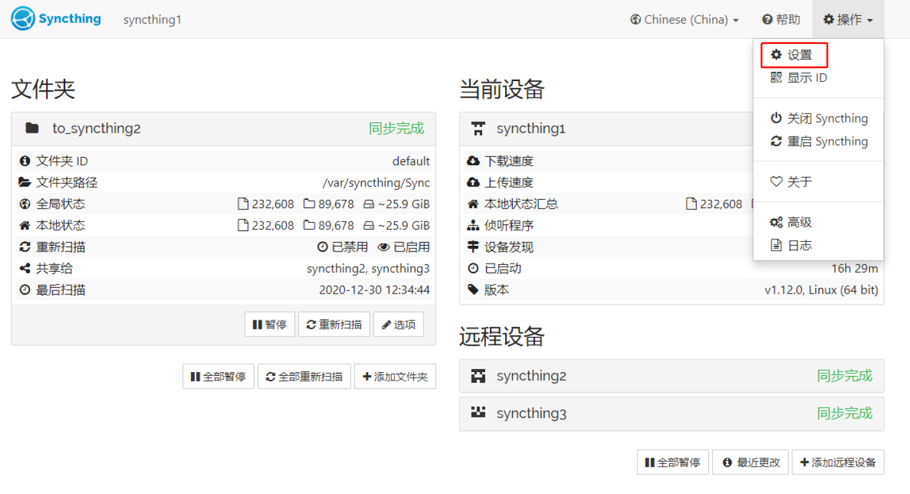

# syncthing-docker

[toc]

## 1. 准备环境

宿主机：docker 172.16.1.22

创建三个容器的volume，用于单独给三个容器存放数据。

```bash
$ sudo mkdir /storge/syncthing{1,2,3}
```

启动三个syncthing的容器


## 2. 部署Syncthing

> 此处省略docker的部署

在docker上下载syncthing镜像

```bash
$ sudo docker pull syncthing/syncthing
```

启动syncthing容器，这里启动三个syncthing。

```bash
# syncthing 1
$ sudo docker run -d -p 172.16.1.22:8384:8384 \
	   -v /storge/syncthing1:/var/syncthing \
	   --name="syncthing1" syncthing/syncthing 
	  
# syncthing 2
$ sudo docker run -d -p 172.16.1.22:8385:8384 \
	   -v /storge/syncthing2:/var/syncthing \
	   --name="syncthing2" syncthing/syncthing
	   
# syncthing 3
$ sudo docker run -d -p 172.16.1.22:8386:8384 \
	   -v /storge/syncthing3:/var/syncthing \
	   --name="syncthing3" syncthing/syncthing
	   
	   sudo docker run -d -p 172.16.1.22:8387:8384 \
	   -v /kubernetes/storge/syncthing4:/var/syncthing \
	   --name="syncthing4" syncthing/syncthing
```

检查容器启动运行

```bash
$ sudo docker ps -a|grep syncthing
```

获取容器IP地址

```bash
$ sudo docker inspect --format='{{.NetworkSettings.IPAddress}}' syncthing1
```

登入容器

```bash
$ sudo docker exec -it syncthing1 /bin/sh
```

启动、停止、重启容器

```bash
$ sudo docker start syncthing1
$ sudo docker stop syncthing1
$ sudo docker restart syncthing1
```


## 3. 配置synthing

syncthing的配置是通过网页来完成的，默认web的端口为8384。在部署syncthing时已经做了端口指定。分别为：

```bash
syncthing1 8384:8384
syncthing2 8385:8384
syncthing3 8386:8384
前者为宿主机的端口，后者为容器的端口。
```

syncthing访问，使用宿主机IP+端口的方式访问，如

```bash
https://172.16.1.22:8384
https://172.16.1.22:8385
https://172.16.1.22:8386
```

打开web后，进行简单配置。


### 3.1 全局配置



**3.1.1 重名服务器**


**3.1.2 设置GUI监听地址和用户名及密码**


**3.1.3 禁用功能**


### 3.2 新增同步文件夹

如果使用默认的文件夹和路径则直接进行配置


### 3.3 添加远程设备

获取远程设备的ID


保存后，这在远程设备的web上则可以看到提示添加新设备。


### 3.4 设置同步文件


**最后添加文件和目前进行同步测试**

**同步时长默认为10秒**，可以在config.xml文件进行修改。


## 5. 中继服务配置

### 5.1 实验说明

**实验流程：**
1、数据流向：hosts1客户端向host2同步数据
2、在hosts1上启动中继容器，hosts1在启动syncthing客户端。
3、在hosts2上启动syncthing客户端。
4、将两台宿主机上的syncthing客户端指向中继服务器，验证数据同步。


**中继切换流程**
1、数据流向：hosts2客户端向host1同步数据
2、在hosts2上启动中继容器
3、将两台宿主机上的syncthing客户端指向hosts2中继服务器，验证数据同步。


### 5.2 环境准备

| 宿主机      | IP地址      | 服务                                 |
| ----------- | ----------- | ------------------------------------ |
| hosts1      | 172.16.1.21 | docker，syncthing中继，syncthing同步 |
| hosts2      | 172.16.1.22 | docker，syncthing中继，syncthing同步 |
| 中继服务器1 | 172.16.1.21 | 在172.16.1.21上启动容器              |
| 中继服务器2 | 172.16.1.22 | 在172.16.1.22上启动容器              |


### 5.3 配置syncthing relay

两套宿主机下载镜像

```bash
# 搜索相应镜像
$ sudo docker docker search relaysrv

# 下载镜像
$ sudo docker pull syncthing/relaysrv
```

在宿主机hosts1上启动syncthing_relay容器

```bash
# syncthing_relay
$ sudo docker run -d -p 172.16.1.21:22067:22067 \
	   -p 172.16.1.21:22070:22070 \
	   --name="syncthing_relay" syncthing/relaysrv
	 


# 检查
$ sudo docker ps


# 获取relay地址
$ sudo docker exec -it syncthing_relay 'strelaysrv'


# 10.0.0.21 万兆
relay://172.16.1.21:22067/?id=3Y4CICX-Z26O26G-XKQ7QRQ-7H2XCGH-U6FEPMV-2VDUWLK-S6T4ZO6-G2RLPQQ&pingInterval=1m0s&networkTimeout=2m0s&sessionLimitBps=0&globalLimitBps=0&statusAddr=:22070&providedBy=

$ sudo docker run -d -p 10.0.0.21:22067:22067 \
	   -p 10.0.0.21:22070:22070 \
	   --name="syncthing_relay2" syncthing/relaysrv
	   
$ sudo docker exec -it syncthing_relay2 'strelaysrv'

relay://10.0.0.21:22067/?id=K5QVL4F-ALD4DNX-I3GOZSS-P3VHTOP-2POHXSV-AAJROIU-DMGPSOB-YJECSQZ&pingInterval=1m0s&networkTimeout=2m0s&sessionLimitBps=0&globalLimitBps=0&statusAddr=:22070&providedBy=
```

在两台宿主机上同时启动一个synthing容器

```bash
# hosts1 启动syncthing1
$ sudo docker run -d -p 172.16.1.21:8384:8384 \
	   -v /storge/syncthing1:/var/syncthing \
	   --name="syncthing1" syncthing/syncthing

# hosts2 启动syncthing1
$ sudo docker run -d -p 172.16.1.22:8384:8384 \
	   -v /storge/syncthing1:/var/syncthing \
	   --name="syncthing1" syncthing/syncthing 
	   

# 万兆网
# hosts1 启动syncthing2
$ sudo docker run -d -p 172.16.1.21:8384:8384 \
	   -p 10.0.0.21:22000:22000 \
	   -p 10.0.0.21:21027:21027 \
	   -v /storge/syncthing2:/var/syncthing \
	   --name="syncthing2" syncthing/syncthing

# hosts2 启动syncthing2
$ sudo docker run -d -p 172.16.1.22:8384:8384 \
	   -p 10.0.0.22:22000:22000 \
	   -p 10.0.0.22:21027:21027 \
	   -v /storge/syncthing2:/var/syncthing \
	   --name="syncthing2" syncthing/syncthing 
```


### 5.4 配置客户端

**5.4.1** 登入两台syncthing客户端网页进行配置，特别注意需勾选 “开启中继”


**5.4.2** 获取两台设备识别码

hosts1的syncthing：O5HZIJQ-2FZ7LDO-V6HQPPR-X3V5CDP-EWW2ITM-TDC74DA-DU6XDTB-2YQL4Q2

hosts1的syncthing：CP3TE5D-XYJXD2M-NN57OZP-YEYRTT4-RHTSEBD-35NCGVP-MCTB3JJ-XKXFCAU


**5.4.3** 为两台客户端添加远程设备


**5.4.4** 设置完后即可进行同步验证


## 6. 发现服务器配置

### 6.1 实验说明

1.搭建syncthing-discovery服务器

2.在

### 6.2 环境准备

| 主机  | 管理IP地址（eth0） | 业务IP地址(eth1) | 数据IP地址(eth2) | 部署服务                   |
| ----- | ------------------ | ---------------- | ---------------- | -------------------------- |
| node1 | 172.16.200.31/16   | 172.20.0.31/24   |                  | docker/syncthing           |
| node2 | 172.16.201.31/16   | 172.20.1.31/24   |                  | docker/syncthing           |
| node3 | 172.16.203.30/16   | 172.20.0.30/24   | 172.20.3.30/24   | docker/syncthing-discovery |
| node4 | 172.16.203.31/16   | 172.20.1.30/24   | 172.20.3.31/24   | docker/syncthing-discovery |

**环境说明：**


### 6.3 部署发现服务器

### 6.4 配置客户端

### 6.5 Replication双发现配置


### 6.6 Replication客户端配置


## 7. 参数影响

**Max Concurrent Writes**

并发，默认为2。影响不是很大