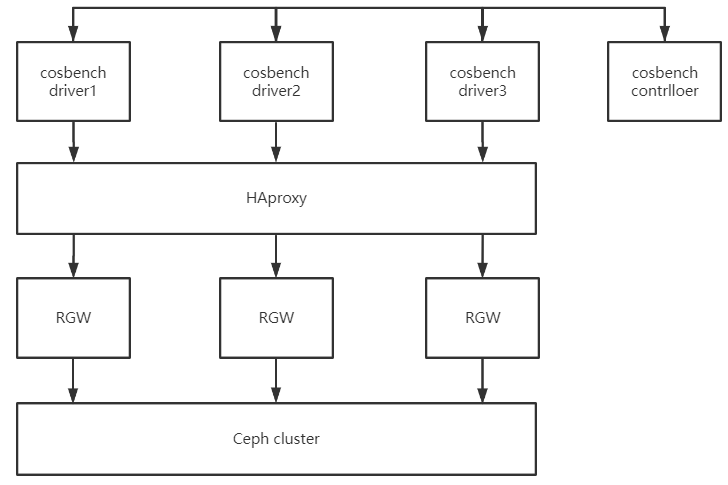

# Cosbench Test-case
[toc]


## 1. 测试场景规划

- 测试ceph radosgw基准性能
- 测试ceph yig基准性能
- 测试ceph radosgw海量小文件下的读写性能和压力
- 测试ceph yig海量小文件下的读写性能和压力


## 2. 测试用例

- rgw测试框架一


- rgw测试框架二


- rgw测试框架三


- rgw测试框架四




- yig测试框架


### 2.1 radosgw基准性能测试

- Test Case group1

| 测试项目                   | 测试参数                               | 测试说明                                          | Rados Bench 参考值                | 实际值                                |
| -------------------------- | -------------------------------------- | ------------------------------------------------- | --------------------------------- | ------------------------------------- |
| 4k-1driver-1rgw-32w-randrw | workers=32  bucket=100 object=100*2000 | 获取在1个rgw和1个客户端下ceph对象存储的基础性能值 | 随机写IOPS  7K     随机读IOPS 40K | 随机写IOPS  4.3K     随机读IOPS 11.8K |
| 4k-1driver-1rgw-64w-randrw | workers=64  bucket=100 object=100*2000 | 对比在workers数量添加一倍的情况下的性能           | 随机写IOPS  7K     随机读IOPS 40K | 随机写IOPS  7.2K     随机读IOPS 12.2K |
| 4k-1driver-1rgw-96w-randrw | workers=96  bucket=100 object=100*2000 | 对比在workers数量添加两倍的情况下的性能           | 随机写IOPS  7K     随机读IOPS 40K | 随机写IOPS  8.5K     随机读IOPS 12.2K |

备注：worker=128的情况下cosbench执行会中断，需要进一步分析。在提高workers时，写提升明显，读一般。


- Test Case group2

| 测试项目                   | 测试参数                                    | 测试说明                                       | Rados Bench 参考值                | 实际值                                 |
| -------------------------- | ------------------------------------------- | ---------------------------------------------- | --------------------------------- | -------------------------------------- |
| 4k-1driver-3rgw-32w-randrw | (workers=32  bucket=100 object=100*2000) *3 | 对比在1个客户端和3个rgw，与1rgw和1driver的性能 | 随机写IOPS  7K     随机读IOPS 40K | 随机写IOPS  9K     随机读IOPS 14.9K    |
| 4k-1driver-3rgw-64w-randrw | (workers=64 bucket=100 object=100*2000) *3  | 对比在workers数量添加一倍的情况下的性能        | 随机写IOPS  7K     随机读IOPS 40K | 随机写IOPS  10.8K     随机读IOPS 14.8K |
| 4k-1driver-3rgw-96w-randrw | (workers=64 bucket=100 object=100*2000) *3  | 对比在workers数量添加两倍的情况下的性能        | 随机写IOPS  7K     随机读IOPS 40K | 随机写IOPS  8.5K     随机读IOPS 12.2K  |


- Test Case group3

| 测试项目                       | 测试参数                                    | 测试说明                                    | Rados Bench 参考值                | 实际值                               |
| ------------------------------ | ------------------------------------------- | ------------------------------------------- | --------------------------------- | ------------------------------------ |
| 4k-1driver-3rgw(HA)-32w-randrw | (workers=32  bucket=100 object=100*2000) *3 | 对比3个rgw用负载均衡，由1个客户端打压的性能 | 随机写IOPS  7K     随机读IOPS 40K | 随机写IOPS  4.1K     随机读IOPS 9.4K |
| 4k-1driver-3rgw(HA)-64w-randrw | (workers=64 bucket=100 object=100*2000) *3  | 对比在workers数量添加一倍的情况下的性能     | 随机写IOPS  7K     随机读IOPS 40K | 随机写IOPS  7.3K     随机读IOPS 9.4K |
| 4k-1driver-3rgw(HA)-96w-randrw | (workers=96 bucket=100 object=100*2000) *3  | 对比在workers数量添加两倍的情况下的性能     | 随机写IOPS  7K     随机读IOPS 40K | 随机写IOPS  8.5K     随机读IOPS 4.2K |


### 2.2 yig基准性能测试

### 2.3 radosgw海量小文件测试

### 2.4 yig海量小文件测试


## 3. 测试详情

###  3.1 Test Case group1

#### 4k-1driver-1rgw-32w-randrw

- 清理缓存
```shell
sudo sync && echo 3 | sudo tee /proc/sys/vm/drop_caches

# 所有cehp osd节点和cosbench测试客户端
```

- 测试模板
```xml
<?xml version="1.0" encoding="UTF-8"?>
<workload name="create-bucket" description="create s3 bucket" config="">
    <auth type="none" config=""/>	
    <workflow config="">

        <!--创建bucket  -->
        <workstage name="create bucket" closuredelay="0" config="">
            <auth type="none" config=""/> 	
            <work name="rgw1-create" type="init" workers="32" interval="5"
                division="container" runtime="0" rampup="0" rampdown="0"
                afr="0" totalOps="1" totalBytes="0" driver="driver1" config="containers=r(1,100)">
                <auth type="none" config=""/>
                <storage type="s3" config="accesskey=SXTUKNM2MCBBQB4Q0BZW;secretkey=5cbxDBmvNgOBk9VG5Bs5iw5Q9BrSFNGXKOp9xVV9;endpoint=http://10.0.0.23:7480;path_style_access=true"/>
                <operation type="init" ratio="100" division="container"
                    config="containers=r(1,100);objects=r(0,0);sizes=c(0)B" id="none"/>
            </work>
        </workstage>
 
        <!--初始化数据，顺序写入对象格式 -->
        <workstage name="initobject" closuredelay="0" config="">
            <auth type="none" config=""/> 	
            <work name="rgw1-put" type="normal" workers="32" interval="5"
                division="container" runtime="600" rampup="0" rampdown="0"
                afr="20000" totalOps="0" totalBytes="0" driver="driver1" config="">
                <auth type="none" config=""/>
                <storage type="s3" config="accesskey=SXTUKNM2MCBBQB4Q0BZW;secretkey=5cbxDBmvNgOBk9VG5Bs5iw5Q9BrSFNGXKOp9xVV9;endpoint=http://10.0.0.23:7480;path_style_access=true"/>
                <operation type="write" ratio="100" division="container"
                    config="containers=r(1,100);objects=r(1,2000);sizes=c(4)KB" id="none"/>
            </work>  	
        </workstage>
 
        <!--测试随机写入 -->
        <workstage name="putobject" closuredelay="0" config="">
            <auth type="none" config=""/> 	
            <work name="rgw1-put" type="normal" workers="32" interval="5"
                division="container" runtime="600" rampup="0" rampdown="0"
                afr="20000" totalOps="0" totalBytes="0" driver="driver1" config="">
                <auth type="none" config=""/>
                <storage type="s3" config="accesskey=SXTUKNM2MCBBQB4Q0BZW;secretkey=5cbxDBmvNgOBk9VG5Bs5iw5Q9BrSFNGXKOp9xVV9;endpoint=http://10.0.0.23:7480;path_style_access=true"/>
                <operation type="write" ratio="100" division="container"
                    config="containers=u(1,100);objects=u(1,2000);sizes=c(4)KB" id="none"/>
            </work>	
        </workstage>
 
        <!--测试随机读 -->
        <workstage name="getobj" closuredelay="0" config="">
            <auth type="none" config=""/>
            <work name="rgw1-get" type="normal" workers="32" interval="5"
                division="none" runtime="600" rampup="0" rampdown="0"
                afr="200000" totalOps="0" totalBytes="0" driver="driver1" config="">
                <auth type="none" config=""/>
                <storage type="s3" config="accesskey=SXTUKNM2MCBBQB4Q0BZW;secretkey=5cbxDBmvNgOBk9VG5Bs5iw5Q9BrSFNGXKOp9xVV9;endpoint=http://10.0.0.23:7480;path_style_access=true"/>
                <operation type="read" ratio="100" division="none"
                    config="containers=u(1,100);objects=u(1,2000);" id="none"/>
            </work>
        </workstage>

        <!--清理对象 -->
        <workstage name="cleanup" closuredelay="0" config="">
            <auth type="none" config=""/>
            <work name="rgw1-cleanup" type="cleanup" workers="32" interval="5"
                division="object" runtime="0" rampup="0" rampdown="0"
                afr="0" totalOps="1" totalBytes="0" driver="driver1" config="containers=r(1,100);objects=r(1,2000);">
                <auth type="none" config=""/>
                <storage type="s3" config="accesskey=SXTUKNM2MCBBQB4Q0BZW;secretkey=5cbxDBmvNgOBk9VG5Bs5iw5Q9BrSFNGXKOp9xVV9;endpoint=http://10.0.0.23:7480;path_style_access=true"/>
                <operation type="cleanup" ratio="100" division="object"
                    config="containers=r(1,100);objects=r(1,2000);;deleteContainer=false;" id="none"/>
            </work>
        </workstage>

        <!--删除bucket -->
        <workstage name="dispose" closuredelay="0" config="">
            <auth type="none" config=""/>
            <work name="rgw1-dispose" type="dispose" workers="32" interval="5"
                division="container" runtime="0" rampup="0" rampdown="0"
                afr="0" totalOps="1" totalBytes="0" driver="driver1" config="containers=r(1,100);">
                <auth type="none" config=""/>
                <storage type="s3" config="accesskey=SXTUKNM2MCBBQB4Q0BZW;secretkey=5cbxDBmvNgOBk9VG5Bs5iw5Q9BrSFNGXKOp9xVV9;endpoint=http://10.0.0.23:7480;path_style_access=true"/>
                <operation type="dispose" ratio="100"
                    division="container"
                    config="containers=r(1,100);;objects=r(0,0);sizes=c(0)B;;" id="none"/>
            </work>
        </workstage>
 
    </workflow>
</workload>
```

- 测试结果


#### 4k-1driver-1rgw-64w-randrw 

- 清理缓存
```shell
sudo sync && echo 3 | sudo tee /proc/sys/vm/drop_caches

# 所有cehp osd节点和cosbench测试客户端
```
- 测试模板
```xml
<?xml version="1.0" encoding="UTF-8"?>
<workload name="create-bucket" description="create s3 bucket" config="">
    <auth type="none" config=""/>	
    <workflow config="">

        <!--创建bucket  -->
        <workstage name="create bucket" closuredelay="0" config="">
            <auth type="none" config=""/> 	
            <work name="rgw1-create" type="init" workers="64" interval="5"
                division="container" runtime="0" rampup="0" rampdown="0"
                afr="0" totalOps="1" totalBytes="0" driver="driver1" config="containers=r(1,100)">
                <auth type="none" config=""/>
                <storage type="s3" config="accesskey=SXTUKNM2MCBBQB4Q0BZW;secretkey=5cbxDBmvNgOBk9VG5Bs5iw5Q9BrSFNGXKOp9xVV9;endpoint=http://10.0.0.23:7480;path_style_access=true"/>
                <operation type="init" ratio="100" division="container"
                    config="containers=r(1,100);objects=r(0,0);sizes=c(0)B" id="none"/>
            </work>
        </workstage>
 
        <!--初始化数据，顺序写入对象格式 -->
        <workstage name="initobject" closuredelay="0" config="">
            <auth type="none" config=""/> 	
            <work name="rgw1-put" type="normal" workers="64" interval="5"
                division="container" runtime="600" rampup="0" rampdown="0"
                afr="20000" totalOps="0" totalBytes="0" driver="driver1" config="">
                <auth type="none" config=""/>
                <storage type="s3" config="accesskey=SXTUKNM2MCBBQB4Q0BZW;secretkey=5cbxDBmvNgOBk9VG5Bs5iw5Q9BrSFNGXKOp9xVV9;endpoint=http://10.0.0.23:7480;path_style_access=true"/>
                <operation type="write" ratio="100" division="container"
                    config="containers=r(1,100);objects=r(1,2000);sizes=c(4)KB" id="none"/>
            </work>  	
        </workstage>
 
        <!--测试随机写入 -->
        <workstage name="putobject" closuredelay="0" config="">
            <auth type="none" config=""/> 	
            <work name="rgw1-put" type="normal" workers="64" interval="5"
                division="container" runtime="600" rampup="0" rampdown="0"
                afr="20000" totalOps="0" totalBytes="0" driver="driver1" config="">
                <auth type="none" config=""/>
                <storage type="s3" config="accesskey=SXTUKNM2MCBBQB4Q0BZW;secretkey=5cbxDBmvNgOBk9VG5Bs5iw5Q9BrSFNGXKOp9xVV9;endpoint=http://10.0.0.23:7480;path_style_access=true"/>
                <operation type="write" ratio="100" division="container"
                    config="containers=u(1,100);objects=u(1,2000);sizes=c(4)KB" id="none"/>
            </work>	
        </workstage>
 
        <!--测试随机读 -->
        <workstage name="getobj" closuredelay="0" config="">
            <auth type="none" config=""/>
            <work name="rgw1-get" type="normal" workers="64" interval="5"
                division="none" runtime="600" rampup="0" rampdown="0"
                afr="200000" totalOps="0" totalBytes="0" driver="driver1" config="">
                <auth type="none" config=""/>
                <storage type="s3" config="accesskey=SXTUKNM2MCBBQB4Q0BZW;secretkey=5cbxDBmvNgOBk9VG5Bs5iw5Q9BrSFNGXKOp9xVV9;endpoint=http://10.0.0.23:7480;path_style_access=true"/>
                <operation type="read" ratio="100" division="none"
                    config="containers=u(1,100);objects=u(1,2000);" id="none"/>
            </work>
        </workstage>

        <!--清理对象 -->
        <workstage name="cleanup" closuredelay="0" config="">
            <auth type="none" config=""/>
            <work name="rgw1-cleanup" type="cleanup" workers="64" interval="5"
                division="object" runtime="0" rampup="0" rampdown="0"
                afr="0" totalOps="1" totalBytes="0" driver="driver1" config="containers=r(1,100);objects=r(1,2000);">
                <auth type="none" config=""/>
                <storage type="s3" config="accesskey=SXTUKNM2MCBBQB4Q0BZW;secretkey=5cbxDBmvNgOBk9VG5Bs5iw5Q9BrSFNGXKOp9xVV9;endpoint=http://10.0.0.23:7480;path_style_access=true"/>
                <operation type="cleanup" ratio="100" division="object"
                    config="containers=r(1,100);objects=r(1,2000);;deleteContainer=false;" id="none"/>
            </work>
        </workstage>

        <!--删除bucket -->
        <workstage name="dispose" closuredelay="0" config="">
            <auth type="none" config=""/>
            <work name="rgw1-dispose" type="dispose" workers="64" interval="5"
                division="container" runtime="0" rampup="0" rampdown="0"
                afr="0" totalOps="1" totalBytes="0" driver="driver1" config="containers=r(1,100);">
                <auth type="none" config=""/>
                <storage type="s3" config="accesskey=SXTUKNM2MCBBQB4Q0BZW;secretkey=5cbxDBmvNgOBk9VG5Bs5iw5Q9BrSFNGXKOp9xVV9;endpoint=http://10.0.0.23:7480;path_style_access=true"/>
                <operation type="dispose" ratio="100"
                    division="container"
                    config="containers=r(1,100);;objects=r(0,0);sizes=c(0)B;;" id="none"/>
            </work>
        </workstage>
 
    </workflow>
</workload>
```

- 测试结果


#### 4k-1driver-1rgw-96w-randrw 
- 清理缓存
```shell
sudo sync && echo 3 | sudo tee /proc/sys/vm/drop_caches

# 所有cehp osd节点和cosbench测试客户端
```

- 测试模板
```xml
<?xml version="1.0" encoding="UTF-8"?>
<workload name="create-bucket" description="create s3 bucket" config="">
    <auth type="none" config=""/>	
    <workflow config="">

        <!--创建bucket  -->
        <workstage name="create bucket" closuredelay="0" config="">
            <auth type="none" config=""/> 	
            <work name="rgw1-create" type="init" workers="96" interval="5"
                division="container" runtime="0" rampup="0" rampdown="0"
                afr="0" totalOps="1" totalBytes="0" driver="driver1" config="containers=r(1,100)">
                <auth type="none" config=""/>
                <storage type="s3" config="accesskey=SXTUKNM2MCBBQB4Q0BZW;secretkey=5cbxDBmvNgOBk9VG5Bs5iw5Q9BrSFNGXKOp9xVV9;endpoint=http://10.0.0.23:7480;path_style_access=true"/>
                <operation type="init" ratio="100" division="container"
                    config="containers=r(1,100);objects=r(0,0);sizes=c(0)B" id="none"/>
            </work>
        </workstage>
 
        <!--初始化数据，顺序写入对象格式 -->
        <workstage name="initobject" closuredelay="0" config="">
            <auth type="none" config=""/> 	
            <work name="rgw1-put" type="normal" workers="96" interval="5"
                division="container" runtime="600" rampup="0" rampdown="0"
                afr="20000" totalOps="0" totalBytes="0" driver="driver1" config="">
                <auth type="none" config=""/>
                <storage type="s3" config="accesskey=SXTUKNM2MCBBQB4Q0BZW;secretkey=5cbxDBmvNgOBk9VG5Bs5iw5Q9BrSFNGXKOp9xVV9;endpoint=http://10.0.0.23:7480;path_style_access=true"/>
                <operation type="write" ratio="100" division="container"
                    config="containers=r(1,100);objects=r(1,2000);sizes=c(4)KB" id="none"/>
            </work>  	
        </workstage>
 
        <!--测试随机写入 -->
        <workstage name="putobject" closuredelay="0" config="">
            <auth type="none" config=""/> 	
            <work name="rgw1-put" type="normal" workers="96" interval="5"
                division="container" runtime="600" rampup="0" rampdown="0"
                afr="20000" totalOps="0" totalBytes="0" driver="driver1" config="">
                <auth type="none" config=""/>
                <storage type="s3" config="accesskey=SXTUKNM2MCBBQB4Q0BZW;secretkey=5cbxDBmvNgOBk9VG5Bs5iw5Q9BrSFNGXKOp9xVV9;endpoint=http://10.0.0.23:7480;path_style_access=true"/>
                <operation type="write" ratio="100" division="container"
                    config="containers=u(1,100);objects=u(1,2000);sizes=c(4)KB" id="none"/>
            </work>	
        </workstage>
 
        <!--测试随机读 -->
        <workstage name="getobj" closuredelay="0" config="">
            <auth type="none" config=""/>
            <work name="rgw1-get" type="normal" workers="96" interval="5"
                division="none" runtime="600" rampup="0" rampdown="0"
                afr="200000" totalOps="0" totalBytes="0" driver="driver1" config="">
                <auth type="none" config=""/>
                <storage type="s3" config="accesskey=SXTUKNM2MCBBQB4Q0BZW;secretkey=5cbxDBmvNgOBk9VG5Bs5iw5Q9BrSFNGXKOp9xVV9;endpoint=http://10.0.0.23:7480;path_style_access=true"/>
                <operation type="read" ratio="100" division="none"
                    config="containers=u(1,100);objects=u(1,2000);" id="none"/>
            </work>
        </workstage>

        <!--清理对象 -->
        <workstage name="cleanup" closuredelay="0" config="">
            <auth type="none" config=""/>
            <work name="rgw1-cleanup" type="cleanup" workers="96" interval="5"
                division="object" runtime="0" rampup="0" rampdown="0"
                afr="0" totalOps="1" totalBytes="0" driver="driver1" config="containers=r(1,100);objects=r(1,2000);">
                <auth type="none" config=""/>
                <storage type="s3" config="accesskey=SXTUKNM2MCBBQB4Q0BZW;secretkey=5cbxDBmvNgOBk9VG5Bs5iw5Q9BrSFNGXKOp9xVV9;endpoint=http://10.0.0.23:7480;path_style_access=true"/>
                <operation type="cleanup" ratio="100" division="object"
                    config="containers=r(1,100);objects=r(1,2000);;deleteContainer=false;" id="none"/>
            </work>
        </workstage>

        <!--删除bucket -->
        <workstage name="dispose" closuredelay="0" config="">
            <auth type="none" config=""/>
            <work name="rgw1-dispose" type="dispose" workers="96" interval="5"
                division="container" runtime="0" rampup="0" rampdown="0"
                afr="0" totalOps="1" totalBytes="0" driver="driver1" config="containers=r(1,100);">
                <auth type="none" config=""/>
                <storage type="s3" config="accesskey=SXTUKNM2MCBBQB4Q0BZW;secretkey=5cbxDBmvNgOBk9VG5Bs5iw5Q9BrSFNGXKOp9xVV9;endpoint=http://10.0.0.23:7480;path_style_access=true"/>
                <operation type="dispose" ratio="100"
                    division="container"
                    config="containers=r(1,100);;objects=r(0,0);sizes=c(0)B;;" id="none"/>
            </work>
        </workstage>
 
    </workflow>
</workload>
```

- 测试结果


### 3.2 Test Case group2
#### 4k-1driver-1rgw-32w-randrw
#### 4k-1driver-1rgw-64w-randrw
#### 4k-1driver-1rgw-96w-randrw