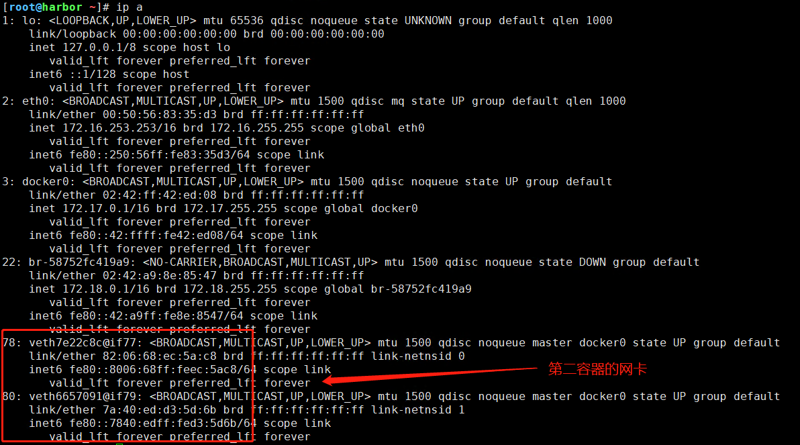
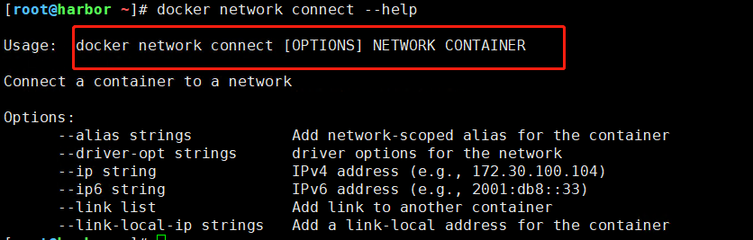
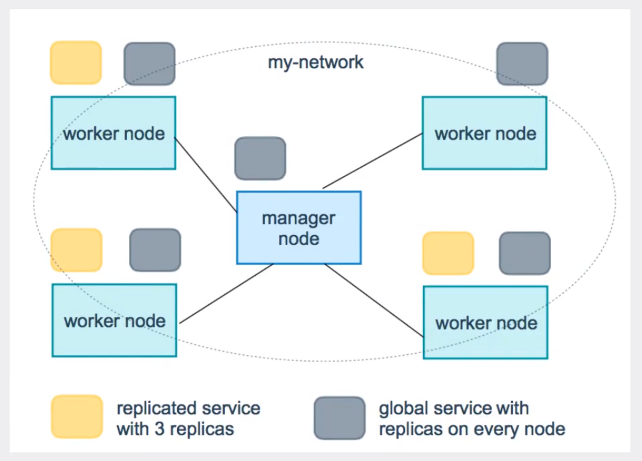

# Docker

[toc]

> Docker学习

- Docker概述
- Docker安装
- Docker命令
  - 镜像命令
  - 容器命令
  - 操作命令
  - ...

- Docker镜像
- 容器数据卷
- DockerFile
- Docker网络原理
- IDEA整合Docker
- Docker Compose
- Docker Swarm
- CI\CD jenkins


## 1. Docker 概述

### 1.1 Docker为什么出现？

问题：

- 一款产品：开发--上线 两套环境！应用环境，应用配置。

- 在我的电脑上海可以允许，版本更新，导致服务不可用！对于运维来说，考验十分大？
- 环境配置十分麻烦，每台机器都要部署环境，费时费力。
- 发布一个项目，能不能都带上环境安装包。
- 之前在服务器配置一个应用，超级麻烦，不能跨平台。
- Window环境开发，Linux环境发布

传统：开发jar，运维来做。

现在：开发打包部署上线，一套流程做完。

Docker给以上的问题，提出了解决方案。

Docker的思想来自于集装箱，讲应用打包装箱，每个箱子是相互隔离的。

Docker讲隔离机制利用到极致。

**本质：所有的技术都是因为出现了一些问题，我们需要去解决，所以才学习。**


### 1.2 Dockers的历史

2010年，几个搞IT的年轻人，就在美国成立了一家公司 `dotcloud` ,做一些paas的云计算服务。Linux有关的容器技术，他们将自己的技术（容器化技术）命令为docker。

Docker刚刚诞生的时候，没有引起行业的注意，dotcloud活不下去了。

2013年，Docker开源，越来越多的人发现它的优点，然后就火了。Docker每一个月都会更新一个版本。

2014年4月9日，第一个Docker版本1.0发布，里程碑。

Docker为什么这么火，十分轻巧。

在容器技术出来之前，我们都是使用虚拟机技术。

虚拟机：在Windows中装一个VMware，通过这个软件我们可以虚拟出来一台或者多台电脑，很笨重。

Docker容器技术也是一种虚拟化技术。

> 聊聊Docker
>
> Docker基于Go语音开发的开源项目
>
> Docker官网：https://www.docker.com/
>
> Docker文档：https://docs.docker.com/
>
> Docker仓库：https://hub.docker.com/


### 1.3 Docker能干嘛？

之前的虚拟化技术，是模拟一台虚拟机。

- 资源占用十分多
- 冗余步骤多
- 启动很慢


> 容器化技术

不是模拟一个完整的操作系统。

比较docker和虚拟机技术的不同：

- 传统虚拟机是虚拟出套硬件，运行一个完成的操作系统，然后再这个系统上安装和运行软件
- 容器内的应用直接运行再宿主机的内容，容器是没有自己的内核的，也没有虚拟我们的硬件，所以就轻便了
- 每个容器间是相互隔离，每个容器都有一个属于自己的文件系统，互不影响


> DevOps（开发、运维）

**应用更快的交付和部署**

传统：一堆帮助文档，安装程序

Docker：打包镜像发布测试，一键运行

**更便捷的升级和扩容**

使用了docker之后，我们部署应用就和搭积木一样

项目打包一个镜像，扩展

**更简单的系统运维**

在容器化之后，我们的开发、测试环境都是高度一致的

**更高效的计算资源利用**

Docker是内核级别的虚拟化，可以再一个物理机上运行很多的容器实例，服务器的性能可以被压榨到极致


## 2. 安装Docker

### 2.1 Dockers基本组成


**镜像（image）：**

Docker镜像就好比是一个模板，可以通过这个模板来创建容器服务，tomcat镜像===> run ==> tomcat01容器（提供服务器），通过这个镜像可以创建多个容器（最终服务运行或者项目运行就是再容器中的）。

**容器（container）：**

Docker利用容器技术，独立运行一个或者一个组应用，通过镜像来创建的
启动、停止、删除、基本命令！
目前就可以把这个容器理解为就是一个简易的Linux系统

**仓库（repository）：**

仓库就是存放镜像的地方 
仓库分为公有仓库和私有仓库
Docker Hub（默认是国外的）
阿里云...都有容器服务器（配置镜像加速！）

 

### 2.2 Docker安装

> 环境准备

1、需要会一点点的Linux的基础
2、Centos7
3、我们使用Xshell连接远程服务器

> 环境查看

```shell
[root@node1 ~]# uname -r
3.10.0-957.el7.x86_64

[root@node1 ~]# cat /etc/os-release 
NAME="CentOS Linux"
VERSION="7 (Core)"
ID="centos"
ID_LIKE="rhel fedora"
VERSION_ID="7"
PRETTY_NAME="CentOS Linux 7 (Core)"
ANSI_COLOR="0;31"
CPE_NAME="cpe:/o:centos:centos:7"
HOME_URL="https://www.centos.org/"
BUG_REPORT_URL="https://bugs.centos.org/"

CENTOS_MANTISBT_PROJECT="CentOS-7"
CENTOS_MANTISBT_PROJECT_VERSION="7"
REDHAT_SUPPORT_PRODUCT="centos"
REDHAT_SUPPORT_PRODUCT_VERSION="7"
```

> 安装
>
> 官方文档：https://docs.docker.com/engine/install/centos/

```shell
# 卸载旧版本
$ sudo yum remove docker \
    			 docker-client \
    			 docker-client-latest \
    			 docker-common \
    			 docker-latest \
   			 	 docker-latest-logrotate \
   				 docker-logrotate \
    			 docker-engine
    
# 需要的依赖包
$ sudo yum install -y yum-utils

# 安装docker-ce源
$ sudo yum-config-manager \
    --add-repo \
    https://download.docker.com/linux/centos/docker-ce.repo # 默认国外 
$ sudo yum-config-manager \
    --add-repo \
    http://mirrors.aliyun.com/docker-ce/linux/centos/docker-ce.repo # 使用阿里源

# 更新yum软件包索引
$ sudo yum makecache fast

# 安装docker
$ sudo yum -y install docker-ce docker-ce-cli containerd.io


# 指定版本安装
$ sudo yum list docker-ce --showduplicates | sort -r
$ sudo yum install docker-ce-<VERSION_STRING> docker-ce-cli-<VERSION_STRING> containerd.io
yum install docker-ce-17.03.3 docker-ce-cli-17.03.3 containerd.io

# 启动docker
$ sudo systemctl start docker
$ sudo docker version

# 启动hell-world
$ sudo docker run hello-world
# 查看是否有hell-word的镜像
$ docker images

# 卸载docker    
$ sudo yum remove -y docker-ce docker-ce-cli containerd.io
$ sudo rm -rf /var/lib/docker   # docker默认资源路径
```


```shell
# ubuntu20.04 install docker

# Uninstall old versions
sudo apt-get remove docker docker-engine docker.io containerd runc

# Install using the repository
sudo apt-get update

sudo apt-get install -y \
    apt-transport-https \
    ca-certificates \
    curl \
    gnupg \
    lsb-release
    
# Add Docker's official GPG key:
curl -fsSL https://mirrors.ustc.edu.cn/docker-ce/linux/ubuntu/gpg | sudo apt-key add -

# Set up the stable repository	(No do)
sudo add-apt-repository \
   "deb [arch=amd64] https://mirrors.ustc.edu.cn/docker-ce/linux/ubuntu/ \
  $(lsb_release -cs) \
  stable"
  
# Install Docke
sudo apt-get update
sudo apt-get -y install docker-ce docker-ce-cli containerd.io
 

# To install a specific version
apt-cache madison docker-ce
sudo apt-get install docker-ce=<VERSION_STRING> docker-ce-cli=<VERSION_STRING> containerd.io
sudo docker run hello-world

# Uninstall Docker Engine
sudo apt-get purge docker-ce docker-ce-cli containerd.io
sudo rm -rf /var/lib/docker
sudo rm -rf /var/lib/containerd
```


### 2.3 阿里云加速

配置阿里云私有加速器
登入阿里云控制台，找到容器镜像服务，在镜像工具下单开镜像加速器获取centos的镜像加速地址

```shell
sudo mkdir -p /etc/docker
sudo tee /etc/docker/daemon.json <<-'EOF'
{
  "registry-mirrors": ["https://wc9koj0u.mirror.aliyuncs.com"]
}
EOF
sudo systemctl daemon-reload
sudo systemctl restart docker
sudo systemctl enable docker
```


### 2.4 回顾Hell-work流程


### 2.5 Docker底层原理

**Docker是怎么工作的？**

Docker是一个Client--server结构的系统，docker的守护进程运行在主机上。通过Socket从客户端访问！
DockerServer接收到Docker——client的指令，就会执行这个命令！


**Docker为什么比VM快？**

1、Docker有着比虚拟机更少的抽象层。
2、Docker利用的是宿主机的内核，VM需要是Guest OS。
所以说，新建一个容器的时候，docker不需要像虚拟机一样重新加载一个操作系统内核，避免 引导。虚拟机是加载GuestOS，分钟级别的，而Docker是利用宿主机的操作系统，省略了这个复杂的过程，秒级。


## 3. Docker常用命令

### 3.1 帮助命令

```shell
docker version		# 显示docker版本信息
docker info			# 显示docker系统信息，包括镜像
docker 命令 --help   # 帮助命令

# 帮助文件：https://docs.docker.com/reference/
```


### 3.2 镜像命令

**docker images**  查看本地所有镜像

```shell
[root@harbor ~]# docker images
REPOSITORY    TAG       IMAGE ID       CREATED         SIZE
centos        latest    300e315adb2f   4 weeks ago     209MB

# 解释
REPOSITORY	# 镜像的仓库源
TAG			# 镜像的标签
IMAGE ID	# 镜像的ID
CREATED		# 镜像的创建时间
SIZE		# 镜像的大小

#可选项
  -a, --all             # 显示所有镜像
  -q, --quiet           # 只显示镜像ID
```


**docker search**  搜索镜像

```shell
[root@harbor ~]# docker search nginx
NAME                               DESCRIPTION                                     STARS     OFFICIAL   AUTOMATED
nginx                              Official build of Nginx.                        14284     [OK]       
jwilder/nginx-proxy                Automated Nginx reverse proxy for docker con…   1940                 [OK]

# 可选项，同股票搜藏来过滤
-f, --filter filter   --filter=starts=3000
```


**docker pull**  下载镜像

```shell
[root@harbor ~]# docker pull nginx
Using default tag: latest		# 如果不写tag，默认就是latest
latest: Pulling from library/nginx
6ec7b7d162b2: Pull complete 	# 分层下载，docker iamge的核心 联合文件系统
cb420a90068e: Pull complete 
2766c0bf2b07: Pull complete 
e05167b6a99d: Pull complete 
70ac9d795e79: Pull complete 
Digest: sha256:4cf620a5c81390ee209398ecc18e5fb9dd0f5155cd82adcbae532fec94006fb9	# 签名
Status: Downloaded newer image for nginx:latest	
docker.io/library/nginx:latest  # 真实地址

# 等价于
docker pull nginx
docker pull docker.io/libraru/nginx:latest

# 指定版本下载
docker pull nginx:1.8

```


**docker rmi**  删除镜像

```shell
docker rmi -f 0d493297b409 # 删除指定容器
docker rmi -f 0d493297b409 bf756fb1ae65  # 删除多个镜像
docker rmi -f `docker images -qa`    # 删除全部镜像
```


### 3.3 容器命令

**docker run [可选参数] image**

```shell
# 参数说明
--name=“Name”	容器名字
-d				后台方式运行
-it				使用交互方式运行，进行容器查看内容
-p				指定容器的端口
	-p 主机IP+主机端口：容器端口
	-p 主机端口：容器端口
	-p 容器端口
-P				随机指定端口

# 测试，启动并进入容器
[root@harbor ~]# docker run -it centos /bin/bash
[root@62951654438b /]#  # 查看容器内的centos，基础版本，很多命令都不完善

# 从容器中退回主机
[root@62951654438b /]# exit
exit

# 容器不停止退出
Ctrl+P+Q

# 用完即删
docker run -it --rm centos
```


**docker ps**  查看运行的容器

```shell
# docker ps 命令
      # 列出当前正在运行的容器
-a    # 列出当前正在运行的容器+带出历史运行过的容器
-n=?  # 显示最近创建的容器
-q    # 只显示容器的编号
```


**docker rm**  删除容器

```shell
docker rm 容器id    			# 删除指定容器，可以是多个，但不能删除在运行的容器
docker rm `docker ps -aq`	 # 删除所有容器，不能删除在运行的容器

# 可选项
-f 强制删除，可以删除在运行中的容器
```


**docker start/stop/restart/kill**  启动停止容器 

```shell
docker start 容器ID		# 启动容器
docker stop 容器ID		# 停止容器
docker restart 容器ID		# 重启容器
docker kill	容器ID		# 强制停止当前容器
```


### 3.4 常用命令

**后台启动容器**

```shell
# 命令 docker run -d 镜像名
[root@harbor ~]# docker run -d centos
d013dc788bd1708ff33c223383ccb407e3aa86e1d3c6b216de33e862f62cd03d
[root@harbor ~]# docker ps
CONTAINER ID   IMAGE     COMMAND   CREATED   STATUS    PORTS     NAMES

# 问题docker ps， 发现centos停止了
# 常见的抗，docker容器使用后台运行，就必须要有一个前台进程，docker发现没有应用，就会自动停止
# nginx，容器启动后，发现自己没有提供服务，就会立即停止，就是没有程序了
```

**查看日志**

```shell
docker logs -tf --tail 10 d013dc788bd1

# 自己写一段shell脚本
docker run -d centos /bin/sh -c "while true;do echo test;sleep 1;done"

# 显示日志
docker logs -tf --tail 10 2d8b424b3071

-tf   # 显示日志
--tail number  # 要显示日志条数
```

**查看容器进程信息**

```shell
# 命令 docker top 容器id
[root@harbor ~]# docker top 2d8b424b3071
UID                 PID                 PPID                C                   STIME               TTY              
root                17394               17375               0                   22:02               ?                   
root                17759               17394               0                   22:06               ?                  
```

**查看容器的元数据**

```shell
# 命令
docker inspect 容器id
```

**进入当前正在运行的容器**

```shell
# 通常容器都是使用后台方式运行的，需要进入容器，修改一些配置

# 命令
docker exec -it 容器id 执行命令
docker exec -it 2d8b424b3071 /bin/bash

# 方式二
docker attach 容器id 
docker attach 2d8b424b3071
# 正在执行当前的代码

# docker exec    # 进入容器后开启一个新的终端，可以在里面操作（常用）
# docker attach  # 进入容器正常执行的终端，不会启动新的进程
```

**从容器内拷贝文件到主机**

```shell
# 命令
docker cp 容器ID:容器内路径   目的主机路径


[root@harbor ~]# docker ps 
CONTAINER ID   IMAGE     COMMAND                  CREATED          STATUS          PORTS     NAMES
2d8b424b3071   centos    "/bin/sh -c 'while t…"   18 minutes ago   Up 18 minutes             optimistic_northcutt
[root@harbor ~]# docker exec -it 2d8b424b3071 /bin/bash
[root@2d8b424b3071 /]# cd /home
[root@2d8b424b3071 home]# touch txt.java
[root@2d8b424b3071 home]# read escape sequence
[root@harbor ~]# docker cp 2d8b424b3071:/home/txt.java .
[root@harbor ~]# ls 
anaconda-ks.cfg  txt.java

```


### 3.5 命令小结


```shell
attach      Attach local standard input, output, and error streams to a running container  # 当前shell下attach连接指定运行镜像
build       Build an image from a Dockerfile							# 通过 dockerfile 定制镜像
commit      Create a new image from a container's changes				# 提交当前容器为新的镜像
cp          Copy files/folders between a container and the local filesystem		# 从容器中拷贝指定文件到宿主机
create      Create a new container			# 创建一个新的容器，通run，但不启动
diff        Inspect changes to files or directories on a container's filesystem  # 查看docker容器变化
events      Get real time events from the server			# 从docker服务获取实时事件
exec        Run a command in a running container			# 在已存在的容器上运行命令
export      Export a container's filesystem as a tar archive		# 导出容器的内容流程作为一个tar归档文件[对于import]
history     Show the history of an image			# 展示一个镜像形成的历史
images      List images		# 列出系统当前镜像
import      Import the contents from a tarball to create a filesystem image	# 从tar包中的内容创建一个新的文件系统映像[对于export]
info        Display system-wide information  	# 显示系统相关信息
inspect     Return low-level information on Docker objects		# 查看容器详细信息
kill        Kill one or more running containers			# kill指定容器
load        Load an image from a tar archive or STDIN	# 从一个tar包中加载一个镜像[对应save]
login       Log in to a Docker registry			# 注册或者登录一个docker源服务器
logout      Log out from a Docker registry		# 从当前docker registry 退出
logs        Fetch the logs of a container		# 输出当前容器日志信息
pause       Pause all processes within one or more containers		# 暂停容器
port        List port mappings or a specific mapping for the container   # 查看映射端口对应的容器内容源端口
ps          List containers			# 列出容器列表
pull        Pull an image or a repository from a registry		# 从docker镜像源拉取指定镜像
push        Push an image or a repository to a registry			# 推送指定镜像或者库镜像至docker源服务器
rename      Rename a container			# 重新命名容器
restart     Restart one or more containers		# 重新重启一个或多个容器
rm          Remove one or more containers		# 移除一个或多个容器
rmi         Remove one or more images			# 移除一个或多个镜像
run         Run a command in a new container	# 创建一个镜像并运行一个命令
save        Save one or more images to a tar archive (streamed to STDOUT by default)	# 保存一个镜像为一个tar包[对于load]
search      Search the Docker Hub for images	# 在docker hub中搜索镜像
start       Start one or more stopped containers		# 启动容器
stats       Display a live stream of container(s) resource usage statistics		# 查看容器启动状态
stop        Stop one or more running containers			# 停下容器
tag         Create a tag TARGET_IMAGE that refers to SOURCE_IMAGE		# 给源中镜像打标签
top         Display the running processes of a container		# 查看容器中运行的进程信息
unpause     Unpause all processes within one or more containers		# 取消暂停容器
update      Update configuration of one or more containers		# 更新一个或多个容器配置
version     Show the Docker version information				# 查看docker版本号
wait        Block until one or more containers stop, then print their exit codes		# 截取容器停止时的退出状态值
```


### 3.6 练习

> 练习：docker装一个tomcat

```shell
# 官方的使用
docker run -it --rm tomcat:9.0

# 我们之前的启动都是后台，停止了容器之后，容器还是可以查到 docker run -it --rm，一般用来测试，用完就删除

# docker pull tomcat

# docker run -d -p 8080:8080 --name tomcat01 tomcat

# 测试访问没有问题

# 进入容器

# 发现问题：
# 1、 Linux命令少了
# 2、没有webapps
# 阿里云镜像的原因，默认时最小的镜像，所有不必要的都剔除掉
# 保证最小可以运行的环境
```

> 思考问题:
> 我们以后要部署项目，如果每次都要进入容器是不是是否麻烦，我要是可以在容器外部提供一个映射路径，webapps。我们在外部放置项目，就自动同步到内部就好了。


> 练习：部署 elasticsearch+kibana

```shell
# es 暴露的端口很多
# es 十分的耗内存
# es 的数据一般需要放置到安全目录！挂载
# 文档：https://hub.docker.com/_/elasticsearch

# 启动 es
docker run -d --name elasticsearch --net somenetwork -p 9200:9200 -p 9300:9300 -e "discovery.type=single-node" elasticsearch:7.10.1

# --net somenetwork  docker网络配置
docker network create somenetwork

# es 非常耗内存的，可以增加内存限制设置启动es  -e 环境配置修改
docker run -d --name elasticsearch --net somenetwork -p 9200:9200 -p 9300:9300 -e "discovery.type=single-node" -e ES_JAVA_OPTS="-Xms64m -Xmx512m" elasticsearch:7.10.1


# 部署kibana，并关联es
docker run -d --name kibana -e ELASTICSEARCH_URL=http://172.16.253.253:9200 --net somenetwork -p 5601:5601 kibana:7.10.1

# 通过访问： http://172.16.253.253:5601
```


### 3.7 portainer可视化

**什么是portainer？**

Docker图形化界面管理工具，提供一个后台面板供我们操作

```shell
docker run -d -p 9000:9000 --restart=always -v /var/run/docker.sock:/var/run/docker.sock --privileged=true portainer/portainer

# 通过访问： http://172.16.253.253:9000
```


**Rancher(CI/CD再用)**

```shell
docker run --privileged -d --restart=unless-stopped -p 80:80 -p 443:443 -v /var/lib/rancher/:/var/lib/rancher/ rancher/rancher
```


## 4. Docker镜像讲解

### 4.1 镜像是什么 

镜像是一种轻量级、可执行的独立软件包，用来打包软件运行环境和基于运行环境开发的软件，它包含运行某个软件所需的所有内容，包括代码、运行时、库、环境变量和配置文件。所有的应用，直接打包docker镜像，就可以直接跑起来。

如何得到镜像：

- 从远程仓库下载
- 朋友拷贝给你
- 自己制作一个镜像dockerfile


### 4.2 镜像加载原理

**UnionFS**（联合文件系统），我们下载镜像的时候看到的一层层就是这个！
UnionFS（联合文件系统）：Union文件系统（UnionFS）是一种分层、轻量级并且高性能的文件系统，它支持对文件系统的修改作为一次提交来一层层的叠加，同时可以将不通目录挂载到同一个虚拟文件系统下（unite serveral directories into a single virtual filesystem）。Union文件系统是Docker镜像的基础，镜像可以通过分层来进行继承，基于基础镜像（没有父镜像）可以制作各种具体的应用镜像。
特性：一次同时加载多个文件系统，单充外面看起来，只能看到一个文件系统，联合加载会把各层文件系统叠加起来，这样最终的文件系统会包含多有底层的文件和目录。


**Docker镜像加载原理**
Docker的镜像实际上由一层层的文件系统组成，这种层级的文件系统UnionFS。

bootfs(boot file system)主要包含bootloader和kernel，bootloader主要是引导加载kernel，Linux刚启动是会加载bootfs文件系统，在docker镜像的最底层是bootfs。这一层与我们典型的Linux/Unix系统是一样的，包含boot加载器和内核。当boot加载完成之后整个内核就都在内存中了，此时内存的使用权已由bootfs转交给内核，此时系统也会卸载bootfs。

rootfs(root file system)，在bootfs之上。包含的就是典型Linux系统中的/dve,/proc,/bin,/etc等标准目录和文件。rootfs就是各种不同的操作系统发现版。如ubuntu，Centos等等。


平时我们安装虚拟机的CentOS都是好几个G，为什么Dockers这里才200M？

对于一个精简的OS，rootfs可以很小，只需要包含最基本的命令，工具和程序库就可以了，因为底层直接用host的kernel，自己值需要提供rootfs就可以了。由此可见对于不同的linux发行版，bootfs基本是一致的，rootfs会有差别，因此不同的发行版可以公用bootfs。

虚拟机是分钟级别，容器是秒级！


### 4.3 分层理解

我们去下载一个镜像，注意观察下的日志输出，可以看到是一层一层的在下载。

所有的Docker镜像都起始于一个基础镜像层，当镜像修改或增加新的内容时，就会在当前镜像层之上，创建新的镜像层。

举一个简单的例子，假如基于Ubuntu linux 16.04创建一个新的镜像，就这是新镜像的第一层；如果在该镜像中添加python包，就会在基础镜像层之上创建第二镜像层；如果继续添加一个安全补丁，就会创建第三个镜像层。

该镜像当前依据包含3个镜像层，如下图多少（这是一个用于演示的很简单的例子）


在额外的镜像层的同时，镜像始终保持是当前所有镜像的组合，理解这一点非常重要，下图举了一个简单的例子，每个镜像层包含3个文件，而镜像包含了来自两个镜像层的6个文件


上图中的镜像层跟之前途中的略有区别，主要目的是便于展示文件。

下图中展示了一个稍微复杂的三层镜像，在外边看来整个镜像只有6个文件，这是因为最上层中的文件7是文件5的一个更新版本


这种情况下，上层镜像层中的文件覆盖了底层镜像中的文件。这样就使得文件的更新版作为一个新镜像层添加到镜像当中。
Docker通过存储引擎（新版本采用快照机制）的方式来实现镜像层堆栈，并保证多镜像层对外展示为统一的文件系统。
Linux上可用的存储引擎有AUFS、Overlay2、Device Mapper、Btrfs以及ZFS。顾名思义，每种存储引擎都基于Linux中对应的文件系统或者块设备技术，并且每种存储引擎都有其独有的性能特性。
Docker在windows上仅支持Windosfilter一种存储赢球，该引擎基于NTFS文件系统之上实现了分层和CoW。

下图展示了与系统显示相同的三次镜像。所有镜像层堆叠并合并，对外提供统一的视图。


> 特点：

Docker镜像都是只读的，当容器启动时，一个新的可写层被加载到镜像的顶部。
这一层就是我们通常说的容器层，容器之下的都叫镜像层。


### 4.4 commit镜像

```shell
docker commit 提交容器成为一个新的副本

docker commit -m="提交的描述信息" -a="作者" 目标镜像名:[TAG]
```

实战测试

```shell
# 启动一个默认的tomcat

# 发现这个默认的tomcat是没有webappps应用。镜像的原因，官方的镜像默认webapps下是没有文件的。

# 我自己拷贝进去了基本的文件

# 将我们操作过的容器通过commit提交为一个镜像！我们以后就使用这个镜像即可
```


## 5. 容器数据卷

### 5.1 什么是容器数据卷

如果数据都在容器中，那么我们容器删除，数据就会丢失！==需求：数据持久化==

容器直接可以有一个数据共享的技术！Docker容器中产生的数据，同步到本地。

这就是卷技术！目录的挂载，将我们容器的目录，挂载到linux上面。

总结一句话：容器的持久化和同步操作。容器间是可以数据共享的！


### 5.2 使用数据卷

> 方式一：使用命令来挂载 -v

```shell
docker run -it -v 主机目录:容器内部目录

# 测试
docker run -it -v /home/ceshi:home centos /bin/bash

# 启动起来，可以通过 docker inspect 容器id
```


好处：我们以后修改只需要在本地修改即可，容器内会自动同步。

> 实战：安装mysql

思考：MySQL的数据持久化的问题！

```shell
# 获取容器
docker pull mysql:5.7

# 启动容器
docker run -d -p 3306:3306 \
    -v /home/mysql/conf.d:/etc/mysql/conf.d \
    -v /home/mysql/data:/var/lib/mysql \
    -e MYSQL_ROOT_PASSWORD=123456
    --name mysql01 \
    mysql:5.7
    
# 参数选项 
-d	后台运行
-p  端口映射
-v  卷挂载
-e  环境配置
--name  容器名字

# 启动成功之后，我们在可以第三方工具来测试一下
```

假设我们将容器删除，会发现我们挂载到本地的数据卷依旧没有丢失，这就实现了容器数据持久化。


### 5.3 具名和匿名挂载

```SHELL
# 匿名挂载
-v 容器内路径
docker run -d -P --name nginx01 -v /etc/nginx nginx

# 查看所有的volume的情况
[root@harbor ~]# docker volume ls
DRIVER    VOLUME NAME
local     5cfd6b391fb1c2222e1cbb39f3980044d16064944a9097ae8511539d7d33870e
# 这种就是匿名挂载，我们在 -v 只写了容器内的路径，没有写容器外的路径

# 具名挂载 
docker run -d -P --name nginx02 -v juming-nginx:/etc/nginx nginx

# 通过 -v 卷名：容器内路径
# 查看一下这个卷
docker volume inspect juming-nginx
```

所有的docker容器内的卷，没有指定目前的情况下都是在 `/var/lib/docker/volumes/xxxx/_data`

我们通过具名挂载可以方便的找到我们的一个卷，大多数情况在使用的具名挂载

```shell
# 如何确定是具名挂载还是匿名挂载，还是指定路径挂载
-v  容器内路径		  # 匿名挂载
-v  卷名：容器内路径	# 具名挂载
-v  /宿主机路径:容器内路径 	# 指定路径挂载
```

扩展：

```shell
# 通过 -v 容器内路径:ro  rw 改变读写权限
ro	readonly    # 只读
rw	readwrite   # 可读可写

# 一旦这个设置容器权限，容器对我们挂载出来的内容就有限定了
docker run -d -P --name nginx02 -v juming-nginx:/etc/nginx:ro nginx
docker run -d -P --name nginx02 -v juming-nginx:/etc/nginx:rw nginx

# ro 只要看到ro就说明这个路径只能通过宿主机来操作，容器内部是无法操作
```


### 5.4 初识 Dockerfile

Dockerfile 就是用来构建docker镜像的脚本文件，命令脚本。先体验一下

通过这个脚本可以生成镜像，镜像是一层一层的，脚本一个个的命令，每个命令都是一层

```shell
# 创建一个dockerfile文件，名字可以随机，建议dockerfile
# 文件中的内容 指令(大写) 参数

FROM centos     # 以centos为基础

VOLUME ["volume01","volume02"]		# 匿名挂载

CMD echo "---end---"

CMD /bin/bash

# 构建镜像
docker build -f dockerfile01 -t rock/centos:1.0 .
```

这种方式我们未来使用的十分多，因为我们通常会构建自己的镜像

假设构建镜像时候没有挂载卷，要手动镜像挂载 -v 卷名:容器内路径


### 5.5 数据卷容器


```shell
# 启动3个容器，通过我们
docker run -d -it docker01 rock/centos:1.0
docker run -d -it docker02 --volumes-from docker01 rock/centos:1.0
docker run -d -it docker03 --volumes-from docker01 rock/centos:1.0

# 测试：可以删除docker01，查看一下docker02和docker03是否还可以访问这个文件
# 结果：依旧可以访问
```


结论：

容器之间配置信息的传递，数据卷容器的生命一直持续到没有容器使用为主。
但是一旦你持久化到了本地，这个时候，本地的数据是不会删除的。


## 6.  DockerFile

### 6.1 dockerfile介绍

dockerfile是用来构建docker镜像的文件。他就是命令参数脚本

构建步骤

1、编写一个dockerfile文件

2、docker build 构建成为一个镜像

3、docker run 运行镜像

4、docker push 发布镜像（私有，公有）


查看官方的centos


很多官方镜像都是基础包，很多功能没有，我们通常会自己搭建自己的镜像！

官方既然可以制作，那我们也可以。


### 6.2 DockerFile构建过程

**基础知识：**

1、每一个保留关键字（指令）都是必须是大写字母

2、执行从上到下顺序执行

3、 “#”表示注释

4、 每一个指令都会创建提交一个新的镜像层，并提交。


dockerFile是面向开发的，我们以后要发布项目，做镜像，就需要编写dockerfile文件，这个文件十分简单！

docker镜像逐渐成为企业交付的标准，都必须掌握。


**步骤** ---开发、部署、运维

dockerfile：构建文件，定义了一切的步骤，源代码

dockerimages：通过dockerfile构建生成的镜像，最终发布和运行的产品。

docker容器：容器就是镜像运行起来提供服务器


### 6.3 dockerfile的指令

```shell
FROM		# 基础镜像，一切从这里开始构建
MAINTAINER	# 镜像是谁写的，姓名+邮件
RUN			# 镜像构建的时候需要运行的命令
ADD			# 步骤，tomcat镜像，这个tomcat压缩包，添加内容
WORKDIR		# 镜像的工作目录
VOLUME		# 挂载的目录
EXPOSE		# 暴露端口配置
CMD			# 指定容器启动的时候要运行的命令,只有最后一个会生效，可以替代
ENTRYPOINT	# 指定容器启动的时候要运行的命令，可以追加命令
ONBUILD		# 当构建一个被继承 DockerFile 这个时候就会运行ONBUILD的指令。触发指令。
COPY		# 类似add，将我们文件拷贝到镜像中
ENV			# 构建的时候设置环境变量。
```


### 6.4 实战测试

> 创建一个 自己的centos，在官方基础上构建一个centos

```shell
# 编写DockerFile文件
FROM centos
MAINTAINER  rock<rockchou@foxmail.com>

ENV MYPATH /usr/local
WORKDIR $MYPATH

RUN yum -y install vim
RUN yum -y install net-tools

EXPOSE 80

CMD echo $MYPATH
CMD echo "---end---"
CMD /bin/bash

# 通过这个文件，构建镜像
docker build -f mydockerfile -t mycentos:0.1 .
```


可以通过 `docker history 镜像ID`，来查看镜像构建的过程。

我们平时拿到一个镜像，可以研究一下他是怎么做的


> CMD 和 ENTRYPOINT 区别

```shell
CMD			# 指定容器启动的时候要运行的命令,只有最后一个会生效，可以替代
ENTRYPOINT	# 指定容器启动的时候要运行的命令，可以追加命令
```

测试CMD

```shell
# 编写dockerfile
vim dockefile-cmd-test
FROM centos
CMD ["ls","-a"]

# 构建镜像
docker build -f dockerfile-cmd-test -t cmdtest .

# 运行容器
docker rum cmdtest


# 想追加一个命令 -l  >ls -al
docker rum cmdtest -l
# cmd的清理下，-l 替换 CMD["ls","-a"] 命令， -l不是命令所以报错.
```

测试ENTRYPOINT

```shell
# 编写dockerfile
vim dockefile-entrypoint-test
FROM centos
ENTRYPOINT ["ls","-a"]

# 构建镜像
docker build -f dockerfile-entrypoint-test -t entrypointtest .

# 运行容器
docker rum ntrypointtest


# 想追加一个命令 -l  >ls -al
docker rum ntrypointtest -l
# 此时则能正常输出 ls -al的命令内容
```


DockerFile中很多命令都十分的相似，我们需要了解他们的区别，我们最好的学习就是对吧他们然后测试效果。


### 6.5 制作tomcat的镜像

1、准备镜像文件tomcat压缩包，jdk的压缩包


2、编写dockerfile文件，官方命令`Dockerfile` ，build会自动寻找个文件，而不需要-f指定。

```shell
# 编写DockerFile文件
FROM centos
MAINTAINER  rock<rockchou@foxmail.com>

COPY readme.md /usr/local/readme.md
ADD jdk-8u221-linux-x64.tar.gz /usr/local/
ADD apache-tomcat-9.0.41.tar.gz /user/local/

RUN yum -y install vim 

ENV MYPATH /usr/local/
WORKDIR $MYPATH

ENV JAVA_HOME /usr/local/jdk1.8.0_221
ENV CLASSPATH $JAVA_HOME/lib/dt.jar:$JAVA_HOME/lib/tools.jar
ENV CATALINA_HOME /usr/local/apache-tomcat-9.0.41
ENV CATALINA_BASH /usr/local/apache-tomcat-9.0.41
ENV PATH $PATH:$JAVA_HOME/bin:$CATALINA_HOME/lib:$CATALINA_HOME/bin

EXPOSE 8080

CMD /usr/local/apache-tomcat-9.0.41/bin/startup.sh && tail -F /usr/local/apache-tomcat-9.0.41/bin/logs/catalina.out
```

3、构建镜像

```shell
docker build -t rock/tomcat:0.1 .

[root@harbor tomcat]# docker images
REPOSITORY            TAG       IMAGE ID       CREATED          SIZE
rock/tomcat           0.1       58c21a520922   22 seconds ago   690MB
```

4、启动容器

```shell
docker run -d -p 8080:8080 --name rocktomcat \
		-v /root/build/tomcat/webapps:/usr/local/apache-tomcat-9.0.41/webapps \
		-v /root/build/tomcat/logs/:/usr/local/apache-tomcat-9.0.41/logs \
		rock/tomcat:0.2
		
# 注意，这里由于使用/root目录，-v后容器里面的webapps目录数据拷贝不过去。建议不要用root目录
# 这里，可以从宿主机拷贝到挂载目录，即可。
```

5、访问测试


6、发布项目（由于做了卷挂载，我们直接在本地编写项目就可以发布了！）


### 6.6 发布镜像

> DockerHub

1、地址：https://hub.docker.com/ 注册自己的账户

2、确定这个账户可以登录

3、在我们服务器上提交自己的镜像

```shell
[root@harbor logs]# docker login --help

Usage:  docker login [OPTIONS] [SERVER]

Log in to a Docker registry.
If no server is specified, the default is defined by the daemon.

Options:
  -p, --password string   Password
      --password-stdin    Take the password from stdin
  -u, --username string   Username

```

4、登入完毕后就可以提交镜像

```shell
# 登入dockerhub
[root@harbor logs]# docker login -u rockchou
Password: 
WARNING! Your password will be stored unencrypted in /root/.docker/config.json.
Configure a credential helper to remove this warning. See
https://docs.docker.com/engine/reference/commandline/login/#credentials-store

Login Succeeded

# 提交镜像
docker push rock/tomcat:0.2

# push镜像的问题
denied: requested access to the resource is denied
# 镜像的作者与账户名要相同
docker tag rock/tomcat:0.2 rockchou/tomcat:0.2
docker push rockchou/tomcat:0.2
```


> 阿里云镜像服务

1、登入阿里云

2、找到容器镜像服务器

3、创建命令空间

4、创建容器镜像

5、浏览阿里云


### 6.7 小结


## 7. Docker网络

### 7.1 理解Docker0

> 清理所有容器和镜像


> 三个网络

**docker是如何处理容器网络访问的？**

```shell
# 启动一个tomcat容器
[root@harbor ~]# docker run -d -P --name tomcat01 tomcat

# 查看容器内部网络地址 ip addr
# 发现容器启动的时候会得到一个eth0@if78 IP地址，是docker分配的
[root@harbor ~]# docker exec -it 191feb535c61 ip addr
1: lo: <LOOPBACK,UP,LOWER_UP> mtu 65536 qdisc noqueue state UNKNOWN group default qlen 1000
    link/loopback 00:00:00:00:00:00 brd 00:00:00:00:00:00
    inet 127.0.0.1/8 scope host lo
       valid_lft forever preferred_lft forever
77: eth0@if78: <BROADCAST,MULTICAST,UP,LOWER_UP> mtu 1500 qdisc noqueue state UP group default 
    link/ether 02:42:ac:11:00:02 brd ff:ff:ff:ff:ff:ff link-netnsid 0
    inet 172.17.0.2/16 brd 172.17.255.255 scope global eth0
       valid_lft forever preferred_lft forever
       
# 思考：宿主机能不能ping通容器内容的网络，必须可以！
[root@harbor ~]# ping 172.17.0.2
PING 172.17.0.2 (172.17.0.2) 56(84) bytes of data.
64 bytes from 172.17.0.2: icmp_seq=1 ttl=64 time=0.093 ms
64 bytes from 172.17.0.2: icmp_seq=2 ttl=64 time=0.070 ms
```

**docker网络原理**

1、我们没启动一个docker容器，docker就会给容器分配一个IP；我们只要安装了docker，就有一个网卡docker0，它是桥接模式，使用的技术是evth-pair技术。


2、在启动一个容器测试，发现有多了一对网卡



这种一对一对的网卡就是**evth-pair**技术。
**evth-pair** 就是一对虚拟设备接口，他们都是成对出现的，一段连着协力，一段彼此相连。
正因为这个特性，**evth-pair** 充当一个桥梁，连接各种虚拟网络设备
openstack，Docker容器之间的连接，OVS的连接，都是使用**evth-pair**技术。

3、我们测试一下tomcat01和tomcat02是否可以ping通

```shell
[root@harbor ~]# docker exec -it tomcat02 ping 172.17.0.2
PING 172.17.0.2 (172.17.0.2) 56(84) bytes of data.
64 bytes from 172.17.0.2: icmp_seq=1 ttl=64 time=0.114 ms
64 bytes from 172.17.0.2: icmp_seq=2 ttl=64 time=0.065 ms

# 结论：容器和容器直接是可以互相ping通的！
```


**结论：**

tomcat01和tomcat02是公用的一个路由器，docker0
所有的容器不指定网络的情况下，都是docker0路由的，docker会给我的容器分配一个默认的可用IP


### 7.2 小结

Docker 使用的是Linux的桥接，宿主机中是一个docker容器的网桥docker0

Docker 中的所有网络接口都是虚拟的。虚拟的转发效率高。

只要容器删除，对应网桥一对就没有了


### 7.3 --link

> 思考:
>
> 我们编写了一个微服务，database url=ip，项目不重启，数据库IP换掉了，我们希望可以处理这个问题，可以名字来镜像访问容器？

```shell
# 容器名字不能ping通
[root@harbor ~]# docker exec -it tomcat02 ping tomcat01
ping: tomcat01: Name or service not known

# 如何解决？
# 通过--link 既可以解决了网络连通问题
[root@harbor ~]# docker run -d -P --name=tomcat03 --link tomcat02 tomcat
878ccfdcb9a48986a91d8cb80a459d7b84ddebe316d99e784293fb01d9ccc796
[root@harbor ~]# docker exec -it tomcat03 ping tomcat02
PING tomcat02 (172.17.0.3) 56(84) bytes of data.
64 bytes from tomcat02 (172.17.0.3): icmp_seq=1 ttl=64 time=0.128 ms
64 bytes from tomcat02 (172.17.0.3): icmp_seq=2 ttl=64 time=0.080 ms

# 但是反过来不一定通，说明tomca02也要 --link
```


**探究inspect**

```shell
[root@harbor ~]# docker inspect 3f4ec0609b7e
[
    {
        "Name": "bridge",
        "Id": "3f4ec0609b7e9828e363ee008378d93afb945a131b9e29bdc0e5a09020f1dce8",
        "Created": "2021-01-09T14:06:09.981594788+08:00",
        "Scope": "local",
        "Driver": "bridge",
        "EnableIPv6": false,
        "IPAM": {
            "Driver": "default",
            "Options": null,
            "Config": [
                {
                    "Subnet": "172.17.0.0/16",
                    "Gateway": "172.17.0.1"
                }
            ]
        },
        "Internal": false,
        "Attachable": false,
        "Ingress": false,
        "ConfigFrom": {
            "Network": ""
        },
        "ConfigOnly": false,
        "Containers": {
            "191feb535c616bc921981cc533905ec82651886a2f10211d5d5ff3d34813a8df": {
                "Name": "tomcat01",
                "EndpointID": "578327f0a8fa89f41582384bc13c1a185e9064421e8a849d67e91d7d757f6152",
                "MacAddress": "02:42:ac:11:00:02",
                "IPv4Address": "172.17.0.2/16",
                "IPv6Address": ""
            },
            "878ccfdcb9a48986a91d8cb80a459d7b84ddebe316d99e784293fb01d9ccc796": {
                "Name": "tomcat03",
                "EndpointID": "8dc831ba1e6ac3ea5a2b413de48f6a8ee316c23d98f77a6b649926dbbc6717db",
                "MacAddress": "02:42:ac:11:00:04",
                "IPv4Address": "172.17.0.4/16",
                "IPv6Address": ""
            },
            "a79fc971ca6e1694a47bc68ff7b13bfe53bf814a891225e3b2a722fcd4414644": {
                "Name": "tomcat02",
                "EndpointID": "4b54ca7574e928baf51a265fb06ea71d79c54194e36c563da66431a1cdcaf563",
                "MacAddress": "02:42:ac:11:00:03",
                "IPv4Address": "172.17.0.3/16",
                "IPv6Address": ""
            }
        },
        "Options": {
            "com.docker.network.bridge.default_bridge": "true",
            "com.docker.network.bridge.enable_icc": "true",
            "com.docker.network.bridge.enable_ip_masquerade": "true",
            "com.docker.network.bridge.host_binding_ipv4": "0.0.0.0",
            "com.docker.network.bridge.name": "docker0",
            "com.docker.network.driver.mtu": "1500"
        },
        "Labels": {}
    }
]
```


其实这个tomcat03就是在本地配置了tomcat02的配置。

```shell
# 可以查看hosts配置，在这里原理发现
[root@harbor ~]# docker exec -it tomcat03 cat /etc/hosts
127.0.0.1	localhost
::1	localhost ip6-localhost ip6-loopback
fe00::0	ip6-localnet
ff00::0	ip6-mcastprefix
ff02::1	ip6-allnodes
ff02::2	ip6-allrouters
172.17.0.3	tomcat02 a79fc971ca6e
172.17.0.4	878ccfdcb9a4
```

本质：--link 就是我们在hosts配置中增加了一个172.17.0.3	tomcat02 a79fc971ca6e

我们真实玩docker 已经不建议使用--link了。

自定义网络，不适用docker0

docker0问题，它不支持容器名连接！


### 7.4 自定义网络

> 查看所有的网络

```shell
[root@harbor ~]# docker network ls
NETWORK ID     NAME          DRIVER    SCOPE
3f4ec0609b7e   bridge        bridge    local
cca3e76c8cbc   host          host      local
636b4ce6fa2f   none          null      local
```

**网络模式**

bridge：桥接docker（默认，自己创建也是使用桥接）

none：不配做网络，一般不用

host：和宿主机共享网络

container：容器网络连通！（少用，局限很大）

**测试**

```shell
# 我们直接启动的命令 --net bridge，而这个就是我们的docker0
docker run -d -P --name tomcat01 tomcat
docker run -d -P --name tomcat01 --net dridge tomcat

# 创建一个自定义网络
docker network create --driver bridge --subnet 172.18.0.0/16 --gateway 172.18.0.1 mynet
--driver bridge
--subnet 172.18.0.0/16
--gateway 172.18.0.1


[root@harbor ~]# docker network ls
NETWORK ID     NAME      DRIVER    SCOPE
3f4ec0609b7e   bridge    bridge    local
cca3e76c8cbc   host      host      local
83506fa3eeef   mynet     bridge    local
636b4ce6fa2f   none      null      local

# 我们自己创建的网络就创建好了
# 在删除容器，使用自定义的网络重新运行容器
[root@harbor ~]# docker run -d -P --name tomcat01 --net mynet tomcat
02f875e0a24352f41d2ac775bac7f7077774539c03957a493dea843482ba1e29
[root@harbor ~]# docker run -d -P --name tomcat02 --net mynet tomcat
60ec87dfe420f3b899e409f9cac29967c1d4f3674878c05cc172bf272d0b3905

# 测试ping
[root@harbor ~]# docker exec -it tomcat01 ping tomcat02
PING tomcat02 (172.18.0.3) 56(84) bytes of data.
64 bytes from tomcat02.mynet (172.18.0.3): icmp_seq=1 ttl=64 time=0.094 ms
64 bytes from tomcat02.mynet (172.18.0.3): icmp_seq=2 ttl=64 time=0.100 ms

[root@harbor ~]# docker exec -it tomcat02 ping tomcat01
PING tomcat01 (172.18.0.2) 56(84) bytes of data.
64 bytes from tomcat01.mynet (172.18.0.2): icmp_seq=1 ttl=64 time=0.077 ms

```

我们自定义的网络docker都已经帮我们维护好了对应的关系，推荐平时这样使用网络！

好处：不同的集群使用不同的网络，保证集群是安全和健康的。


### 7.5 网络连通





**测试打通tomcat03到mynet**

```shell
# 使用默认docker0启动tomcat03
[root@harbor ~]# docker run -d -P --name tomcat03 tomcat
cb3d5868f683fcc7b45956edd338ba3d13ca3aefc66723cd1d706ea86d76fe6d

# 打通网络
[root@harbor ~]# docker network connect mynet tomcat03
# 没有提示就是成功


# 查看mynet网络
docker network inspect mynet
# 连通之后就是将tomcat03放到了mynet网络下
# 这个叫做一个容器多个IP
```


### 7.6 部署redis集群

架构


编写shell脚本

```shell
#bin/sh

#创建网卡
docker network create redis --subnet 172.38.0.0/16

# 通过加班创建六个redis配置
for port in `seq 1 6`
do
mkdir -p /mydata/redis/node-${port}/conf
touch /mydata/redis/node-${port}/conf/redis.conf
cat << EOF > /mydata/redis/node-${port}/conf/redis.conf
port 6379
bind 0.0.0.0
cluster-enabled yes
cluster-config-file nodes.conf
cluster-node-timeout 5000
cluster-announce-ip 172.38.0.1${port}
cluster-announce-port 6379
cluster-announce-bus-port 16379
appendonly yes
EOF
done

# 启动六个容器
for port in `seq 1 6`
do
docker run -d -p 637${port}:6379 -p 1637${port}:16379 --name redis-${port} \
-v /mydata/redis/node-${port}/data:/data \
-v /mydata/redis/node-${port}/conf/redis.conf:/etc/redis/redis.conf \
--net redis --ip 172.38.0.1${port} redis:5.0.9-alpine3.11 redis-server /etc/redis/redis.conf
done

# 进入容器
[root@harbor ~]# docker exec -it redis-1 /bin/sh
/data # 

# 创建集群
redis-cli --cluster create 172.38.0.11:6379 172.38.0.12:6379 172.38.0.13:6379 172.38.0.14:6379 172.38.0.15:6379 172.38.0.16:6379 --cluster-replicas 1
```


docker 搭建redis集群完成

```shell
[root@harbor redis]# docker exec -it redis-1 /bin/sh
/data # redis-cli --cluster create 172.38.0.11:6379 172.38.0.12:6379 172.38.0.13:6379 172.38.0.14:6379 172.38.0.15:6379 172.38.0.16:6379 --cluster-replicas 1
>>> Performing hash slots allocation on 6 nodes...
Master[0] -> Slots 0 - 5460
Master[1] -> Slots 5461 - 10922
Master[2] -> Slots 10923 - 16383
Adding replica 172.38.0.15:6379 to 172.38.0.11:6379
Adding replica 172.38.0.16:6379 to 172.38.0.12:6379
Adding replica 172.38.0.14:6379 to 172.38.0.13:6379
M: 5dabb903c3cab28b566712cc5c08d68bbc7eed32 172.38.0.11:6379
   slots:[0-5460] (5461 slots) master
M: c829ba0dc87d2a33c4808097b78c5784888ed196 172.38.0.12:6379
   slots:[5461-10922] (5462 slots) master
M: 9fc9940d071e28947b2940e0116d3278560b0da2 172.38.0.13:6379
   slots:[10923-16383] (5461 slots) master
S: e47993f023daf48126665ad0d74785d1eee3a49c 172.38.0.14:6379
   replicates 9fc9940d071e28947b2940e0116d3278560b0da2
S: 7337c6753360307474393ebaaf1346b552a11d06 172.38.0.15:6379
   replicates 5dabb903c3cab28b566712cc5c08d68bbc7eed32
S: fcb847951ec765f2bdddb7339b1cbb10e010dab0 172.38.0.16:6379
   replicates c829ba0dc87d2a33c4808097b78c5784888ed196
Can I set the above configuration? (type 'yes' to accept): yes
>>> Nodes configuration updated
>>> Assign a different config epoch to each node
>>> Sending CLUSTER MEET messages to join the cluster
Waiting for the cluster to join
...
>>> Performing Cluster Check (using node 172.38.0.11:6379)
M: 5dabb903c3cab28b566712cc5c08d68bbc7eed32 172.38.0.11:6379
   slots:[0-5460] (5461 slots) master
   1 additional replica(s)
S: fcb847951ec765f2bdddb7339b1cbb10e010dab0 172.38.0.16:6379
   slots: (0 slots) slave
   replicates c829ba0dc87d2a33c4808097b78c5784888ed196
M: c829ba0dc87d2a33c4808097b78c5784888ed196 172.38.0.12:6379
   slots:[5461-10922] (5462 slots) master
   1 additional replica(s)
M: 9fc9940d071e28947b2940e0116d3278560b0da2 172.38.0.13:6379
   slots:[10923-16383] (5461 slots) master
   1 additional replica(s)
S: e47993f023daf48126665ad0d74785d1eee3a49c 172.38.0.14:6379
   slots: (0 slots) slave
   replicates 9fc9940d071e28947b2940e0116d3278560b0da2
S: 7337c6753360307474393ebaaf1346b552a11d06 172.38.0.15:6379
   slots: (0 slots) slave
   replicates 5dabb903c3cab28b566712cc5c08d68bbc7eed32
[OK] All nodes agree about slots configuration.
>>> Check for open slots...
>>> Check slots coverage...
[OK] All 16384 slots covered.
```


我们使用了docker之后，所有的技术都会慢慢变得简单起来。

```shell
/data # redis-cli -c
127.0.0.1:6379> cluster nodes
5dabb903c3cab28b566712cc5c08d68bbc7eed32 172.38.0.11:6379@16379 myself,master - 0 1610499811000 1 connected 0-5460
fcb847951ec765f2bdddb7339b1cbb10e010dab0 172.38.0.16:6379@16379 slave c829ba0dc87d2a33c4808097b78c5784888ed196 0 1610499813000 6 connected
c829ba0dc87d2a33c4808097b78c5784888ed196 172.38.0.12:6379@16379 master - 0 1610499813000 2 connected 5461-10922
9fc9940d071e28947b2940e0116d3278560b0da2 172.38.0.13:6379@16379 master - 0 1610499812000 3 connected 10923-16383
e47993f023daf48126665ad0d74785d1eee3a49c 172.38.0.14:6379@16379 slave 9fc9940d071e28947b2940e0116d3278560b0da2 0 1610499813513 4 connected
7337c6753360307474393ebaaf1346b552a11d06 172.38.0.15:6379@16379 slave 5dabb903c3cab28b566712cc5c08d68bbc7eed32 0 1610499812509 5 connected
```


### 7.7 SpringBoot微服务打包

1、架构springboot项目

2、打包应用

3、编写dockerfile

4、构建镜像

5、发布运行


## 8. Docker Compose

### 8.1 简介

Docker Compose来轻松高校的管理容器。定义运行多个容器。

> 官方介绍

**定义、运行多个容器。YAML File文件。single command，命令有哪些？**

Compose is a tool for defining and running multi-container Docker applications. With Compose, you use a YAML file to configure your application’s services. Then, with a single command, you create and start all the services from your configuration. To learn more about all the features of Compose, see [the list of features](https://docs.docker.com/compose/#features).


**所有的环境都可以使用Compose**

Compose works in all environments: production, staging, development, testing, as well as CI workflows. You can learn more about each case in [Common Use Cases](https://docs.docker.com/compose/#common-use-cases).


**三步骤：**

Using Compose is basically a three-step process:

1. Define your app’s environment with a `Dockerfile` so it can be reproduced anywhere.	

   Dockerfile保证我们项目在任何地方可以运行

2. Define the services that make up your app in `docker-compose.yml` so they can be run together in an isolated environment.

   services什么是服务，docker-compose.yaml 怎么写？

3. Run `docker-compose up` and Compose starts and runs your entire app.

   启动项目

作用：批量容器编排

Docker Compose是docker官方的开源项目，需要安装！
`Dockerfile`  让程序在任何地方运行。web服务，redis、mysql、nginx...多个容器

Compose YAML

```yaml
version: "3.9"  # optional since v1.27.0
services:
  web:
    build: .
    ports:
      - "5000:5000"
    volumes:
      - .:/code
      - logvolume01:/var/log
    links:
      - redis
  redis:
    image: redis
volumes:
  logvolume01: {}
```

**重要的概念：**

- 服务services，容器。应用

- 项目project。一组关联的容器


### 8.2 安装

```shell
# 官方下载
sudo curl -L "https://github.com/docker/compose/releases/download/1.27.4/docker-compose-$(uname -s)-$(uname -m)" -o /usr/local/bin/docker-compose

# 国内下载
curl -L https://get.daocloud.io/docker/compose/releases/download/2.27.4/docker-compose-`uname -s`-`uname -m` > /usr/local/bin/docker-compose

# 授权
chmod +x /usr/local/bin/docker-compose
```


### 8.3 快速入门

官方文件：https://docs.docker.com/compose/gettingstarted/

**第一步：** 创建app.py应用

```shell
# 创建目录、进入到目录
$ mkdir composetest
$ cd composetest

# 创建一个 app.py 文件
import time

import redis
from flask import Flask

app = Flask(__name__)
cache = redis.Redis(host='redis', port=6379)

def get_hit_count():
    retries = 5
    while True:
        try:
            return cache.incr('hits')
        except redis.exceptions.ConnectionError as exc:
            if retries == 0:
                raise exc
            retries -= 1
            time.sleep(0.5)

@app.route('/')
def hello():
    count = get_hit_count()
    return 'Hello World! I have been seen {} times.\n'.format(count)
    
# 编辑文件 requirements.txt，添加以下内容
flask
redis
```

**第二步：**创建Dockerfile文件

```dockerfile
FROM python:3.7-alpine
WORKDIR /code
ENV FLASK_APP=app.py
ENV FLASK_RUN_HOST=0.0.0.0
RUN apk add --no-cache gcc musl-dev linux-headers
COPY requirements.txt requirements.txt
RUN pip install -r requirements.txt
EXPOSE 5000
COPY . .
CMD ["flask", "run"]
```

**第三步：**  编写docker-compose.yml文件

```yaml
version: "3.9"
services:
  web:
    build: .
    ports:
      - "5000:5000"
  redis:
    image: "redis:alpine"
```

**第四步**：启动compose项目

```shell
$ docker-compose up


Digest: sha256:2cd821f730b90a197816252972c2472e3d1fad3c42f052580bc958d3ad641f96
Status: Downloaded newer image for redis:alpine
Creating composetest_redis_1 ... done
Creating composetest_web_1   ... done
Attaching to composetest_web_1, composetest_redis_1
redis_1  | 1:C 13 Jan 2021 16:23:14.939 # oO0OoO0OoO0Oo Redis is starting oO0OoO0OoO0Oo
redis_1  | 1:C 13 Jan 2021 16:23:14.939 # Redis version=6.0.10, bits=64, commit=00000000, modified=0, pid=1, just started
redis_1  | 1:C 13 Jan 2021 16:23:14.939 # Warning: no config file specified, using the default config. In order to specify a config file use redis-server /path/to/redis.conf
redis_1  | 1:M 13 Jan 2021 16:23:14.941 * Running mode=standalone, port=6379.
redis_1  | 1:M 13 Jan 2021 16:23:14.941 # WARNING: The TCP backlog setting of 511 cannot be enforced because /proc/sys/net/core/somaxconn is set to the lower value of 128.
redis_1  | 1:M 13 Jan 2021 16:23:14.941 # Server initialized
redis_1  | 1:M 13 Jan 2021 16:23:14.941 # WARNING you have Transparent Huge Pages (THP) support enabled in your kernel. This will create latency and memory usage issues with Redis. To fix this issue run the command 'echo madvise > /sys/kernel/mm/transparent_hugepage/enabled' as root, and add it to your /etc/rc.local in order to retain the setting after a reboot. Redis must be restarted after THP is disabled (set to 'madvise' or 'never').
redis_1  | 1:M 13 Jan 2021 16:23:14.942 * Ready to accept connections
web_1    |  * Serving Flask app "app.py"
web_1    |  * Environment: production
web_1    |    WARNING: This is a development server. Do not use it in a production deployment.
web_1    |    Use a production WSGI server instead.
web_1    |  * Debug mode: off
web_1    |  * Running on http://0.0.0.0:5000/ (Press CTRL+C to quit)
web_1    | 192.168.1.8 - - [14/Jan/2021 00:51:36] "GET / HTTP/1.1" 200 -
redis_1  | 1:M 14 Jan 2021 00:51:36.195 * 1 changes in 3600 seconds. Saving...
redis_1  | 1:M 14 Jan 2021 00:51:36.196 * Background saving started by pid 14
redis_1  | 14:C 14 Jan 2021 00:51:36.209 * DB saved on disk
redis_1  | 14:C 14 Jan 2021 00:51:36.209 * RDB: 4 MB of memory used by copy-on-write
redis_1  | 1:M 14 Jan 2021 00:51:36.298 * Background saving terminated with success
web_1    | 192.168.1.8 - - [14/Jan/2021 00:51:36] "GET /favicon.ico HTTP/1.1" 404 -


[root@harbor ~]# docker ps
CONTAINER ID   IMAGE             COMMAND                  CREATED        STATUS        PORTS                    NAMES
13faf1931739   composetest_web   "flask run"              12 hours ago   Up 12 hours   0.0.0.0:5000->5000/tcp   composetest_web_1
72c6a2149476   redis:alpine      "docker-entrypoint.s…"   12 hours ago   Up 12 hours   6379/tcp                 composetest_redis_1
```


**流程：**

1、创建网络

2、执行Docker-compose.yml

3、启动服务


**自动默认规则：**


Docker images


```shell
[root@harbor ~]# docker service ls
Error response from daemon: This node is not a swarm manager. Use "docker swarm init" or "docker swarm join" to connect this node to swarm and try again.
```

默认的服务名 文件名_服务名 _num

多个服务器。集群 _num副本数量

服务redis =>4个副本

集群状态，服务都不可能只有一个运行实例。弹性、10 HA 高并发

kubectl service负载均衡


**网络规则**


10个服务=>项目，项目中的内容都在同个网络下。域名访问


**停止:**

```shell
docker-compose down

Ctrl+c
```

Docker-compose

以前都是单个docker run启动容器

docker-compose，通过docker-compose编写yaml文件、可以通过compose一键启动所有服务，停止。


**Docker-compose小结：**

1、Docker镜像  run=> 容器

2、DockerFIle构建镜像（服务打包）

3、docker-compose启动项目（编排多个微服务/环境）

4、Docker网络


### 8.4 yaml规则

> 官方文件：https://docs.docker.com/compose/compose-file/compose-file-v3/

```yaml
# 3层！

version: ''   # 版本
service:	  # 服务
	服务1:
		images
		build
		network
		......
	服务2:
	.....
# 其他配置 网络/卷、全局配置	

```


学习，要掌握规律

只要多写，多看。compose.yaml配置

### 8.5 开源项目

下载程序、安装数据库、配置....

compose应用，一键启动

wordpress：https://docs.docker.com/compose/wordpress/

1、下载项目（docker-compose.yaml）

2、如果需要文件。Dockerfile

3、文件准备齐全（直接一键启动项目）


**创建目录**

```shell
mkdir my_wordpress
cd my_wordpress/
```


**编写yaml文件**

vim docker-compose.yaml

```yaml
version: '3.3'

services:
   db:
     image: mysql:5.7
     volumes:
       - db_data:/var/lib/mysql
     restart: always
     environment:
       MYSQL_ROOT_PASSWORD: somewordpress
       MYSQL_DATABASE: wordpress
       MYSQL_USER: wordpress
       MYSQL_PASSWORD: wordpress

   wordpress:
     depends_on:
       - db
     image: wordpress:latest
     ports:
       - "8000:80"
     restart: always
     environment:
       WORDPRESS_DB_HOST: db:3306
       WORDPRESS_DB_USER: wordpress
       WORDPRESS_DB_PASSWORD: wordpress
       WORDPRESS_DB_NAME: wordpress
volumes:
    db_data: {}
```

**启动项目**

```shell
docker-compose up -d

-d  # 后台启动

```


### 8.6 自建服务

1、编写项目服务

2、dockerfile构建镜像

3、docker-compose.yaml编排项目

4、丢到服务器 docker-compose up


**小结：**

未来项目只要有docker-compose文件，按照这个规则，启动编排容器。

公司：docker-compose，直接启动

网上开源项目：docker-compose一键搞定


假设项目要重新部署打包

```shell
docker-compose up --build  # 重新构建
```


## 9. Docker Swarm

### 9.1 **准备环境**

1主 3从

### 9.2 **安装docker-ce**

### 9.3 工作模式

官方文档：https://docs.docker.com/engine/swarm/how-swarm-mode-works/nodes/

 


### 9.4 搭建集群

> docker swarm --help

```shell
[root@node1 ~]# docker swarm --help

Usage:  docker swarm COMMAND

Manage Swarm

Commands:
  ca          Display and rotate the root CA
  init        Initialize a swarm	# 
  join        Join a swarm as a node and/or manager
  join-token  Manage join tokens
  leave       Leave the swarm
  unlock      Unlock swarm
  unlock-key  Manage the unlock key
  update      Update the swarm

Run 'docker swarm COMMAND --help' for more information on a command.
```

> docker swarm init --help

```shell
[root@node1 ~]# docker swarm init --help

Usage:  docker swarm init [OPTIONS]

Initialize a swarm

Options:
      --advertise-addr string                  Advertised address (format: <ip|interface>[:port])
      --autolock                               Enable manager autolocking (requiring an unlock key to start a stopped manager)
      --availability string                    Availability of the node ("active"|"pause"|"drain") (default "active")
      --cert-expiry duration                   Validity period for node certificates (ns|us|ms|s|m|h) (default 2160h0m0s)
      --data-path-addr string                  Address or interface to use for data path traffic (format: <ip|interface>)
      --data-path-port uint32                  Port number to use for data path traffic (1024 - 49151). If no value is set or is set to 0, the default port (4789) is used.
      --default-addr-pool ipNetSlice           default address pool in CIDR format (default [])
      --default-addr-pool-mask-length uint32   default address pool subnet mask length (default 24)
      --dispatcher-heartbeat duration          Dispatcher heartbeat period (ns|us|ms|s|m|h) (default 5s)
      --external-ca external-ca                Specifications of one or more certificate signing endpoints
      --force-new-cluster                      Force create a new cluster from current state
      --listen-addr node-addr                  Listen address (format: <ip|interface>[:port]) (default 0.0.0.0:2377)
      --max-snapshots uint                     Number of additional Raft snapshots to retain
      --snapshot-interval uint                 Number of log entries between Raft snapshots (default 10000)
      --task-history-limit int                 Task history retention limit (default 5)

```


**初始化集群**

```shell
docker swarm init --advertise-addr 172.16.103.111


[root@node1 ~]# docker swarm init --advertise-addr 172.16.103.111
Swarm initialized: current node (bca811hw9ffnnjr4u8bg7h6ql) is now a manager.

To add a worker to this swarm, run the following command:

    docker swarm join --token SWMTKN-1-5blcgr6hgqw86j90xvuqjw5je82go5a374kpko4n46ognrzqkf-6c1x5xohxoz1p5eq4qwvlw39l 172.16.103.111:2377

To add a manager to this swarm, run 'docker swarm join-token manager' and follow the instructions.

```

**加入节点**

```shell
# 获取令牌
docker swarm join-token manager
docker swarm join-token worker

# 加入worker节点
[root@node1 ~]# docker swarm join-token worker
To add a worker to this swarm, run the following command:

    docker swarm join --token SWMTKN-1-5blcgr6hgqw86j90xvuqjw5je82go5a374kpko4n46ognrzqkf-6c1x5xohxoz1p5eq4qwvlw39l 172.16.103.111:2377


[root@node2 ~]# docker swarm join --token SWMTKN-1-5blcgr6hgqw86j90xvuqjw5je82go5a374kpko4n46ognrzqkf-6c1x5xohxoz1p5eq4qwvlw39l 172.16.103.111:2377
This node joined a swarm as a worker.

[root@node1 ~]# docker node ls
ID                            HOSTNAME   STATUS    AVAILABILITY   MANAGER STATUS   ENGINE VERSION
bca811hw9ffnnjr4u8bg7h6ql *   node1      Ready     Active         Leader           20.10.2
gcp2mpgbxim6dgfwpr1sldlk9     node2      Ready     Active                          20.10.2

# 加入managerr节点
[root@node1 ~]# docker swarm join-token manager
To add a manager to this swarm, run the following command:

    docker swarm join --token SWMTKN-1-5blcgr6hgqw86j90xvuqjw5je82go5a374kpko4n46ognrzqkf-ex7x3is45r28y2iq6q5viwcop 172.16.103.111:2377
    
[root@node4 ~]# docker swarm join --token SWMTKN-1-5blcgr6hgqw86j90xvuqjw5je82go5a374kpko4n46ognrzqkf-ex7x3is45r28y2iq6q5viwcop 172.16.103.111:2377
This node joined a swarm as a manager.

[root@node1 ~]# docker node ls
ID                            HOSTNAME   STATUS    AVAILABILITY   MANAGER STATUS   ENGINE VERSION
bca811hw9ffnnjr4u8bg7h6ql *   node1      Ready     Active         Leader           20.10.2
gcp2mpgbxim6dgfwpr1sldlk9     node2      Ready     Active                          20.10.2
y4eft8x1axqjhwucdrbt861gk     node4      Ready     Active         Reachable        20.10.2
```


### 9.5 Raft协议

双主双从：假设一个节点挂了，其他节点是否可用

Raft协议：保证大多数节点存活才可以用。只要>1，集群至少大于3台！

实验：

1、将node1机器停止。宕机！，双主，另外一个主节点也不能使用了

```SHELL
[root@node1 ~]# docker node ls
Error response from daemon: rpc error: code = Unknown desc = The swarm does not have a leader. It's possible that too few managers are online. Make sure more than half of the managers are online.
```

2、可以将其他节点离开/修改/降级/升级

```shell
# 离开集群（本机执行）
docker swarm leave 

# 修改角色（manger节点执行）
docker node update --role manager node4

# 晋升角色
docker node promote node4

# 降级角色
docker node demote node4
```

3、worker就是工作的，manger是管理的，3台机器设置了管理节点

```shell
[root@node1 ~]# docker node ls
ID                            HOSTNAME   STATUS    AVAILABILITY   MANAGER STATUS   ENGINE VERSION
cc750asbmvqqntlhemnygfx4x *   node1      Ready     Active         Leader           20.10.2
2hvzuimow0gjkxhjnuzbqijfz     node2      Ready     Active                          20.10.2
y0aoznihmqcxfv6k0nvuypjvn     node3      Ready     Active         Reachable        20.10.2
elrl95p77537gfo6fqgxzqiwb     node4      Ready     Active         Reachable        20.10.2
```

5、在关闭node1，集群可以正常使用

```shell
[root@node4 ~]# docker node ls
ID                            HOSTNAME   STATUS    AVAILABILITY   MANAGER STATUS   ENGINE VERSION
cc750asbmvqqntlhemnygfx4x     node1      Unknown   Active         Unreachable      20.10.2
2hvzuimow0gjkxhjnuzbqijfz     node2      Ready     Active                          20.10.2
y0aoznihmqcxfv6k0nvuypjvn     node3      Unknown   Active         Reachable        20.10.2
elrl95p77537gfo6fqgxzqiwb *   node4      Ready     Active         Leader           20.10.2

```


### 9.6 弹性扩缩容 

弹性、扩缩容，集群
以后告别docker run！

docker-compose up 启动一个项目。单机

集群swarm  `docker seriver`

容器 =>服务 => 副本

redis! = 3副本 容器

集群：高可用，web->redis（3台，不同的集群上）


> docker seriver

```shell
[root@node4 ~]# docker service --help

Usage:  docker service COMMAND

Manage services

Commands:
  create      Create a new service
  inspect     Display detailed information on one or more services
  logs        Fetch the logs of a service or task
  ls          List services
  ps          List the tasks of one or more services
  rm          Remove one or more services
  rollback    Revert changes to a service's configuration		# 回滚服务
  scale       Scale one or multiple replicated services			# 动态扩容
  update      Update a service									# 动态更新

Run 'docker service COMMAND --help' for more information on a command.


```


> 灰度发布（又名金丝雀发布）是指在黑与白之间，能够平滑过渡的一种发布方式

```shell
[root@node4 ~]# docker service create -p 8888:80 --name mynginx nginx
2mk30xwxd3wtzo09uej0tqnh7
overall progress: 1 out of 1 tasks 
1/1: running   [==================================================>] 
verify: Service converged

[root@node4 ~]# docker service ps mynginx 
ID             NAME        IMAGE          NODE      DESIRED STATE   CURRENT STATE                ERROR     PORTS
yrwu90mcu0v3   mynginx.1   nginx:latest   node1     Running         Running about a minute ago             
[root@node4 ~]# docker service ls 
ID             NAME      MODE         REPLICAS   IMAGE          PORTS
2mk30xwxd3wt   mynginx   replicated   1/1        nginx:latest   *:8888->80/tcp


# docker run 容器启动，不具备扩缩容
# docker service 服务启动，具备扩缩容，滚动更新。

#  动态扩容至3副本
[root@node4 ~]# docker service update mynginx --replicas 3
mynginx
overall progress: 3 out of 3 tasks 
1/3: running   [==================================================>] 
2/3: running   [==================================================>] 
3/3: running   [==================================================>] 
verify: Service converged 

[root@node4 ~]# docker service ps mynginx 
ID             NAME        IMAGE          NODE      DESIRED STATE   CURRENT STATE                ERROR     PORTS
yrwu90mcu0v3   mynginx.1   nginx:latest   node1     Running         Running 6 minutes ago                  
sn8cbix8ebne   mynginx.2   nginx:latest   node3     Running         Running about a minute ago             
l67zqu8lxcl0   mynginx.3   nginx:latest   node4     Running         Running about a minute ago             
[root@node4 ~]# docker service ls
ID             NAME      MODE         REPLICAS   IMAGE          PORTS
2mk30xwxd3wt   mynginx   replicated   3/3        nginx:latest   *:8888->80/tcp

# 效果一样
[root@node4 ~]# docker service scale mynginx=3
mynginx scaled to 3
overall progress: 3 out of 3 tasks 
1/3: running   [==================================================>] 
2/3: running   [==================================================>] 
3/3: running   [==================================================>] 
verify: Service converged 

```

服务，集群中任意节点都可以访问。服务可以有多个副本动态扩缩容实现高可用、弹性、扩缩容。

ip 

移除service

```shell
[root@node4 ~]# docker service rm mynginx
mynginx
[root@node4 ~]# docker service ls
ID        NAME      MODE      REPLICAS   IMAGE     PORTS
```


docker swarm 其实并不难，只要会搭建集群，会启动服务，动态管理容器就可以了。


### 9.7 概念总结

**swarm**

集群管理和编排，docker可以初始化一个swarm集群，其他节点可以加入。（管理者和工作者）

**Node**

就是一个docker节点，多个节点就组成了一个网络集群。

**Service**

任务/服务，可以哦在管理记得或者工作节点来运行。**核心**


 


**Task**

容器内的命令，细节任务


命令--> 管理 --> api --> 调度 --> 工作节点（创建task容器维护创建）

> 服务副本与全局服务



调整serivce以什么方式运行

```shell
--mode string
service mode (replicated or global)(default "replicated")

docker service create --mode replicated --name mytom tomcat:7 默认的
docker service create --mode global --name hah alpine ping baidu.com
```


**网络模式** 

ingress：特殊的Oerlay网络！负载均衡的功能。IPvs  VIP。

虽然docker在4台机器上，实际网络是同一个 `ingress` ，是一个特殊的overlay网络

网络就变成了一个整体。


## 10. Docker Stack

docker-compoes 单机部署项目

docker-stack集群部署项目

```shell
# 单机
docker-compose up -d

# 集群
docker stack deploy wordpress.yaml


[root@node4 ~]# docker stack --help

Usage:  docker stack [OPTIONS] COMMAND

Manage Docker stacks

Options:
      --orchestrator string   Orchestrator to use (swarm|kubernetes|all)

Commands:
  deploy      Deploy a new stack or update an existing stack
  ls          List stacks
  ps          List the tasks in the stack
  rm          Remove one or more stacks
  services    List the services in the stack

Run 'docker stack COMMAND --help' for more information on a command.
```


## 11. Docker Secret

安全，配置密码，证书

```shell
[root@node4 ~]# docker secret --help

Usage:  docker secret COMMAND

Manage Docker secrets

Commands:
  create      Create a secret from a file or STDIN as content
  inspect     Display detailed information on one or more secrets
  ls          List secrets
  rm          Remove one or more secrets

Run 'docker secret COMMAND --help' for more information on a command.

```


## 12. Docker Config

配置

```shell
[root@node4 ~]# docker config --help

Usage:  docker config COMMAND

Manage Docker configs

Commands:
  create      Create a config from a file or STDIN
  inspect     Display detailed information on one or more configs
  ls          List configs
  rm          Remove one or more configs

```


## 13. 扩展到K8S

**云原生时代**，大趋势

Go语言！并发语言，必须掌握！java、Go！

B语言 C语言的创始人，Unix创始人 V8

**Go**（又称 **Golang**）是 [Google](https://baike.baidu.com/item/Google/86964) 的 Robert Griesemer，Rob Pike 及 Ken Thompson 开发的一种[静态](https://baike.baidu.com/item/静态)[强类型](https://baike.baidu.com/item/强类型)、[编译型语言](https://baike.baidu.com/item/编译型语言/9564109)。Go 语言语法与 [C](https://baike.baidu.com/item/C/7252092) 相近，但功能上有：内存安全，[GC](https://baike.baidu.com/item/GC/66426)（垃圾回收），[结构形态](https://baike.baidu.com/item/结构形态/5942010)及 CSP-style [并发计算](https://baike.baidu.com/item/并发计算/9939802)。


## 14. CI/CD之jenkins


## 错误解决

- docker-compose

```shell
# 报错提示
docker compose: Error while loading shared libraries: libz.so.1: failed to map segment from shared object: Operation not permitted

# 临时解决
sudo mount /tmp -o remount,exec
```