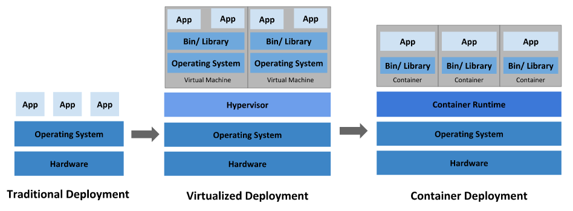
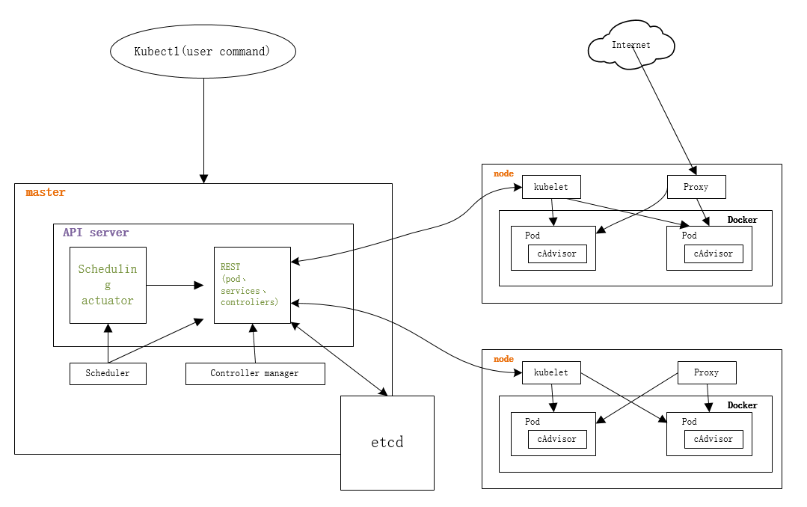
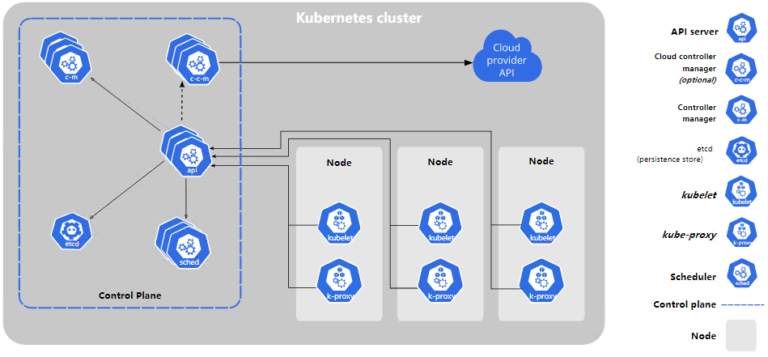
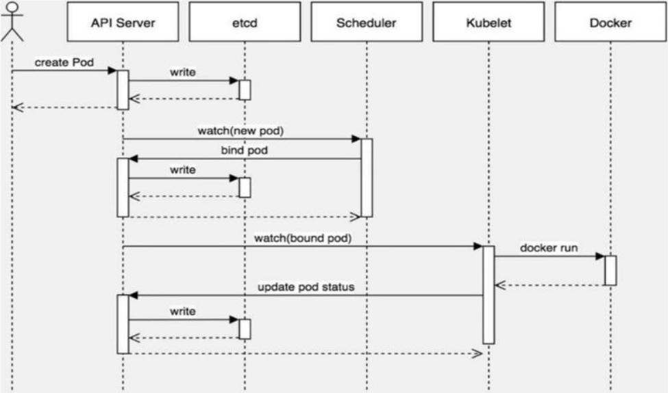
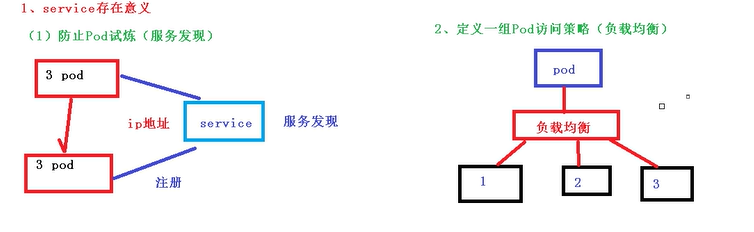
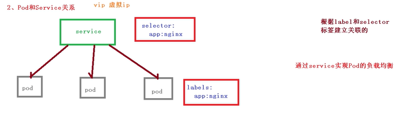
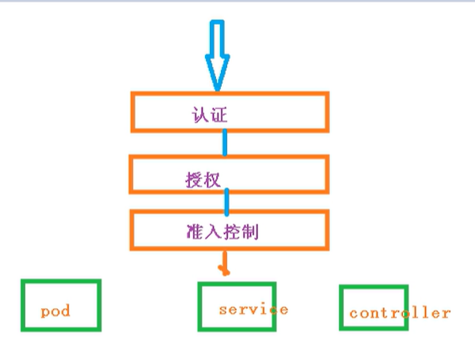
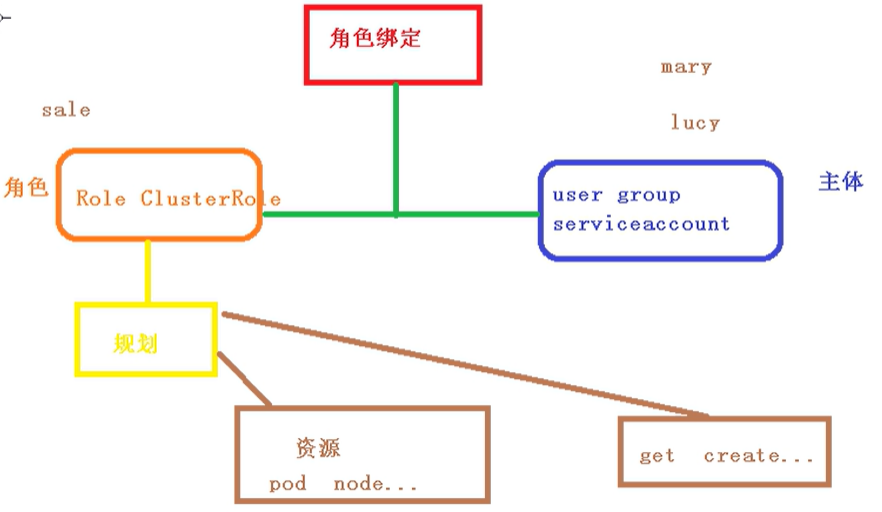
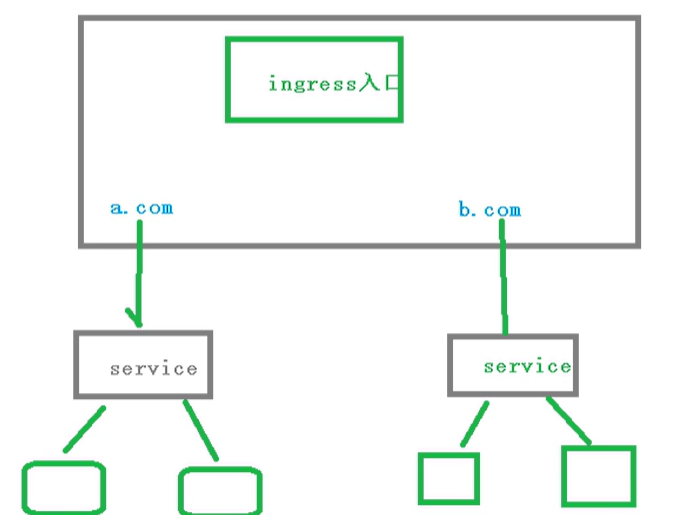
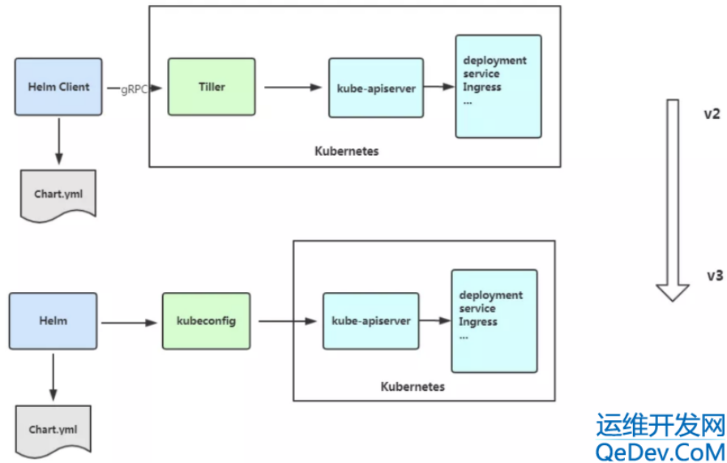

# Kubernetes

[toc]

## 1. Kubernetes介绍

### 1.1 Kubernetes 是什么？

Kubernetes 是 Google 团队发起的开源项目，它的目标是管理跨多个主机的容器，提供基本的部署，维护以及应用伸缩，主要实现语言为 Go 语言。

Kubernetes 是一个可移植的、可扩展的开源平台，用于管理容器化的工作负载和服务，可促进声明式配置和自动化。 Kubernetes 拥有一个庞大且快速增长的生态系统。Kubernetes 的服务、支持和工具广泛可用。

Kubernetes 源于希腊语，意为“舵手”或“飞行员”。Google 在 2014 年开源了 Kubernetes 项目。 Kubernetes 建立在 Google 在大规模运行生产工作负载方面拥有十几年的经验 的基础上，结合了社区中最好的想法和实践。

Kubernetes 是：

- 易学：轻量级，简单，容易理解
- 便携：支持公有云，私有云，混合云，以及多种云平台
- 可拓展：模块化，可插拔，支持钩子，可任意组合
- 自修复：自动重调度，自动重启，自动复制


官方地址：https://kubernetes.io/

官方文档：https://kubernetes.io/zh/docs/home/


Kubernetes，简称k8s，是用8代替8个字符“ubrnete”而成的缩写。是一个开源的，用于管理云平台中多个主机上的容器化的应用，Kubernetes的目标是让部署容器化的应用简单并且高校（powerful），Kubernetes提供了应用部署，规划，更新，维护的一种机制。

传统的应用部署方式是通过插件或者脚本来安装应用。这样做的缺点是应用的运行、配置、管理、所有生存周期将于当前操作系统绑定，这样做并不利于应用的升级更新、回滚等操作，当然也可以通过创建虚拟机的方式来实现某些功能，但是虚拟机非常重，并不利于可移植性。

新的方式是通过部署容器方式实现，每个容器之间互相隔离，每个容器有自己的文件系统，容器之间进程不会互相影响，能区分计算资源。相对于虚拟机，容器能快速部署，由于容器于底层设置、机器文件系统解耦的，所以它能在不同云、不同版本操作系统间进行迁移。

容器占用资源少、部署快，每个应用可以被打包成一个容器镜像，每个应用于容器间成一对一关系也使容器有更大优势，使用容器可以在build或release的阶段，为应用创建容器镜像，因为每个应用不需要于其余的应用堆栈组合，也不依赖于生产环境基础结果，这使得从研发到测试、生产能提供一致环境。类似地，容器比虚拟机轻量、更透明，这更便于监控和管理。


**回顾应用程序部署方式**




​	**传统部署时代：**

早期，组织在物理服务器上运行应用程序。无法为物理服务器中的应用程序定义资源边界，这会导致资源分配问题。 例如，如果在物理服务器上运行多个应用程序，则可能会出现一个应用程序占用大部分资源的情况， 结果可能导致其他应用程序的性能下降。 一种解决方案是在不同的物理服务器上运行每个应用程序，但是由于资源利用不足而无法扩展， 并且组织维护许多物理服务器的成本很高。


​	**虚拟化部署时代：**

作为解决方案，引入了虚拟化。虚拟化技术允许你在单个物理服务器的 CPU 上运行多个虚拟机（VM）。 虚拟化允许应用程序在 VM 之间隔离，并提供一定程度的安全，因为一个应用程序的信息 不能被另一应用程序随意访问。虚拟化技术能够更好地利用物理服务器上的资源，并且因为可轻松地添加或更新应用程序 而可以实现更好的可伸缩性，降低硬件成本等等。每个 VM 是一台完整的计算机，在虚拟化硬件之上运行所有组件，包括其自己的操作系统。


​	**容器部署时代：**

容器类似于 VM，但是它们具有被放宽的隔离属性，可以在应用程序之间共享操作系统（OS）。 因此，容器被认为是轻量级的。容器与 VM 类似，具有自己的文件系统、CPU、内存、进程空间等。 由于它们与基础架构分离，因此可以跨云和 OS 发行版本进行移植。

容器因具有许多优势而变得流行起来。下面列出的是容器的一些好处：

- 敏捷应用程序的创建和部署：与使用 VM 镜像相比，提高了容器镜像创建的简便性和效率。
- 持续开发、集成和部署：通过快速简单的回滚（由于镜像不可变性），支持可靠且频繁的容器镜像构建和部署。
- 关注开发与运维的分离：在构建/发布时而不是在部署时创建应用程序容器镜像， 从而将应用程序与基础架构分离。
- 可观察性不仅可以显示操作系统级别的信息和指标，还可以显示应用程序的运行状况和其他指标信号。
- 跨开发、测试和生产的环境一致性：在便携式计算机上与在云中相同地运行。
- 跨云和操作系统发行版本的可移植性：可在 Ubuntu、RHEL、CoreOS、本地、 Google Kubernetes Engine 和其他任何地方运行。
- 以应用程序为中心的管理：提高抽象级别，从在虚拟硬件上运行 OS 到使用逻辑资源在 OS 上运行应用程序。
- 松散耦合、分布式、弹性、解放的微服务：应用程序被分解成较小的独立部分， 并且可以动态部署和管理 - 而不是在一台大型单机上整体运行。
- 资源隔离：可预测的应用程序性能。
- 资源利用：高效率和高密度。


**为什么需要Kubernetes，它能做什么**

容器是打包何运行应用程序的好方式。在生产环境中，你需要管理运行应用程序的容器，并确保不会停机。例如，如果一个容器发送故障，则需要启动另一个容器。如果系统处理此行为，会不会更容易？

这就是Kubernetes来解决这些问题的方法。Kubernetes为你提供了一个可弹性运行分布式系统的框架。Kubernetes会满足你的扩展要求、故障转移、部署模式等。例如，Kubernetes可以轻松管理系统的Canary部署。

**Kubernetes的特性：**

- **服务发现和负载均衡**

  Kubernetes可以使用DNS名称或自己的IP地址公开容器，如果进入容器的流量很大，Kubernetes可以负载均衡并分配网络流量，从而使部署稳定。

- **存储编排**

  Kubernetes允许你自动挂载你选择的存储系统，例如本地存储、公共云提供商等。

- **自动部署和回滚**

  你可以使用Kubernetes描述已部署容器的所需状态，它可以以受控的速率将实际状态更改为期望状态。例如，你可以自动化Kubernetes来为你的部署创建新容器，删除现有容器并将它们的所有资源用于新容器。

- **自动完成装箱技术**

  Kubernetes允许你指定每个容器所需CPU和内存(RAM)。当容器指定了资源请求时，Kubernetes可以做出更好的决策来管理容器的资源。

- **自我修复**

  Kubernetes重新启动失败的容器、替换容器、杀死不响应用户定义的运行状况检查的容器，并且在准备好服务之前不将其通告给客户端。

- **密钥与配置管理**

  Kubernetes允许你存储和管理敏感信息，例如密码、OAuth令牌和ssh密码。你可以在不重建容器镜像的情况下部署和更新密钥和应用程序配置，也无需在堆栈配置中暴露密钥。

- **水平扩展**

  通过简单的命令、用户UI界面或基于CPU等资源使用情况，对应用容器进行规模扩大或规模剪裁

- **滚动更新和版本回退**

  可以根据应用的变化，对应用容器运行的应用，进行一次性或批量式更新和历史版本即时回退。

- **批处理**

  提供一次性能任务，定时任务，满足批量数据处理和分析的场景


**Kubernetes 不是什么**

Kubernetes不是传统的、包罗万象的PaaS(平台即服务)系统。由于Kubernetes在容器级别而不是在硬件级别运行，它提供了PaaS产品共有的一些普通适用的功能，例如部署、扩展、负载均衡、日志记录和监视。但是，Kubernetes部署单体系统，默认解决方案都是可选和可以插拔的。Kubernetes提供了构建开发人员平台的基础，但是在重要的地方保留了用户的选择和灵活性。

Kubernetes：

- 不限制支持的应用程序类型。Kubernetes旨在支持及其多种多样的工作负载，包括无状态、有状态和数据处理工作负载。如果应用程序可以在容器中运行，那么它应该可以在Kubernetes上很好的运行。
- 不部署源代码，也不构建你的应用程序。持续集成(CI)、交付和部署(CI/CD)工作流取决于组织的文化和偏好以及技术要求。
- 不提供应用程序级别的服务作为内置服务，例如中间件、数据处理框架、数据库、缓存、集群存储系统。这样的组件可以在Kubernetes上运行，并且或者可以由运行在Kubernetes上的应用程序通过可以移植机制来访问。
- 不要求日志记录、监视或警报解决方案。它提供了一些集成作为概念证明，并提供了收集和导出指标的机制。
- 不提供或不要钱配置语音系统，它提供了声明性API，该声明性API可以由任意形式的声明性规范所构成。
- 不提供也不采用任何全面的机器配置、维护、管理或自我修复系统。
- 此外，kubernetes不仅仅是一个编排系统，实际上它消除了编排的需要。编排的技术定义是执行已定义的流程：首先执行A，然后执行B，再执行C。相比下，Kubernetes包含一组独立的、可组合控制过程，这些连续地将当前状态驱动所提供的所需状态。如何从A到C的方式无关紧要，也不需要集中控制，这使得系统更易于使用且功能更强大、系统更健壮、更为弹性和可扩展。


### 1.2 基本概念

节点（Node）：一个节点是一个运行 Kubernetes 中的主机。
容器组（Pod）：一个 Pod 对应于由若干容器组成的一个容器组，同个组内的容器共享一个存储卷(volume)。
容器组生命周期（pos-states）：包含所有容器状态集合，包括容器组状态类型，容器组生命周期，事件，重启策略，以及 replication controllers。
Replication Controllers：主要负责指定数量的 pod 在同一时间一起运行。
服务（services）：一个 Kubernetes 服务是容器组逻辑的高级抽象，同时也对外提供访问容器组的策略。
卷（volumes）：一个卷就是一个目录，容器对其有访问权限。
标签（labels）：标签是用来连接一组对象的，比如容器组。标签可以被用来组织和选择子对象。
接口权限（accessing_the_api）：端口，IP 地址和代理的防火墙规则。
web 界面（ux）：用户可以通过 web 界面操作 Kubernetes。
命令行操作（cli）：kubectl命令。


**云计算发展经历**

- **IaaS**   Infrastructure as a Service  基础设施即服务      阿里云
- **Paas**  Platform as a Service    平台即服务      新浪云
- **SaaS**  Software as a Service    软件即服务     Office365


### 1.3 集群架构与组件



可见，Kubernetes 首先是一套分布式系统，由多个节点组成，节点分为两类：一类是属于管理平面的主节点/控制节点（Master Node）；一类是属于运行平面的工作节点（Worker Node）。
显然，复杂的工作肯定都交给控制节点去做了，工作节点负责提供稳定的操作接口和能力抽象即可。
从这张图上，我们没有能发现 Kubernetes 中对于控制平面的分布式实现，但是由于数据后端自身就是一套分布式的数据库 Etcd，因此可以很容易扩展到分布式实现。




**控制平面组件 Control Plane（master组件）**

- **kube-apiserver** 

Kubernetes API，集群的统一入口，各组件协调者，以RESTfulAPI提供接口服务，所有对象资源的增删改查和监听操作都交给APIServer处理后再交给Etcd存储。

- **Kube-controller-manager** 

处理集群中常规后台任务，一个资源对应一个控制器，而ControllerManager就是负载管理这些控制器的。

- **kube-scheduler** 

根据调度算法为新创建的Pod选择一个Node节点，可以任务部署，可以部署在同一个节点上，也可以部署在不同的节点上。

- **etcd** 

分布式键值存储。用于保存集群状态数据，比如Pod、Service等对象信息。


**Node组件**

- **kubelet** 

kubelet是Master在Node节点上的Agent，管理本机运行容器的生命周期。比如创建容器、Pod挂载数据卷、下载secret、后去容器和节点状态等工作。Kubelet将每个Pod转换成一组容器。

- **kube-proxy** 

在Node节点上实现Pod网络代理维护网络规则和四层负载均衡工作。

- **docker或rocket** 

容器引擎，运行容器


### 1.4 核心概念

**Pod**

- 是kubernetes最小部署单元
- 一组容器的集合
- 共享网络
- 生命周期是短暂的


**Controller**

- 确保预期的pod副本数量
- 无状态应用部署
- 有状态应用部署
- 确保所有node运行同一个pod
- 一次性任务和定时任务


**Service**

- 定义一组pod的访问的规则


### 1.5 部署的两种方式

- **kubeadmin**

Kubeadm是一个工具，提供kubeadmin init和kubeadm join，用于快速部署Kubernetes集群。

部署文档：https://kubernetes.io/zh/docs/setup/production-environment/tools/kubeadm/install-kubeadm/


- **二进制包**

推荐，从官方下载发行版的二进制包，手动部署每个组件，组成Kubernetes集群。掌握部署过程每个组件的情况，更利于掌握。

下载地址：https://github.com/kubernetes/kubernetes/blob/master/CHANGELOG/CHANGELOG-1.18.md


- minikube

minikube是一个工具，可以在本地快事运行一个单点的kubernetes，仅用于尝试kubernetes或者日常开发的用户使用。

部署地址：https://minikube.sigs.k8s.io/docs/start/


## 2. 环境准备

### 2.1 环境列表

| 主机名 | 角色                   | IP地址         | 组件                                          |
| ------ | ---------------------- | -------------- | --------------------------------------------- |
| node1  | master                 | 172.16.103.111 | apiserver、ontroller-manager、scheduler、etcd |
| node2  | master                 | 172.16.103.112 | apiserver、ontroller-manager、scheduler       |
| node3  | node                   | 172.16.103.113 | kubelet、proxy、docker、etcd                  |
| node4  | node                   | 172.16.103.114 | kubelet、proxy、docker、etcd                  |
| node5  | Load Banlancer(master) | 172.16.103.115 | nginx L4   (172.16.103.110-vip)               |
| node6  | Load Banlancer(backup) | 172.16.103.116 | nginx L4   (172.16.103.110-vip)               |

### 2.2 版本介绍

```shell
// 系统版本
[root@node1 ~]# cat /etc/redhat-release 
CentOS Linux release 7.6.1810 (Core)

// 内核
[root@node1 ~]# uname -r
3.10.0-957.el7.x86_64

// k8s版本
kubernetes v1.18.0
```

### 2.3 组网架构


## 3.  先决条件

### 2.1 禁用交换分区

```shell
// 所以节点执行
swapoff -a   # 临时
vim /etc/fstab	#永久
    #/mnt/swap swap swap defaults 0 0

sed -ri 's/.*swap.*/#&/' /etc/fstab
```

### 2.2 主机解析

```shell
// 主机名
hostnamectl set-hostname node1


// 主机解析
cat > /etc/hosts <<EOF
127.0.0.1   localhost localhost.localdomain localhost4 localhost4.localdomain4
::1         localhost localhost.localdomain localhost6 localhost6.localdomain6
172.16.103.111 node1
172.16.103.112 node2
172.16.103.113 node3
172.16.103.114 node4
172.16.103.115 node5
172.16.103.116 node6
EOF
```

### 2.3 修改内核

将桥接的IPv4流量传递到iptables的链

```shell
// 所有节点
// br_netfilter模块
# 默认是开启的，可以通过lsmod | grep br_netfilter来查看
# 使用 modprobe br_netfilter加载

// 配置内核参数
cat > /etc/sysctl.d/k8s.conf <<EOF
net.bridge.bridge-nf-call-ip6tables = 1
net.bridge.bridge-nf-call-iptables = 1
net.ipv4.ip_forward = 1
EOF

sysctl --system
```

### 2.4 安全设置

```shell
// 关闭selinux
sed -i 's/SELINUX=enforcing/SELINUX=disabled/g' /etc/seliunx/conf

setenforce 0
getenforce

// 关闭防火墙
systemctl stop firewalld.service
systemctl disable firewalld.service
```

### 2.5 时间同步

```shell
echo "*/5 * * * * /usr/sbin/ntpdate ntp.aliyun.com >/dev/null 2>&1" >/var/spool/cron/root
```

### 2.6 ssh免密

```shell
ssh-keygen
ssh-copy-id node1
ssh-copy-id node2
ssh-copy-id node3
```


## 4. Kubeadm Deploy Kubernetes

部署Kubernetes，先部署Dokcer

### 4.1 Install Docker-ce

```shell
/ 所有节点执行,
// 清除旧版本
yum remove docker docker-client docker-client-latest docker-common docker-latest docker-latest-logrotate docker-logrotate docker-engine

// 常用工具
yum install vim bash-completion net-tools gcc wget -y

// yum工具
yum install -y yum-utils device-mapper-persistent-data lvm2

// 安装docker-ce源
yum-config-manager --add-repo https://mirrors.aliyun.com/docker-ce/linux/centos/docker-ce.repo

// 安装最新版docker-ce
yum -y install docker-ce docker-ce-cli containerd.io

// 指定版本安装docker-ce
yum list docker-ce --showduplicates | sort -r
# yum install docker-ce-<VERSION STRING>
yum install docker-ce-20.10.1 docker-ce-cli containerd.io

// 启动docker
systemctl enable docker
systemctl start docker
systemctl status docker

// 测试
docker run hello-world

// 配置镜像加速器
mkdir -p /etc/docker
tee /etc/docker/daemon.json <<-'EOF'
{
  "registry-mirrors": ["https://wc9koj0u.mirror.aliyuncs.com"]
}
EOF


// 重启docker
systemctl daemon-reload
systemctl restart docker
systemctl status docker


// 卸载docker
yum remove docker-ce docker-ce-cli containerd.io
rm -rf /var/lib/docker
```


### 4.2 Install Kubernetes

- CentOS
```shell
/ 所有节点执行
// k8s源
cat <<EOF > /etc/yum.repos.d/kubernetes.repo
[kubernetes]
name=Kubernetes
baseurl=https://mirrors.aliyun.com/kubernetes/yum/repos/kubernetes-el7-x86_64/
enabled=1
gpgcheck=1
repo_gpgcheck=1
gpgkey=https://mirrors.aliyun.com/kubernetes/yum/doc/yum-key.gpg https://mirrors.aliyun.com/kubernetes/yum/doc/rpm-package-key.gpg
EOF

// 组件说明
# kubeadm：用来初始化集群的指令。
# kubelet：在集群中的每个节点上用来启动 pod 和容器等。
# kubectl：用来与集群通信的命令行工具。


// 部署kubelet kubeadm kubectl
yum install -y --nogpgcheck kubelet kubeadm kubectl

##指定版本安装：yum install -y --nogpgcheck kubelet-1.19.4 kubeadm-1.19.4  kubectl-1.19.4
##卸载 yum remove -y --nogpgcheck kubelet kubeadm kubectl

// 查看版本
kubectl version

// 启动服务
systemctl start kubelet


// 启动ipvs内核模块（centos8不用）
cat > /lib/systemd/system/kubelet.service.d/10-proxy-ipvs.conf  <<EOF
[Service]
ExecStartPre=-/sbin/modprobe ip_vs
ExecStartPre=-/sbin/modprobe ip_vs_rr
ExecStartPre=-/sbin/modprobe ip_vs_wrr
ExecStartPre=-/sbin/modprobe ip_vs_sh
EOF
systemctl daemon-reload
systemctl enable kubelet


/ cgroup 驱动程序
# 使用 docker 时，kubeadm 会自动为其检测 cgroup 驱动并在运行时对 /var/lib/kubelet/kubeadm-flags.env 文件进行配置。
# 如果使用不同的 CRI（容器），需要使用 cgroup-driver 值修改 /etc/default/kubelet 文件（对于 CentOS、RHEL、Fedora，修改 /etc/sysconfig/kubelet 文件）
KUBELET_EXTRA_ARGS=--cgroup-driver=<value>
# 这个文件将由 kubeadm init 和 kubeadm join 使用以获取额外的用户自定义的 kubelet 参数。
# 请注意，需要在 cgroup 驱动程序不是 cgroupfs 时这么做，因为它已经是 kubelet 中的默认值。
# 配置完后重启kubelet
systemctl daemon-reload
systemctl restart kubelet
自动检测其他容器运行时的 cgroup 驱动，例如在进程中工作的 CRI-O 和 containerd。
```

- Ubuntu
```shell
# 依赖包
sudo apt-get update
sudo apt-get install -y apt-transport-https ca-certificates curl

# 下载公钥
curl -s https://packages.cloud.google.com/apt/doc/apt-key.gpg | sudo apt-key add -


# apt仓库源
echo "deb https://mirrors.tuna.tsinghua.edu.cn/kubernetes/apt kubernetes-stretch main" | sudo tee /etc/apt/sources.list.d/kubernetes.list

# 安装kubelet、kubeadm、kubectl
sudo apt-get update
sudo apt-get install -y kubelet-1.18 kubeadm-1.18 kubectl-1.18

# 锁定版本
sudo apt-mark hold kubelet kubeadm kubectl
```


### 4.3 kubeadm deploy cluster

使用kubeadm工具创建集群，创建一个符合最佳实践的最小化 Kubernetes 集群。事实上，你可以使用 kubeadm 配置一个通过 Kubernetes 一致性测试 的集群。 kubeadm 还支持其他集群生命周期功能， 例如 启动引导令牌 和集群升级s

#### 4.3.1 初始化集群

```shell
// 初始化集群
kubeadm init \
	--apiserver-advertise-address=172.16.103.101 \
	--image-repository registry.aliyuncs.com/google_containers \
	--pod-network-cidr=10.244.0.0/16 \
	--service-cidr=10.96.0.0/12 \
  --v 5 \
  --ignore-preflight-errors=all
# --pod-network-cidr 10.244.0.0/16 参数与后续 CNI 插件有关，这里以 flannel 为例，若后续部署其他类型的网络插件请更改此参数

//重置初始化
kubeadm reset -f

## 成功执行输出
[addons] Applied essential addon: CoreDNS
[addons] Applied essential addon: kube-proxy

Your Kubernetes control-plane has initialized successfully!

To start using your cluster, you need to run the following as a regular user:

  mkdir -p $HOME/.kube
  sudo cp -i /etc/kubernetes/admin.conf $HOME/.kube/config
  sudo chown $(id -u):$(id -g) $HOME/.kube/config

Alternatively, if you are the root user, you can run:

  export KUBECONFIG=/etc/kubernetes/admin.conf

You should now deploy a pod network to the cluster.
Run "kubectl apply -f [podnetwork].yaml" with one of the options listed at:
  https://kubernetes.io/docs/concepts/cluster-administration/addons/

Then you can join any number of worker nodes by running the following on each as root:

kubeadm join 172.16.103.111:6443 --token wfmcd5.3j904il24dsu26ez \
    --discovery-token-ca-cert-hash sha256:8faa433020658f0dd38f4da6af2e492fb73994c002c15c73b048e4e236a76e25 

// 配置
## 非root账户，请执行如下命令
  mkdir -p $HOME/.kube
  sudo cp -i /etc/kubernetes/admin.conf $HOME/.kube/config
  sudo chown $(id -u):$(id -g) $HOME/.kube/config

## root账户，请执行如下命令
  export KUBECONFIG=/etc/kubernetes/admin.conf	 或
  cp /etc/kubernetes/admin.conf ~/.kube/config


// 加入节点命令
kubeadm join 172.16.103.111:6443 --token wfmcd5.3j904il24dsu26ez \
    --discovery-token-ca-cert-hash sha256:8faa433020658f0dd38f4da6af2e492fb73994c002c15c73b048e4e236a76e25 

// 查看服务
kubectl get all -A

[root@node1 ~]# kubectl get all -A
NAMESPACE     NAME                                READY   STATUS    RESTARTS   AGE
kube-system   pod/coredns-54d67798b7-85t7k        0/1     Pending   0          40m
kube-system   pod/coredns-54d67798b7-fn2pb        0/1     Pending   0          40m
kube-system   pod/etcd-node1                      1/1     Running   0          41m
kube-system   pod/kube-apiserver-node1            1/1     Running   0          41m
kube-system   pod/kube-controller-manager-node1   1/1     Running   0          41m
kube-system   pod/kube-proxy-2wvc4                1/1     Running   0          40m
kube-system   pod/kube-scheduler-node1            1/1     Running   0          41m

NAMESPACE     NAME                 TYPE        CLUSTER-IP   EXTERNAL-IP   PORT(S)                  AGE
default       service/kubernetes   ClusterIP   10.96.0.1    <none>        443/TCP                  41m
kube-system   service/kube-dns     ClusterIP   10.96.0.10   <none>        53/UDP,53/TCP,9153/TCP   41m

NAMESPACE     NAME                        DESIRED   CURRENT   READY   UP-TO-DATE   AVAILABLE   NODE SELECTOR            AGE
kube-system   daemonset.apps/kube-proxy   1         1         1       1            1           kubernetes.io/os=linux   41m

NAMESPACE     NAME                      READY   UP-TO-DATE   AVAILABLE   AGE
kube-system   deployment.apps/coredns   0/2     2            0           41m

NAMESPACE     NAME                                 DESIRED   CURRENT   READY   AGE
kube-system   replicaset.apps/coredns-54d67798b7   2         2         0       40m

// 主节点服务
# apiserver 是整个系统的对外接口，提供 RESTful 方式供客户端和其它组件调用；
# scheduler 负责对资源进行调度，分配某个 pod 到某个节点上；
# controller-manager 负责管理控制器，包括 endpoint-controller（刷新服务和 pod 的关联信息）和 replication-controller（维护某个 pod 的复制为配置的数值）。

// 工作节点服务
# proxy 为 pod 上的服务提供访问的代理。

// 其他服务
# Etcd 是所有状态的存储数据库；
```


#### 4.3.2 CNI网络组件部署

容器网络接口(CNI)，基于pod网络附加组件，使得pod可以相互通信，在安装之前集群CoreDNS将不会启动。在集群初始化时 `kubeadm init` 可以使用参数 `--pod-network-cidr` 来指定。

每一个集群只能安装一个pod网络，安装 Pod 网络后，您可以通过在 ` kubectl get pods --all-namespaces`  输出中检查 CoreDNS Pod 是否 Running 来确认其是否正常运行。 一旦 CoreDNS Pod 启用并运行，你就可以继续加入节点。

Flannel 
Flannel 是一个非常简单的能够满足 Kubernetes 所需要的覆盖网络。已经有许多人报告了使用 Flannel 和 Kubernetes 的成功案例

> 关于CNI支持网络模型：https://kubernetes.io/zh/docs/concepts/cluster-administration/addons/

```shell
// 检查podCIDR设置
kubectl get node -o yaml | grep CIDR
# 输出
    podCIDR: 10.244.0.0/24
    podCIDRs:

// 查看coreDNS是否未running
kubectl get pods --all-namespaces
# 输出
NAMESPACE     NAME                            READY   STATUS    RESTARTS   AGE
kube-system   coredns-54d67798b7-85t7k        0/1     Pending   0          17h
kube-system   coredns-54d67798b7-fn2pb        0/1     Pending   0          17h

// 部署flannel
kubectl apply -f https://github.com/coreos/flannel/blob/master/Documentation/kube-flannel.yml
# 这里执行时会报错，一般直接下载kube-flannel.yml文件，到本地在执行，如下执行结果

[root@node1 ~]# kubectl apply -f flannel.yml 
podsecuritypolicy.policy/psp.flannel.unprivileged created
clusterrole.rbac.authorization.k8s.io/flannel configured
clusterrolebinding.rbac.authorization.k8s.io/flannel configured
serviceaccount/flannel unchanged
configmap/kube-flannel-cfg configured
daemonset.apps/kube-flannel-ds created
```


#### 4.3.3  解除master不能运行pod

如果用 kubeadm 部署一个单节点集群，默认情况下无法使用，请执行以下命令解除限制。

```shell
// 设置
kubectl taint nodes --all node-role.kubernetes.io/master-
# 输出
	node/node1 untainted
# 这将从任何拥有 node-role.kubernetes.io/master taint 标记的节点中移除该标记， 包括控制平面节点，这意味着调度程序将能够在任何地方调度 Pods。

// 查看
kubectl describe node node01 |grep Taints

// 恢复默认值
kubectl taint nodes node1 node-role.kubernetes.io/master=true:NoSchedule
```


#### 4.3.4 加入新节点

节点是你的工作负载（容器和 Pod 等）运行的地方。

```shell
// 命令格式
kubeadm join --token <token> <control-plane-host>:<control-plane-port> --discovery-token-ca-cert-hash sha256:<hash>

// 加入node2,node3
# 在node2,node3上执行，也可以从node1节点上ssh node1
kubeadm join 172.16.103.111:6443 --token wfmcd5.3j904il24dsu26ez \
    --discovery-token-ca-cert-hash sha256:8faa433020658f0dd38f4da6af2e492fb73994c002c15c73b048e4e236a76e25 

// 查看集群
# 在master上执行
kubectl get nodes
```

 token令牌，如果没有令牌，可以通过在控制平面节点上运行。

```shell
// 获取token
kubeadm token list
```

默认情况下，令牌会在24小时后过期。如果要在当前令牌过期后将节点加入集群， 则可以通过在控制平面节点上运行命令来创建新令牌。

```shell
// 创建token
kubeadm token create
```

如果没有 --discovery-token-ca-cert-hash 的值，则可以通过在控制平面节点上执行命令链来获取它

```shell
openssl x509 -pubkey -in /etc/kubernetes/pki/ca.crt | openssl rsa -pubin -outform der 2>/dev/null | openssl dgst -sha256 -hex | sed 's/^.* //'

# 输出
	8faa433020658f0dd38f4da6af2e492fb73994c002c15c73b048e4e236a76e25
```

加入集群运行输出信息

```shell
[root@node3 ~]# kubeadm join 172.16.103.111:6443 --token wfmcd5.3j904il24dsu26ez \
>     --discovery-token-ca-cert-hash sha256:8faa433020658f0dd38f4da6af2e492fb73994c002c15c73b048e4e236a76e25 

[preflight] Running pre-flight checks
	[WARNING IsDockerSystemdCheck]: detected "cgroupfs" as the Docker cgroup driver. The recommended driver is "systemd". Please follow the guide at https://kubernetes.io/docs/setup/cri/
	[WARNING SystemVerification]: this Docker version is not on the list of validated versions: 20.10.1. Latest validated version: 19.03
	[WARNING Service-Kubelet]: kubelet service is not enabled, please run 'systemctl enable kubelet.service'
[preflight] Reading configuration from the cluster...
[preflight] FYI: You can look at this config file with 'kubectl -n kube-system get cm kubeadm-config -o yaml'
[kubelet-start] Writing kubelet configuration to file "/var/lib/kubelet/config.yaml"
[kubelet-start] Writing kubelet environment file with flags to file "/var/lib/kubelet/kubeadm-flags.env"
[kubelet-start] Starting the kubelet
[kubelet-start] Waiting for the kubelet to perform the TLS Bootstrap...

This node has joined the cluster:
* Certificate signing request was sent to apiserver and a response was received.
* The Kubelet was informed of the new secure connection details.

Run 'kubectl get nodes' on the control-plane to see this node join the cluster.
```


#### 4.3.5 扩展控制节点

为了使 kubectl 在其他计算机上与你的集群通信， 你需要将管理员 kubeconfig 文件从控制平面节点复制到工作站

```shell
// 命令格式
scp root@<control-plane-host>:/etc/kubernetes/admin.conf .
kubectl --kubeconfig ./admin.conf get nodes

// 执行scp
scp root@node1:/etc/kubernetes/admin.conf .
kubectl --kubeconfig ./admin.conf get nodes

# 可将admin.conf 复制到 ~/.kube/config
cp admin.conf ~/.kube/config

kubectl get nodes
```

如果要从集群外部连接到 API 服务器，则可以使用 kubectl proxy

```shell
scp root@<control-plane-host>:/etc/kubernetes/admin.conf .
kubectl --kubeconfig ./admin.conf proxy

# 你现在可以在本地访问API服务器 http://localhost:8001/api/v1
```


#### 4.3.6 清理集群

```shell
// 删除节点
kubectl drain <node name> --delete-local-data --force --ignore-daemonsets
kubectl delete node <node name>

// 清理集群
kubeadm reset
# 尽最大努力还原通过 'kubeadm init' 或者 'kubeadm join' 操作对主机所做的更改

// etcd清理
etcdctl del "" --prefix
# 如果使用了外部 etcd，kubeadm reset 将不会删除任何 etcd 中的数据。这意味着，如果再次使用相同的 etcd 端点运行 kubeadm init，你将看到先前集群的状态。
```


#### 4.3.8 kube-dashboard

**4.3.8.1 部署dashboard**

```shell
// 国外地址
kubectl apply -f https://raw.githubusercontent.com/kubernetes/dashboard/v2.1.0/aio/deploy/recommended.yaml

// 下载yml文件，本地执行
[root@node1 ~]# kubectl apply -f dashboard.yml 
namespace/kubernetes-dashboard created
serviceaccount/kubernetes-dashboard created
service/kubernetes-dashboard created
secret/kubernetes-dashboard-certs created
secret/kubernetes-dashboard-csrf created
secret/kubernetes-dashboard-key-holder created
configmap/kubernetes-dashboard-settings created
role.rbac.authorization.k8s.io/kubernetes-dashboard created
clusterrole.rbac.authorization.k8s.io/kubernetes-dashboard created
rolebinding.rbac.authorization.k8s.io/kubernetes-dashboard created
clusterrolebinding.rbac.authorization.k8s.io/kubernetes-dashboard created
deployment.apps/kubernetes-dashboard created
service/dashboard-metrics-scraper created
deployment.apps/dashboard-metrics-scraper created


// 删除用户
kubectl -n kubernetes-dashboard delete serviceaccount admin-user
kubectl -n kubernetes-dashboard delete clusterrolebinding admin-user
```


**4.3.8.2  部署token(RBAC)**

> 参考：[Creating sample user](https://github.com/kubernetes/dashboard/blob/master/docs/user/access-control/creating-sample-user.md)

```shell
// 创建用户
cat <<EOF | kubectl apply -f -
apiVersion: v1
kind: ServiceAccount
metadata:
  name: admin-user
  namespace: kubernetes-dashboard
EOF

// 绑定角色
cat <<EOF | kubectl apply -f -
apiVersion: rbac.authorization.k8s.io/v1
kind: ClusterRoleBinding
metadata:
  name: admin-user
roleRef:
  apiGroup: rbac.authorization.k8s.io
  kind: ClusterRole
  name: cluster-admin
subjects:
- kind: ServiceAccount
  name: admin-user
  namespace: kubernetes-dashboard
EOF
# 或将以上保存为yml文件
# 在通过执行kubectl apply -f dashborad-admin.yml

// 获取token
kubectl -n kubernetes-dashboard describe secret $(kubectl -n kubernetes-dashboard get secret | grep admin-user | awk '{print $1}')

# 输出
Name:         admin-user-token-bhc6v
Namespace:    kubernetes-dashboard
Labels:       <none>
Annotations:  kubernetes.io/service-account.name: admin-user
              kubernetes.io/service-account.uid: 3db23e39-82d8-4576-8bd0-db38af6c5382

Type:  kubernetes.io/service-account-token

Data
====
ca.crt:     1066 bytes
namespace:  20 bytes
token:      eyJhbGciOiJSUzI1NiIsImtpZCI6Im84ZGp4dFdtTTVudHNSb21uQWMwS1VXdExzc2RpNHBJeTY2VWN2cGNiWm8ifQ.eyJpc3MiOiJrdWJlcm5ldGVzL3NlcnZpY2VhY2NvdW50Iiwia3ViZXJuZXRlcy5pby9zZXJ2aWNlYWNjb3VudC9uYW1lc3BhY2UiOiJrdWJlcm5ldGVzLWRhc2hib2FyZCIsImt1YmVybmV0ZXMuaW8vc2VydmljZWFjY291bnQvc2VjcmV0Lm5hbWUiOiJhZG1pbi11c2VyLXRva2VuLWJoYzZ2Iiwia3ViZXJuZXRlcy5pby9zZXJ2aWNlYWNjb3VudC9zZXJ2aWNlLWFjY291bnQubmFtZSI6ImFkbWluLXVzZXIiLCJrdWJlcm5ldGVzLmlvL3NlcnZpY2VhY2NvdW50L3NlcnZpY2UtYWNjb3VudC51aWQiOiIzZGIyM2UzOS04MmQ4LTQ1NzYtOGJkMC1kYjM4YWY2YzUzODIiLCJzdWIiOiJzeXN0ZW06c2VydmljZWFjY291bnQ6a3ViZXJuZXRlcy1kYXNoYm9hcmQ6YWRtaW4tdXNlciJ9.IOOi7DYKBsfn-13JpRIuHY5AouN__73qSjCOdBM8oJc4uAa1moGe_Rm1qcalgt3ye5P3EEGwr6-uPavN4Sw_oDWXZZ78Ydj94RCNGxYktmlOHwmDMQdeDCNS-LQYrqWxs_h6oBWo0saJ_3ObG3dcyHRWGadBlhA0j0MnAdfxEjWwJB7S_iWDnR4XZ_7VZhNUs80va8Lgh8ltTSbET3Vch53KNgg6cQjuioy1ima0Y1N8VdB2ao6T3_GJfwDCNW4bPrwZISorHoo0heXAxEth2HMxXH749uP-Ba1A5Kyrbqze5C9HRtzEGV-1eAUoKy_mpt3JYI34Woy7N9d19mKcpQ
```


**4.3.8.3 Dashboarh访问**

官方给出的多种访问方式部署方法，这里分别介绍并部署实践。

**proxy** 代理访问方式，只能通过本机访问，很蹩脚的一种方式，Linux系统一般不会部署图形化桌面，如何在本机浏览网页呢，一般还是适合开发环境。

**port-forward** 端口转发方式，是在proxy代理访问的基础上，设置端口转发，将代理地址暴露给外网，这样则可以通过集群以外的主机来访问Dashboarh。

**NodePort** 自动生成端口方式，这是方式是更改dashboard的访问规则，使其自动生成代理端口。与port-forward不同的是它不需要proxy的支持，而是自动关联代理。

**API Server** API服务公开方式，如果Kubernetes API server是公开的，并可以从外部访问，那我们可以直接使用API Server的方式来访问，也是比较推荐的方式。

**Ingress** 方向代理方式，Ingress将开源的反向代理负载均衡器（如 Nginx、Apache、Haproxy等）与k8s进行集成，并可以动态的更新Nginx配置等，是比较灵活，更为推荐的暴露服务的方式，但也相对比较复杂。

> 参考：[Accessing Dashboard](https://github.com/kubernetes/dashboard/blob/master/docs/user/accessing-dashboard/README.md#login-not-available)


**proxy**

proxy最为简单，只需执行 `kubectl proxy` 即可启动代理访问，这里不做详细介绍。


**port-forward**

port-forward是在proxy基础上配置端口转发的。这里再 `node3` 节点上执行。

设置proxy代理

```bash
kubectl proxy --address='0.0.0.0' --port=8001 --accept-hosts='^*$'
```

> 注意：
> --address='0.0.0.0'   表示允许所有IP来访
> --accept-hosts='^*$' 表示允许所有主机来访
> --port=8001 指定端口，默认8001
>
> 这里有个疑问，按照这个命令执行是不是直接就可以访问呢，答案是不可以的。Dashboard拒接非本机与http的方式访问，非本机只能允许与https方式访问。如下提示
>
> ```bash
> ## 获取地址，但在这里访问有提示“检测到不安全的访问，无法登陆”。
> https://172.16.103.113:8001/api/v1/namespaces/kubernetes-dashboard/services/https:kubernetes-dashboard:/proxy/
> ```

配置端口转发

```bash
kubectl port-forward --address='0.0.0.0' -n kubernetes-dashboard service/kubernetes-dashboard 8080:443
```

> 获取访问IP
>
> ```bash
> https://172.16.103.113:8080
> ```


**NodePort**

仅在单节点设置中的开发环境中才建议使用这种访问Dashboard的方式。

编辑 `Kubernetes-dashboard` 服务

```bash
kubectl -n kubernetes-dashboard edit service kubernetes-dashboard
```

该文件是yaml格式表示，将 `type: ClusterIP` 修改为 `type: NodePort`  保存。

```bash
# Please edit the object below. Lines beginning with a '#' will be ignored,
# and an empty file will abort the edit. If an error occurs while saving this file will be
# reopened with the relevant failures.
#
apiVersion: v1
...
  name: kubernetes-dashboard
  namespace: kubernetes-dashboard
  resourceVersion: "227778"
  uid: c6634b70-02cd-4e30-9fee-9d1e27e4d9f3
spec:
  clusterIP: 10.106.246.5
  clusterIPs:
  - 10.106.246.5
  externalTrafficPolicy: Cluster
  ports:
  - nodePort: 32251
    port: 443
    protocol: TCP
    targetPort: 8443
  selector:
    k8s-app: kubernetes-dashboard
  sessionAffinity: None
  type: NodePort
status:
  loadBalancer: {}
```

查看dashborad自动生成的端口

```bash
[root@node1 ~]# kubectl -n kubernetes-dashboard get service kubernetes-dashboard
NAME                   TYPE       CLUSTER-IP     EXTERNAL-IP   PORT(S)         AGE
kubernetes-dashboard   NodePort   10.106.246.5   <none>        443:32251/TCP   6h4m
```

Dashboard已经在32251端口上公开，现在可以在外部使用https://<cluster-ip>:32251进行访问。

> 注意：在多节点的集群中，任何节点的IP地址都可以访问Dashboard。例如，访问IP 
>
> ```bash 
> https://172.16.103.113:32251/
> ```


**API Server** 

API Server 访问连接地址为：

```bash
https://<master-ip>:<apiserver-port>/api/v1/namespaces/kubernetes-dashboard/services/https:kubernetes-dashboard:/proxy/
```

而API Server的默认端口为6443，可通过 `kubectl cluster-info` 查看。 在根据当前环境，访问地址如下：

```bash
https://172.16.103.111:6443/api/v1/namespaces/kubernetes-dashboard/services/https:kubernetes-dashboard:/proxy/
```

> 但是返回的结果可能如下：
>
> ```bash
> {
>   "kind": "Status",
>   "apiVersion": "v1",
>   "metadata": {
>     
>   },
>   "status": "Failure",
>   "message": "services \"https:kubernetes-dashboard:\" is forbidden: User \"system:anonymous\" cannot get resource \"services/proxy\" in API group \"\" in the namespace \"kubernetes-dashboard\"",
>   "reason": "Forbidden",
>   "details": {
>     "name": "https:kubernetes-dashboard:",
>     "kind": "services"
>   },
>   "code": 403
> }
> ```
>
> 这是因为最新的Kubernetes默认启用了RBAC，并为未认证用户赋予了一个默认的身份anonymous。

对于API Server来，它是使用证书进行认证的，所有我们需要先创建一个证书。首先我们找到kubectl命令的配置文件，默认情况下在/etc/kubernetes/admin.conf。之前我们已经复制到了~.kube/config中。

然后我们使用 `client-certificate-data` 和 `client-key-data` 生成一个p12文件。

```bash
# 生成client-certificate-data
grep 'client-certificate-data' ~/.kube/config | head -n 1 | awk '{print $2}' | base64 -d >> kubecfg.crt

# 生成client-key-data
grep 'client-key-data' ~/.kube/config | head -n 1 | awk '{print $2}' | base64 -d >> kubecfg.key

# 生成p12
openssl pkcs12 -export -clcerts -inkey kubecfg.key -in kubecfg.crt -out kubecfg.p12 -name "kubernetes-client"
```

最后在将p12导入到浏览器的主机上。注意导入时选择证书存储为“个人”。重启浏览器即可看到首页了。


**Ingress** 

<待补充>


#### 4.3.9  测试

在Kubernetes集群中创建一个pod，验证是否正常运行

```shell
# 命令
kubectl create deployment nginx --image=nginx
kubectl expose deployment nginx --port=80 --type=NodePort
kubectl get pod,svc

# 执行过程
[root@node1 kube-system]# kubectl create deployment nginx --image=nginx
deployment.apps/nginx created

[root@node1 kube-system]# kubectl get pod
NAME                     READY   STATUS    RESTARTS   AGE
nginx-6799fc88d8-5k9bd   1/1     Running   0          64s

[root@node1 kube-system]# kubectl expose deployment nginx --port=80 --type=NodePort
service/nginx exposed

[root@node1 kube-system]# kubectl get pod,svc
NAME                         READY   STATUS    RESTARTS   AGE
pod/nginx-6799fc88d8-5k9bd   1/1     Running   0          2m37s

NAME                 TYPE        CLUSTER-IP      EXTERNAL-IP   PORT(S)        AGE
service/kubernetes   ClusterIP   10.96.0.1       <none>        443/TCP        20m
service/nginx        NodePort    10.111.146.60   <none>        80:30535/TCP   7s


# 任意node的ip加上端口，进行web测试
```


## 5. Binary Deploy Kubernetes

按照模拟环境，手动部署一套Kubernetes集群

注意无特别说明，Kubernetes所有软件默认安装路径为：/opt


### 5.1  自签SSL证书

为Etcd和APIServer自签证书。

证书分为：自签和权威机构证书


**使用cfssl工具自签证书**

cfssl官方：https://github.com/cloudflare/cfssl

cfssl下载：https://github.com/cloudflare/cfssl/releases/tag/v1.5.0

- 安装cfssl工具（v1.5版本）

```shell
# 下载三个命令
curl -L https://github.com/cloudflare/cfssl/releases/download/v1.5.0/cfssl_1.5.0_linux_amd64 -o /usr/local/bin/cfssl
curl -L https://github.com/cloudflare/cfssl/releases/download/v1.5.0/cfssljson_1.5.0_linux_amd64 -o /usr/local/bin/cfssljson
curl -L https://github.com/cloudflare/cfssl/releases/download/v1.5.0/cfssl-certinfo_1.5.0_linux_amd64 -o /usr/local/bin/cfssl-certinfo

# 添加权限
chmod +x /usr/local/bin/cfssl*

# 验证
[root@node1 cfssl_linux]# cfssl version
Version: 1.5.0
Runtime: go1.12.12

# 参考使用方法
https://blog.51cto.com/9406836/2407290


# 在这里可以使用命令生成默认ca.json模板
cfssl print-defaults config > ca-config.json
cfssl print-defaults csr > ca-csr.json
```


**Etcd自签证书**

准备三个json文件：`ca-config.json` ， `ca-csr.json` ，`server-csr.json` ，然后在创建pem文件

- ca-config.json，根证书配置文件

```json
{
    "signing":{
        "default":{
            "expiry":"87600h"
        },
        "profiles":{
            "etcd":{
                "expiry":"87600h",
                "usages":[
                    "signing",
                    "key encipherment",
                    "server auth",
                    "client auth"
                ]
            }
        }
    }
}
```

- ca-csr.json，根证书信息

```json
{
    "CN":"etcd",
    "key":{
        "algo":"rsa",
        "size":2048
    },
    "names":[
        {
            "C":"CN",
            "L":"Shanghai",
            "ST":"Shanghai",
            "O":"etcd",
            "OU":"System"
        }
    ]
}
```

- server.json，服务证书信息

```json
{
    "CN": "etcd",
    "hosts": [
        "172.16.103.111",
        "172.16.103.113",
        "172.16.103.114"
    ],
    "key": {
        "algo": "rsa",
        "size": 2048
    },
    "names": [
        {
            "C": "CN",
            "L": "Shanghai",
            "ST": "Shanghai"
        }
    ]
}
```

- 生成pem

```shell
# 创建etcd目录
mkdir /opt/etcd/{bin,ssl,cfg} -p

# 在ssl目录下生成以上三个文件
cd /opt/etcd/ssl

[root@node1 ssl]# ls
ca-config.json  ca-csr.json  server-csr.jso

# 生成pem文件
cfssl gencert -initca ca-csr.json | cfssljson -bare ca -
cfssl gencert -ca=ca.pem -ca-key=ca-key.pem -config=ca-config.json -profile=etcd server-csr.json | cfssljson -bare server

# 查看文件
[root@node1 ssl]# ls
ca-config.json  ca.csr  ca-csr.json  ca-key.pem  ca.pem server.csr  server-csr.json  server-key.pem  server.pem
# 正常情况只要留下所有pem文件即可。其他可以删除。

```


### 5.2 Etcd集群搭建

官方下载：https://github.com/etcd-io/etcd

快速入门：https://www.jianshu.com/p/f68028682192

Etcd数据库有两个二进制命令文件

**etcd:**  服务器程序，用于启动etcd服务

**etcdctl:**  客户端工具，以命令行方式使用

此环境使用etcd版本 `etcd-v3.4.14-linux-amd64.tar.gz`

- 安装etcd ，node1上

```shell
# 解压etcd
tar xf etcd-v3.4.14-linux-amd64.tar.gz

# etcd目录下的文件
[root@node1 etcd-v3.4.14-linux-amd64]# ls
Documentation  etcd  etcdctl  README-etcdctl.md  README.md  READMEv2-etcdctl.md

# 将etcd和etcdclt拷贝到/opt/etcd/bin目录下
[root@node1 bin]# pwd
/opt/etcd/bin
[root@node1 bin]# ls
etcd  etcdctl
```

- 准备etcd的conf文件，  node1上

```shell
# 路径
[root@node1 cfg]# pwd
/opt/etcd/cfg

# 配置文件
cat << EOF | tee /opt/etcd/cfg/etcd.conf
#[Member]
ETCD_NAME="etcd01"
ETCD_DATA_DIR="/var/lib/etcd/default.etcd"
ETCD_LISTEN_PEER_URLS="https://172.16.103.111:2380"
ETCD_LISTEN_CLIENT_URLS="https://172.16.103.111:2379,http://127.0.0.1:2379"

#[Clustering]
ETCD_INITIAL_ADVERTISE_PEER_URLS="https://172.16.103.111:2380"
ETCD_ADVERTISE_CLIENT_URLS="https://172.16.103.111:2379"
ETCD_INITIAL_CLUSTER="etcd01=https://172.16.103.111:2380,etcd02=https://172.16.103.113:2380,etcd03=https://172.16.103.114:2380"
ETCD_INITIAL_CLUSTER_TOKEN="etcd-cluster"
ETCD_INITIAL_CLUSTER_STATE="new"

#[Security]
ETCD_CERT_FILE="/opt/etcd/ssl/server.pem"
ETCD_KEY_FILE="/opt/etcd/ssl/server-key.pem"
ETCD_TRUSTED_CA_FILE="/opt/etcd/ssl/ca.pem"
ETCD_CLIENT_CERT_AUTH="true"
ETCD_PEER_CERT_FILE="/opt/etcd/ssl/server.pem"
ETCD_PEER_KEY_FILE="/opt/etcd/ssl/server-key.pem"
ETCD_PEER_TRUSTED_CA_FILE="/opt/etcd/ssl/ca.pem"
ETCD_PEER_CLIENT_CERT_AUTH="true"
EOF

# 注意本机IP地址修改，和集群的etcdIP地址修改
# 集群其他主机参照修改
```

- 准备etcd的systemd文件

```shell
# 目录路径
[root@node1 system]# pwd
/lib/systemd/system


# 启动文件
cat << EOF | tee /usr/lib/systemd/system/etcd.service
[Unit]
Description=Etcd Server
After=network.target
After=network-online.target
Wants=network-online.target

[Service]
Type=notify
EnvironmentFile=/opt/etcd/cfg/etcd.conf
ExecStart=/opt/etcd/bin/etcd
Restart=on-failure
LimitNOFILE=65536

[Install]
WantedBy=multi-user.target
EOF

# 启动服务
systemctl daemon-reload 
systemctl start etcd.service

# 大坑
ETCD3.4版本ETCDCTL_API=3 etcdctl 和 etcd --enable-v2=false 成为了默认配置，如要使用v2版本，执行etcdctl时候需要设置ETCDCTL_API环境变量，例如：ETCDCTL_API=2 etcdctl
ETCD3.4版本会自动读取环境变量的参数，所以EnvironmentFile文件中有的参数，不需要再次在ExecStart启动参数中添加，二选一，如同时配置，会触发以下类似报错“etcd: conflicting environment variable "ETCD_NAME" is shadowed by corresponding command-line flag (either unset environment variable or disable flag)”
flannel操作etcd使用的是v2的API，而kubernetes操作etcd使用的v3的API
```


### 5.3 APIServer


## 6.  kubectl 命令

**kubectl** 是 Kubernetes 集群的命令行工具，通过kubeclt能够对集群本身进行管理，并能够在集群上进行容器化应用的安装部署。


### 6.1 kubectl 语法

**kubectl** 语法  ` kubectl [command] [TYPE] [NAME] [flags]  `

- **command**  指定要对资源执行的操作，例如：create，get，describe，delete

- **TYPE**  指定资源类型，资源类型是大小写敏感的，开发者能够以单数、复数和缩略的形式；如：

  ```shell
  kubectl get pod pod1
  kubectl get pods pod1
  kubectl get po pod1
  ```

- **NAME**  指定资源的名称，名称也大小写敏感的。如果省略名称，则会显示所有资源；如：`kubectl get pods`

- **flags**  指定可选的参数。如可以用 -s 或者 -server 参数指定kubernetes API server的地址和端口。

```shell
// 获取kubectl帮助
kubcetl help

// 获取kubect选项帮助
kubectl <command> --help


# 选项列表
get			显示一个或多个资源	eg. # kubcetl get all -A
describe	显示资源详情
create		从文件或标准输入创建资源
update		从文件或标准输入更新资源
delete		通过文件名，标准输入，资源名或者label selector删除资源
log			输出pod中一个容器的日志
rolling-update	对指定的replication conntroller执行滚动升级
exec 		在容器内部执行命令
port-forward	将本地端口转发搭配pod
porxy		为kubernetes API server 启动代理服务器
run			在集群中使用指定镜像启动容器
expors		将replication controller service 或 pod暴露为新的 k8s服务
label		更新资源的label
config		修改k8s配置文件
cluster-info	显示集群信息
api-versions	以“组/版本”的格式输出服务端支持的API版本
version			输出版本信息
help			查看帮助信息

-A --all-namespaces

// 查看pod在哪个节点
kubectl get pods -A -o wide
kubectl get pods -n kube-system -o wide
kubectl get pods --all-namespaces -o wide

// 集群内部IP
kubectl get services --all-namespaces
kubectl get services -A
```


### 6.2 kubectl 子命令分类

```shell
# 1、基础命令
create		通过文件名或者标准输入创建资源
expose		将一个资源公开为一个新的service
run			在集群中运行一个特定的镜像
set			在对象上设置特定的功能
get			显示一个或多个资源
explain		文档参考资料
edit		使用默认的编辑器编辑一个资源
delete		通过文件、标准输入、资源名称或标签选择器来删除资源

# 2、部署命令
rollout		管理资源的发布
rolling-update	对给定的复制控制器滚动更新
scale		扩容和缩容pod数量，deployment、replicaset、rc或job
autoscale	创建一个自动选择扩容或缩容并设置pod数量


# 3、集群管理命令
certificate	修正证书资源
cluster-info	显示集群信息
top			显示资源（CPU/Memory/Storage）使用。需要Heapster运行
cordon		标记节点不可调度
uncordon	标记节点可调度
drain		驱逐节点上的应用，准备下线维护
taint		修改节点taint标记

# 4、故障诊断和调试命令
describe	显示特定资源或资源组的详细信息
logs		在一个pod中打印一个容器日志，如果pod只有一个容器，容器名称是可以选的
attach		附加到一个运行的容器
exec		执行命令到容器
port-forward	转发一个或多个本地端口到一个pod
proxy		运行一个proxy到kubernetes API server
cp			拷贝文件或目录到容器中
auth		检查授权

# 5、高级命令
apply		通过文件名或标准输入对资源应用配置
patch		使用补丁修改、更新资源的字段
replace		通过文件名或标准输入替换一个资源
convert		不同的API版本之间转换配置文件

# 6、设置命令
label		更新资源上的标签
annotate	更新资源上的注释
completion	用于实现kubectl工具自动补全

# 7、其他命令
api-versions	打印受支持的API版本
config		修改kubeconfig文件（用于访问API，比如配置认证信息）
help		所有命令帮助
plugin		运行一个命令行插件
version		打印客户端和服务端版本信息
```


## 7. Kubernetes集群YAML文件

### 7.1 YAML文件概述

Kubernetes集群中对资源管理和资源对象编排部署都可以通过声明样式（YAML）文件来解决，也就是可以把需要对资源对象操作编辑到YAML格式文件中，我们把这样文件叫做**资源清单文件**，通过kubectl命令之间适合用资源清单文件就可以实现对大量的**资源对象镜像编排**部署了。

YAML仍是一种标记语言。为了强调这种语言以数据作为中心，而不是以标记语言为重点。

YAML是一个可读性高，用来表达数据序列的格式。

### 7.2 YAML文件书写格式

- 使用空格作为缩进，不能使用Tab键进行缩进
- 通过缩进表示层级关系
- 一般开始缩进使用两个空格
- 字符后缩进使用一个空格，比如冒号、逗号等后面
- 使用--- 表示新的yaml文件开始
- 使用#代表注释

### 7.3 YAML文件组成部分

- 控制器定义
- 被控制对象

```yaml
# 控制器定义 表示
apiVersion: apps/v1
kind: Deployment
metadata: 
  name: nginx-deployment
  namespace: default
spec: 
  replicas: 3
  selector: 
    matchLabels: 
      app: nginx
      
# 被控制对象
  template: 
    metadata: 
      labels: 
        app: nginx
    spec: 
      containers: 
      - name: nginx
        image: nginx:1.15
        ports: 
        - containerPort: 80
        
        
# 常用字段说明
apiVersion	API版本，使用kubectl api-versions查看
kind		资源类型，使用kubectl api-resources查看
metadata	资源元数据
spec		资源规格
replicas	副本数量
selector	标签选择器
template	pod模板
metadata	pod元数据
spec		pod规格
containers	容器配置
```

### 7.4 YAML文件如何快速编写

第一种方式：使用kubectl create命令生成yaml文件

```shell
# 生成文件
kubectl create deployment web --image=nginx -o yaml --dry-run >web.yaml


# 查看文件
cat web.yaml
apiVersion: apps/v1
kind: Deployment
metadata:
  creationTimestamp: null
  labels:
    app: web
  name: web
spec:
  replicas: 1
  selector:
    matchLabels:
      app: web
  strategy: {}
  template:
    metadata:
      creationTimestamp: null
      labels:
        app: web
    spec:
      containers:
      - image: nginx
        name: nginx
        resources: {}
status: {}

```


第二种方式：使用kubectl get 命令导出yaml文件，适用于已经部署好的项目

```shell
# 导出nginx项目的资源
kubectl get deploy nginx -o=yaml  > my.yaml

# 查看 
cat my.yaml
apiVersion: apps/v1
kind: Deployment
metadata:
  annotations:
    deployment.kubernetes.io/revision: "1"
  creationTimestamp: "2021-01-20T14:18:10Z"
  generation: 1
  labels:
    app: nginx
  managedFields:
  - apiVersion: apps/v1
    fieldsType: FieldsV1
    fieldsV1:
      f:metadata:
        f:labels:
          .: {}
          f:app: {}
      f:spec:
        f:progressDeadlineSeconds: {}
        f:replicas: {}
        f:revisionHistoryLimit: {}
        f:selector: {}
        f:strategy:
          f:rollingUpdate:
            .: {}
            f:maxSurge: {}
            f:maxUnavailable: {}
          f:type: {}
        f:template:
          f:metadata:
            f:labels:
              .: {}
              f:app: {}
          f:spec:
            f:containers:
              k:{"name":"nginx"}:
                .: {}
                f:image: {}
                f:imagePullPolicy: {}
                f:name: {}
                f:resources: {}
                f:terminationMessagePath: {}
                f:terminationMessagePolicy: {}
            f:dnsPolicy: {}
            f:restartPolicy: {}
            f:schedulerName: {}
            f:securityContext: {}
            f:terminationGracePeriodSeconds: {}
    manager: kubectl-create
    operation: Update
    time: "2021-01-20T14:18:10Z"
  - apiVersion: apps/v1
    fieldsType: FieldsV1
    fieldsV1:
      f:metadata:
        f:annotations:
          .: {}
          f:deployment.kubernetes.io/revision: {}
      f:status:
        f:availableReplicas: {}
        f:conditions:
          .: {}
          k:{"type":"Available"}:
            .: {}
            f:lastTransitionTime: {}
            f:lastUpdateTime: {}
            f:message: {}
            f:reason: {}
            f:status: {}
            f:type: {}
          k:{"type":"Progressing"}:
            .: {}
            f:lastTransitionTime: {}
            f:lastUpdateTime: {}
            f:message: {}
            f:reason: {}
            f:status: {}
            f:type: {}
        f:observedGeneration: {}
        f:readyReplicas: {}
        f:replicas: {}
        f:updatedReplicas: {}
    manager: kube-controller-manager
    operation: Update
    time: "2021-01-20T14:18:23Z"
  name: nginx
  namespace: default
  resourceVersion: "2138"
  uid: 328ee4fb-7a3b-4b98-8112-c75d74b34341
spec:
  progressDeadlineSeconds: 600
  replicas: 1
  revisionHistoryLimit: 10
  selector:
    matchLabels:
      app: nginx
  strategy:
    rollingUpdate:
      maxSurge: 25%
      maxUnavailable: 25%
    type: RollingUpdate
  template:
    metadata:
      creationTimestamp: null
      labels:
        app: nginx
    spec:
      containers:
      - image: nginx
        imagePullPolicy: Always
        name: nginx
        resources: {}
        terminationMessagePath: /dev/termination-log
        terminationMessagePolicy: File
      dnsPolicy: ClusterFirst
      restartPolicy: Always
      schedulerName: default-scheduler
      securityContext: {}
      terminationGracePeriodSeconds: 30
status:
  availableReplicas: 1
  conditions:
  - lastTransitionTime: "2021-01-20T14:18:23Z"
    lastUpdateTime: "2021-01-20T14:18:23Z"
    message: Deployment has minimum availability.
    reason: MinimumReplicasAvailable
    status: "True"
    type: Available
  - lastTransitionTime: "2021-01-20T14:18:10Z"
    lastUpdateTime: "2021-01-20T14:18:23Z"
    message: ReplicaSet "nginx-6799fc88d8" has successfully progressed.
    reason: NewReplicaSetAvailable
    status: "True"
    type: Progressing
  observedGeneration: 1
  readyReplicas: 1
  replicas: 1
  updatedReplicas: 1
```


## 8. Kubernetes核心技术-Pod

### 8.1 Pod 基本概念

Pod是k8s系统中可以创建和管理的最小单元，是资源对象模型中有用户创建或部署的最小资源对象模型，也是在k8s上运行容器化应用的资源对象，其他的资源对象都是用来支撑或这扩展pod对象功能的。比如控制器对象是用来管控Pod对象的Service或者Ingress资源对象是用来暴露Pod引用对象的，PersistentVolume资源对象是用来为Pod提供存储等等，k8s不会直接处理容器，而是Pod，Pod是由一个或多个container组成，是一组容器的集合。

Pod是k8s的最重要概念，每一个Pod都有一个特殊的被称为“根容器”的Pause容器。Pause容器对应的镜像属于k8s平台的一部分，除了Pause容器，每个Pod还包含一个或多个紧密相关的用户业务容器。

一个Pod中容器共享网络命令空间，Pod是短暂的。


### 8.2 Pod 存在意义

创建容器使用docker，一个docker对应是一个容器，一个容器有进程，一个容器运行一个应用程序。

Pod是多进程设计，运行多个应用程序。一个Pod有多个容器，一个容器里面运行一个应用程序。

Pod存在是为了亲密性应用。

- 两个应用之间进行交互
- 网络之间的调用
- 两个应用需要频繁调用


### 8.3 Pod 实现机制

**共享网络**

通过Pause容器，把其他业务容器加入到Pause容器里面，让所有业务容器在同一个名称空间中，可以实现网络共享。

**共享存储**

引入数据卷概念Volume，使用数据卷进行持久化存储。


### 8.4 Pod 镜像拉取策略

```yaml
# 示例
apiVersion: apps/v1
kind: Pod
metadata:
  name: web
spec: 
  containers: 
    - name: nginx
      image: nginx:1.16
      imagePullPolicy: Always     # 策略

# IfNotPresent  默认值，镜像在宿主机上不存在时才拉取
# Always		每次创建Pod都会重新拉取一次镜像
# Never			Pod永远不会主段拉取这个镜像
```


### 8.5 Pod 资源限制

```yaml
# 示例
apiVersion: apps/v1
kind: Pod
metadata:
  name: frontend
spec: 
  containers: 
    - name: db
      image: mysql
      env: 
      - name: MYSQL_ROOT_PASSWORD
        value: "password"
        
      resources: 
        requests: 
          memory: "64Mi"
          cpu: "250m"
          
        limits: 
          memory: "128Mi"
          cpu: "500m"
          
# spec.containers[].resources.limits.cpu
# spec.containers[].resources.limits.memory
# spec.containers[].resources.requests.cpu
# spec.containers[].resources.requests.memory
# requests  调度时的限制
# limits	最大的限制
# "64Mi"	64MB
# "250m"	1c=1000m,250m=0.25c
```


### 8.6 Pod 重启机制

```yaml
# 示例
apiVersion: apps/v1
kind: Pod
metadata:
  name: dns-test
spec: 
  containers: 
    - name: busybox
      image: busybox:1.28.4
      args: 
      - /bin/sh
      - -c
      - sleep 36000
    restartPolicy: Never	# 策略

# Always	当容器终止退出后，总是重启容器，默认策略
# OnFailure	当容器异常退出（退出状态码非0）时，才重启容器
# Never		当容器终止退出，从不重启容器
```


### 8.7 Pod 监控检查

**livenessProbe** 存活检查

如果检查失败，将杀死容器，根据Pod的restartPolicy来操作。

**readinessProbe** 就绪检查

如果检查失败，Kubernetes会把Pod从service endpoints中删除。

```yaml
apiVersion: v1
Kind: Pod
metadata: 
  labels: 
    test: liveness
  name: liveness-exec
spec: 
  containers: 
  - name: liveness
    image: busybox
    args:
    - /bin/sh
    - -c
    - touch /tmp/healthy; sleep 30; rm -rf /tmp/healthy
    livenessProbe: 
      exec:
        command:
        - cat
        - /tmp/healthy
      initialDelaySeconds: 5
      periodSeconds: 5
      
# Probe支持以下三种检查方式：
## httpGet	  发送HTTP请求，返回200-400范围状态码为成功。
## exec  	  执行shell命令返回状态码是0为成功。
## tcpSocket  发起TCP Socket建立成功
```


### 8.8 Pod 调度策略

**创建Pod的流程：**

- **master节点**

  create pod -- apiserver -- etcd

  scheduler -- apiserver -- 监控etcd的新pod -- 调度算法，把ppod调度某个node节点上

- **node节点**

  kubelet -- apiserver -- 读取etcd拿到分配给当前节点pod -- docker创建容器




**Pod调度**

- 影响调度的属性

  Pod资源限制对Pod调度产生影响，根据request找到足够node节点调度

  ```yaml
  spec: 
    containers: 
      - name: nginx
        image: nginx:1.15
        resources: 
          requests: 				# 资源限制
            memory: "64Mi"
            cpu: "250m"
  ```

- 节点选择器标签影响调度

  ```yaml
  spec: 
    nodeSelector:		# 节点选择器
      env_role: dev	# 节点标签dev
    containers:
    - name: nginx
      image: nginx:1.15
  ```

  > node节点打标签：`kubect label node node1 env_role=dev`   
  >
  > node节点查询标签：`kubectl get nodes node1 --show-labels`

- 节点亲和性影响Pod调度

  节点亲和性**nodeAffinity**和之前**nodeSelector**基本一样，根据节点上标签约束来决定Pod调度到那些节点上。

  ```yaml
  spec: 
    affinity:				# 亲和性
      nodeAffinity: 		# 节点亲和性
        requiredDuringSchedulingIgnoredDuringExecution: 
          nodeSelectorTerms:
          - matchExpressions:
            - key: env_role
              operator: In
              values:
              - dev
              - test
        preferredDuringSchedulingIgnoredDuringExecution: 
        - weight: 1		# 权重或比例
          preference:
            matchExpressions:
            - key: group
              operator: In
              values: 
              - otherprod        
    containers:
    - name: nginx
      image: nginx:1.15
      
  # required 	  硬亲和性：约束条件必须满足
  # preferred	  软亲和性：尝试满足，不保证
  
  # operator	  支持常用操作符  In在，NotIn不在，Exists存在,Gt大于，Lt小于，DoesNotExists不存在
  # operator，也可以利用NotIn，DoesNotExists做“反亲和性”
  ```


- 污点和污点容忍

  nodeSelector和nodeAffinity是Pod调度到某些节点上，Pod属性，调度时候实现

  **Taint**污点：节点不做普通分配调度，是节点属性。

  场景：专用节点，配置特点节点，基于Taint驱逐

  - 查看节点污点情况 :

  ```shell
  kubectl describe node node1|grep Taint
  
  
  # 污点值有三个
  NoSchedule   		一定不被调度
  PreferNoSchedule	尽量不被调度
  NoExecute			不会调度，并且还会驱逐Node已有Pod
  ```

  - 为节点添加污点

  ```shell
  kubectl taint node [node] key=value:[污点值]
  ```

  - 测试

  ```shell
  # 为ngix服务添加至5副本
  kubectl scale deployment nginx --replicas=5
  
  # 查看
  [root@node1 ~]# kubectl get pod -o wide
  NAME                     READY   STATUS    RESTARTS   AGE     IP           NODE    NOMINATED NODE   READINESS GATES
  nginx-6799fc88d8-5c548   1/1     Running   0          2m22s   10.244.1.6   node2   <none>           <none>
  nginx-6799fc88d8-5k9bd   1/1     Running   2          5d23h   10.244.1.4   node1   <none>           <none>
  nginx-6799fc88d8-gdpc8   1/1     Running   0          2m22s   10.244.2.2   node2   <none>           <none>
  nginx-6799fc88d8-sgprv   1/1     Running   0          2m22s   10.244.1.5   node3   <none>           <none>
  nginx-6799fc88d8-wvrlv   1/1     Running   0          2m22s   10.244.2.3   node1   <none>           <none>
  
  
  # 删除pod
  [root@node1 ~]# kubectl delete deployment nginx
  deployment.apps "nginx" deleted
  [root@node1 ~]# kubectl get pod -o wide
  No resources found in default namespace.
  
  # 创建污点
  [root@node1 ~]# kubectl taint node node1 env_role=yes:NoSchedule
  [root@node1 ~]# kubectl describe node node1 |grep Taint
  Taints:             env_role=yes:NoSchedule
  
  
  # 从新创建pod
  [root@node1 ~]# kubectl create deployment nginx --image=nginx
  [root@node1 ~]# kubectl get pod -o wide
  NAME                     READY   STATUS    RESTARTS   AGE   IP           NODE    NOMINATED NODE   READINESS GATES
  nginx-6799fc88d8-g5rwf   1/1     Running   0          5s    10.244.2.4   node3   <none>           <none>
  
  [root@node1 ~]# kubectl scale deployment nginx --replicas=5
  [root@node1 ~]# kubectl get pod -o wide
  NAME                     READY   STATUS    RESTARTS   AGE   IP           NODE    NOMINATED NODE   READINESS GATES
  nginx-6799fc88d8-f4t6m   1/1     Running   0          55s   10.244.1.7   node2   <none>           <none>
  nginx-6799fc88d8-g5rwf   1/1     Running   0          85s   10.244.2.4   node3   <none>           <none>
  nginx-6799fc88d8-hb56g   1/1     Running   0          55s   10.244.1.8   node2   <none>           <none>
  nginx-6799fc88d8-km27v   1/1     Running   0          54s   10.244.2.6   node3   <none>           <none>
  nginx-6799fc88d8-ktqml   1/1     Running   0          55s   10.244.2.5   node3   <none>           <none>
  ```

  - 删除污点

  ```shell
  [root@node1 ~]# kubectl describe node node1 |grep Taint
  Taints:             env_role=yes:NoSchedule
  
  [root@node1 ~]# kubectl taint node node1 env_role:NoSchedule-
  node/node1 untainted
  
  [root@node1 ~]# kubectl describe node node1 |grep Taint
  Taints:             <none>
  ```


- 污点容忍

  即便设置了污点，也可能被分配

```yaml
spec: 
  tolerations:
  - key: "key"
    operator: "Equal"
    value: "value"
    effect: "NoSchedule"
  containrs: 
  - name: webemo
    image: nginx
```


## 9. Kubernetes核心技术-Controller

### 9.1 基本概念

**什么是Controller**

在集群上管理和运行容器对象。


**Pod和Controller关系**

Pod是通过Controller实现应用的运维，比如伸缩，滚动升级等等

Pod和Controller之间是通label标签和selector选择器建立关系的


**无状态和有状态**

无状态特点：

- 认为Pod都是一样的

- 没有顺序要求
- 步用考虑在哪个node运行
- 随意进行伸缩和扩展


有状态特点：

- 在无状态里面特点都需要考虑
- 让每个pod是独立的，保持pod启动顺序和唯一性
- 唯一的网络标识符，持久存储
- 有序的，比如MySQL主从


### 9.2 Department 无状态应用

**Deployment控制器应用场景**

部署**无状态**应用，管理Pod和ReplicaSet，部署、滚动升级等功能；如web服务、微服务等。

**yaml文件字段说明**

```shell
# 生成一个yaml
kubectl create deployment web --image=nginx --dry-run -o yaml >web.yaml

# 查看
[root@node1 ~]# cat web.yaml 
apiVersion: apps/v1
kind: Deployment
metadata:
  creationTimestamp: null
  labels:
    app: web
  name: web
spec:
  replicas: 1
  selector:
    matchLabels:
      app: web			# Controller控制器
  strategy: {}
  template:
    metadata:
      creationTimestamp: null
      labels:
        app: web		# Pod标签
    spec:
      containers:
      - image: nginx
        name: nginx
        resources: {}
status: {}

# 使用yaml部署应用
kubectl apply -f web.yaml
kubectl get pod -o wide
```


**Deployment控制器部署实例**

导出yaml文件，编辑yaml，应用yaml，对外发布（暴露端口）

```shell
# 在web的基础暴露端口
kubectl expose deployment web --port=80 --type=NodePort --target-port=80 --name web1 -o yaml >web1.yaml

# 应用部署
kubectl apply -f web1.yaml 

# 查看端口
kubectl get pods,svc

# 通过IE访问任意k8s节点加端口，访问正常
```


**升级回滚**

升级即升级镜像，回滚即回退镜像

```shell
# web.yaml文件
apiVersion: apps/v1
kind: Deployment
metadata:
  creationTimestamp: null
  labels:
    app: web
  name: web
spec:
  replicas: 2		# 副本数据为2
  selector:
    matchLabels:
      app: web
  strategy: {}
  template:
    metadata:
      creationTimestamp: null
      labels:
        app: web
    spec:
      containers:
      - image: nginx:1.14		# 指定nginx版本，非latest
        name: nginx
        resources: {}
status: {}

# 应用web.yaml
kubectl apply -f web.yaml

# 验证
[root@node1 ~]# kubectl get pods -o wide
NAME                  READY   STATUS    RESTARTS   AGE   IP            NODE    NOMINATED NODE   READINESS GATES
web-88c6cbf44-fn62f   1/1     Running   0          40s   10.244.2.10   node3   <none>           <none>
web-88c6cbf44-vt5zp   1/1     Running   0          50s   10.244.1.14   node2   <none>           <none>


# 升级nginx版本
kubectl set image deployment web nginx=nginx:1.15


# 查看
[root@node1 ~]# kubectl rollout status deployment web
deployment "web" successfully rolled out

[root@node1 ~]# kubectl get pods -o wide
NAME                   READY   STATUS    RESTARTS   AGE   IP            NODE    NOMINATED NODE   READINESS GATES
web-586db47859-hcp8r   1/1     Running   0          75s   10.244.2.11   node3   <none>           <none>
web-586db47859-nw9l6   1/1     Running   0          67s   10.244.1.17   node2   <none>           <none>

# 回滚
# 查看历史版本
[root@node1 ~]# kubectl rollout history deployment web
deployment.apps/web 
REVISION  CHANGE-CAUSE
1         <none>
2         <none>
3         <none>
4         <none>

# 回滚上一个版本
kubectl rollout undo deployment web

# 回滚到指定版本
kubectl rollout undo deployment web --to-revision=1

```


**弹性伸缩**

```shell
kubectl scale deployment web --replicas=10
```


### 9.3 StatefulSet有状态应用

**无头service** 

- ClusterIP：none

  

**部署StatefulSet有状态应用**

```yaml
# yaml文件
apiVersion: v1
kind: Service
metadata: 
  name: nginx
  labels: 
    app: nginx
spec:
  ports: 
  - port: 80
    name: web
  clusterIP: None       # 无头service
  selector: 
    app: nginx
  
---

apiVersion: apps/v1
kind: StatefulSet
metadata: 
  name: nginx-statefulset
  namespace: default
spec: 
  serviceName: nginx
  replicas: 3
  selector:
    matchLabels: 
      app: nginx
  template:
    metadata: 
      labels:
        app: nginx
    spec:
      containers:
      - name: nginx
        image: nginx:latest
        ports:
        - containerPort: 80
    
```

```shell
# 部署
[root@node1 ~]# kubectl apply -f sts.yaml 

# 查看
[root@node1 ~]# kubectl get pod,svc
NAME                      READY   STATUS    RESTARTS   AGE
pod/nginx-statefulset-0   1/1     Running   0          73s
pod/nginx-statefulset-1   1/1     Running   0          71s
pod/nginx-statefulset-2   1/1     Running   0          69s

NAME                 TYPE        CLUSTER-IP   EXTERNAL-IP   PORT(S)   AGE
service/kubernetes   ClusterIP   10.96.0.1    <none>        443/TCP   8d
service/nginx        ClusterIP   None         <none>        80/TCP    114s


# 结果
# 查看pod时有三个，每一个都是唯一名称
# 查看创建无头的service  ClusterIP： None
```


**Deployment**和**StatefulSet**区别：

Deployment特点：

- 有身份的（唯一标识的）
- 根据主机名+按照一定规则生成域名

StatefulSet特点：

- 每个pod有唯一主机名
- 唯一域名，格式：`主机名.service名.名称空间.svc.cluster.local`


### 9.4 DaemonSet部署守护进程 

在每个node上运行一个pod，新加入的node也同样运行在一个pod里面

例子： 在每个node节点按照数据采集工具

```yaml
# yaml文件
apiVersion: apps/v1
kind: DaemonSet
metadata:
  name: ds-test
  labels:
    app: filebeat
spec:
  selector:
    matchLabels:
      app: filebeat
  template:
    metadata:
      labels:
        app: filebeat
    spec:
      containers:
      - name: logs
        image: nginx
        ports:
        - containerPort: 80
        volumeMounts:
        - name: varlog
          mountPath: /tmp/log
      volumes:
      - name: varlog
        hostPath:
          path: /var/log
```

```shell
# 部署应用
[root@node1 ~]# kubectl apply -f ds.yaml 
daemonset.apps/ds-test created

# 查看
[root@node1 ~]# kubectl get pods -o wide
NAME            READY   STATUS    RESTARTS   AGE   IP            NODE    NOMINATED NODE   READINESS GATES
ds-test-842v4   1/1     Running   0          37s   10.244.0.13   node1   <none>           <none>
ds-test-982lv   1/1     Running   0          37s   10.244.2.18   node3   <none>           <none>
ds-test-kcvrp   1/1     Running   0          37s   10.244.1.26   node2   <none>           <none>

# 进入pod
[root@node1 log]# kubectl exec -it ds-test-842v4 /bin/bash

# 查看日志
root@ds-test-842v4:/# ls /tmp/log/

# 宿主机日志
[root@node1 log]# ls /var/log/
```


### 9.5 一次性任务和定时任务

**Job 一次性任务**

```yaml
apiVersion: batch/v1
kind: Job
metadata:
  name: pi
spec:
  template:
    spec:
      containers:
      - name: pi
        image: perl
        command: ["perl", "-Mbignum=bpi", "-wle", "print bpi(2000)"]
      restartPolicy: Never
  backoffLimit: 4
```

```shell
[root@node1 ~]# kubectl apply -f job.yaml 
job.batch/pi created


[root@node1 ~]# kubectl get pods -o wide
NAME            READY   STATUS              RESTARTS   AGE   IP            NODE    NOMINATED NODE   READINESS GATES
ds-test-842v4   1/1     Running             0          42h   10.244.0.13   node1   <none>           <none>
ds-test-982lv   1/1     Running             0          42h   10.244.2.18   node3   <none>           <none>
ds-test-kcvrp   1/1     Running             0          42h   10.244.1.26   node2   <none>           <none>
pi-7z7bz        0/1     ContainerCreating   0          2s    <none>        node3   <none>           <none>

[root@node1 ~]# kubectl get pods -o wide
NAME            READY   STATUS      RESTARTS   AGE   IP            NODE    NOMINATED NODE   READINESS GATES
ds-test-842v4   1/1     Running     0          42h   10.244.0.13   node1   <none>           <none>
ds-test-982lv   1/1     Running     0          42h   10.244.2.18   node3   <none>           <none>
ds-test-kcvrp   1/1     Running     0          42h   10.244.1.26   node2   <none>           <none>
pi-7z7bz        0/1     Completed   0          38s   10.244.2.20   node3   <none>           <none>


[root@node1 ~]# kubectl get jobs
NAME   COMPLETIONS   DURATION   AGE
pi     1/1           13s        96s


[root@node1 ~]# kubectl logs pi-7z7bz
3.1415926535897932384626433832795028841971693993751058209749445923078164062862089986280348253421170679821480865132823066470938446095505822317253594081284811174502841027019385211055596446229489549303819644288109756659334461284756482337867831652712019091456485669234603486104543266482133936072602491412737245870066063155881748815209209628292540917153643678925903600113305305488204665213841469519415116094330572703657595919530921861173819326117931051185480744623799627495673518857527248912279381830119491298336733624406566430860213949463952247371907021798609437027705392171762931767523846748184676694051320005681271452635608277857713427577896091736371787214684409012249534301465495853710507922796892589235420199561121290219608640344181598136297747713099605187072113499999983729780499510597317328160963185950244594553469083026425223082533446850352619311881710100031378387528865875332083814206171776691473035982534904287554687311595628638823537875937519577818577805321712268066130019278766111959092164201989380952572010654858632788659361533818279682303019520353018529689957736225994138912497217752834791315155748572424541506959508295331168617278558890750983817546374649393192550604009277016711390098488240128583616035637076601047101819429555961989467678374494482553797747268471040475346462080466842590694912933136770289891521047521620569660240580381501935112533824300355876402474964732639141992726042699227967823547816360093417216412199245863150302861829745557067498385054945885869269956909272107975093029553211653449872027559602364806654991198818347977535663698074265425278625518184175746728909777727938000816470600161452491921732172147723501414419735685481613611573525521334757418494684385233239073941433345477624168625189835694855620992192221842725502542568876717904946016534668049886272327917860857843838279679766814541009538837863609506800642251252051173929848960841284886269456042419652850222106611863067442786220391949450471237137869609563643719172874677646575739624138908658326459958133904780275901


[root@node1 ~]# kubectl delete -f job.yaml 
job.batch "pi" deleted

```


**cronjob 定时性任务**

```yaml
apiVersion: batch/v1beta1
kind: CronJob
metadata:
  name: hello
spec:
  schedule: "*/1 * * * *"
  jobTemplate:
    spec:
      template:
        spec:
          containers:
          - name: hello
            image: busybox
            args:
            - /bin/sh
            - -c
            - date; echo Hello from the kubernetes cluster
          restartPolicy: OnFailure
```

```shell
[root@node1 ~]# kubectl apply -f cronjob.yaml 
cronjob.batch/hello created

[root@node1 ~]# kubectl get pods -o wide
NAME                     READY   STATUS      RESTARTS   AGE   IP            NODE    NOMINATED NODE   READINESS GATES
ds-test-842v4            1/1     Running     0          43h   10.244.0.13   node1   <none>           <none>
ds-test-982lv            1/1     Running     0          43h   10.244.2.18   node3   <none>           <none>
ds-test-kcvrp            1/1     Running     0          43h   10.244.1.26   node2   <none>           <none>
hello-1612000380-m879x   0/1     Completed   0          23s   10.244.1.27   node2   <none>           <none>


[root@node1 ~]# kubectl get cronjob
NAME    SCHEDULE      SUSPEND   ACTIVE   LAST SCHEDULE   AGE
hello   */1 * * * *   False     0        63s             2m3s

[root@node1 ~]# kubectl get pods -o wide
NAME                     READY   STATUS              RESTARTS   AGE   IP            NODE    NOMINATED NODE   READINESS GATES
ds-test-842v4            1/1     Running             0          43h   10.244.0.13   node1   <none>           <none>
ds-test-982lv            1/1     Running             0          43h   10.244.2.18   node3   <none>           <none>
ds-test-kcvrp            1/1     Running             0          43h   10.244.1.26   node2   <none>           <none>
hello-1612000380-m879x   0/1     Completed           0          62s   10.244.1.27   node2   <none>           <none>
hello-1612000440-2mmjd   0/1     ContainerCreating   0          1s    <none>        node3   <none>           <none>

[root@node1 ~]# kubectl logs hello-1612000380-m879x
Sat Jan 30 09:53:05 UTC 2021
Hello from the kubernetes cluster

[root@node1 ~]# kubectl delete -f cronjob.yaml 
cronjob.batch "hello" deleted

```


## 10. Kubernetes核心技术-Service

**Service存在的意义**

防止Pod失联（服务发现）

定义一组Pod访问策略（负载均衡）




**Pod和Service关系**

通过service实现Pod的负载均衡




**常用Service类型**

ClusterIP：集群内部使用

NodePort：对外访问应用使用

LoadBalancer：对外访问应用，适用公有云


```shell
# 生成一个service文件
kubectl expose deployment web --port=80 --target-port=80 --dry-run -o yaml >service1.yaml


# 应用service1.ymal
kubectl apply -f  service1.yaml

# 查看service
[root@node1 ~]# kubectl get pod,svc
NAME                 TYPE        CLUSTER-IP       EXTERNAL-IP   PORT(S)   AGE
service/kubernetes   ClusterIP   10.96.0.1        <none>        443/TCP   7d20h
service/web          ClusterIP   10.104.163.254   <none>        80/TCP    6s


# 编辑ymal
apiVersion: v1
kind: Service
metadata:
  creationTimestamp: null
  labels:
    app: web
  name: web1		# 修改name
spec:
  ports:
  - port: 80
    protocol: TCP
    targetPort: 80
  selector:
    app: web
  type: NodePort   # 添加内容
status:
  loadBalancer: {}
  
# 应用新的yaml
kubectl apply -f  service1.yaml

# 验证
[root@node1 ~]# kubectl get pod,svc
NAME                 TYPE        CLUSTER-IP       EXTERNAL-IP   PORT(S)        AGE
service/kubernetes   ClusterIP   10.96.0.1        <none>        443/TCP        7d20h
service/web          ClusterIP   10.104.163.254   <none>        80/TCP         4m30s
service/web1         NodePort    10.102.87.1      <none>        80:30012/TCP   7s

```

node内网部署应用，外网一般不能访问到，可以找一台有外网访问机器，安装nginx反向代理，手动把可以访问节点添加到nginx里面


## 11. Kubernetes核心技术-配置管理

### 11.1 secret加密凭证

作用：加密数据存在etcd里面，让Pod容器以挂载Volume方式进行访问

场景：凭证

```shell
# base64 编码
[root@node1 ~]# echo -n 'admin' |base64
YWRtaW4=

[root@node1 ~]# echo -n 'Admin@123'|base64
QWRtaW5AMTIz

```

```yaml
# 创建secret
apiVersion: v1
kind: Secret
metadata:
  name: mysecret
type: Opaque
data:
  username: YWRtaW4=
  password: QWRtaW5AMTIz
```

```shell
# 应用
[root@node1 ~]# kubectl apply -f secret.yaml 
secret/mysecret created

# 查看
[root@node1 ~]# kubectl get secret
NAME                  TYPE                                  DATA   AGE
default-token-7fd7n   kubernetes.io/service-account-token   3      9d
mysecret              Opaque 
```

**应用1：以变量形式挂载到pod容器中**

```yaml
apiVersion: v1
kind: Pod
metadata: 
  name: mypod
spec:
  containers:
  - name: nginx
    image: nginx
    env:
      - name: SECRET_USERNAME
        valueFrom:
          secretKeyRef:
            name: mysecret
            key: username
      - name: SECRET_PASSWORD
        valueFrom:
          secretKeyRef:
            name: mysecret
            key: password
```

```shell
[root@node1 ~]# kubectl apply -f secret-var.yaml 
pod/mypod created

[root@node1 ~]# kubectl get pods -o wide
NAME    READY   STATUS    RESTARTS   AGE   IP            NODE    NOMINATED NODE   READINESS GATES
mypod   1/1     Running   0          35s   10.244.2.22   node3   <none>           <none>

[root@node1 ~]# kubectl exec -it mypod bash
kubectl exec [POD] [COMMAND] is DEPRECATED and will be removed in a future version. Use kubectl exec [POD] -- [COMMAND] instead.
root@mypod:/# echo $SECRET_USERNAME
admin
root@mypod:/# echo $SECRET_PASSWORD
Admin@123

```

**应用2：以volume形式挂载pod容器中**

```yaml
apiVersion: v1
kind: Pod
metadata:
  name: mypod
spec:
  containers:
  - name: nginx
    image: nginx
    volumeMounts:
    - name: foo
      mountPath: "/etc/foo"
      readOnly: true
  volumes:
  - name: foo
    secret: 
      secretName: mysecret
```

```shell
[root@node1 ~]# kubectl get pods
NAME    READY   STATUS    RESTARTS   AGE
mypod   1/1     Running   0          25s

root@mypod:/# cd /etc/foo/
root@mypod:/etc/foo# cat password 
Admin@123                        
root@mypod:/etc/foo# cat username 
admin
```


### 11.2 ConifgMap配置文件

作用：存储不加密数据到etcd，让pod以变量或者volume挂载到容器中。

场景：配置文件

应用案例：

1、创建redis配置文件

```shell
cat redis.properties
redis.host=127.0.0.1
redis.port=6379
redis.password=123456
```

2、创建configmap

```shell
kubectl create configmap redis-config --from-file=redis.properties

[root@node1 ~]# kubectl create configmap redis-config --from-file=redis.properties
configmap/redis-config created
[root@node1 ~]# kubectl get cm
NAME               DATA   AGE
kube-root-ca.crt   1      9d
redis-config       1      9s

[root@node1 ~]# kubectl describe cm redis-config
Name:         redis-config
Namespace:    default
Labels:       <none>
Annotations:  <none>

Data
====
redis.properties:
----
redis.host=127.0.0.1
redis.port=6379
redis.password=123456

Events:  <none>
```

3、以volume形式挂载到pod中

```yaml
apiVersion: v1
kind: Pod
metadata:
  name: mypod
spec:
  containers:
    - name: busybox
      image: busybox
      command: [ "/bin/sh", "-c", "cat /etc/config/redis.properties" ]
      volumeMounts:
      - name: config-volume
        mountPath: /etc/config
  volumes:
    - name: config-volume
      configMap:
        name: redis-config			# 挂载
  restartPolicy: Never
```

```shell
[root@node1 ~]# kubectl apply -f cm-vol.yaml 
pod/mypod created

[root@node1 ~]# kubectl get pods -o wide
NAME    READY   STATUS      RESTARTS   AGE   IP            NODE    NOMINATED NODE   READINESS GATES
mypod   0/1     Completed   0          32s   10.244.1.29   node2   <none>           <none>

[root@node1 ~]# kubectl logs mypod
redis.host=127.0.0.1
redis.port=6379
redis.password=123456
```

4、以变量形式挂载到pod中

(1)创建yaml，声明变量信息configmap创建

(2)以变量挂载

```yaml
# myconfig.yaml
apiVersion: v1
kind: ConfigMap
metadata:
  name: myconfig
  namespace: default
data:
  special.level: info
  special.type: hello
```

```shell
[root@node1 ~]# kubectl apply -f myconfig.yaml 

configmap/myconfig created
[root@node1 ~]# kubectl get configmap
NAME               DATA   AGE
kube-root-ca.crt   1      12d
myconfig           2      11s
redis-config       1      2d21h

```

```yaml
# config-var.yaml
apiVersion: v1
kind: Pod
metadata:
  name: mypod
spec:
  containers:
    - name: busybox
      image: busybox
      command: [ "/bin/sh", "-c", "echo $(LEVEL) $(TYPE)" ]
      env:
        - name: LEVEL
          valueFrom:
          configMapKeyRef:
            name: myconfig
            key: special.level
        - name: TYPE
          valueFrom:
            configMapKeyRef:
              name: myconfig
              key: special.type
  restartPolicy: Never
```

```shell
[root@node1 ~]# kubectl apply -f config-var.yaml 
pod/mypod created

[root@node1 ~]# kubectl get pods
NAME    READY   STATUS      RESTARTS   AGE
mypod   0/1     Completed   0          63s

[root@node1 ~]# kubectl logs mypod
info hello
```


## 12. Kubernetes核心技术-安全机制

访问k8s集群时候，需要经过三个步骤完成具体操作：认证---鉴权---准入控制。

进行访问时候，过程中都需要经过apiserver，apiserver做统一协调，访问过程中需要证书、token、或者用户名和密码；如果访问pod需要serviceAccount。



- **认证**

认证也叫传输安全，对外不暴露端口，只能内部访问，对外统一使用的端口6443。

客户端身份认证常用方式：

1. https证书认证，基于ca证书

2. http token认证，通过koken识别用户

3. http基本认证，用户和密码


- **鉴权**

基于RBAC进行鉴权操作，RBAC是基于角色访问控制。


- **准入控制**

就是准入控制的列表，如果列表有请求内容，有通过，没有拒绝。


- **RBAC**

基于角色的访问控制:

1. 角色
   - role：特定命令访问权限	
   - ClusterRole：所有命名空间访问权限
2. 角色绑定
   - roleBinding：角色绑定到主体
   - ClusterRoleBinding：集群角色绑定到主题
3. 主体
   - user：用户
   - group：用户组
   - serviceAccount：服务账号




> 演示

```shell
# 创建命名空间
[root@node1 ~]# kubectl create ns roledemo
namespace/roledemo created
[root@node1 ~]# kubectl get ns
NAME              STATUS   AGE
default           Active   12d
kube-node-lease   Active   12d
kube-public       Active   12d
kube-system       Active   12d
roledemo          Active   2s

# 创建pod
[root@node1 ~]# kubectl run nginx --image=nginx -n roledemo
pod/nginx created
[root@node1 ~]# kubectl get pod -n roledemo
NAME    READY   STATUS    RESTARTS   AGE
nginx   1/1     Running   0          4m19s
```

```yaml
# 创建角色
# rbac-role.yaml
kind: Role
apiVersion: rbac.authorization.k8s.io/v1
metadata:
  namespace: roledemo
  name: pod-reader
rules:
  - apiGroups: [""]    # "" indicates the core API group
    resources: ["pods"]
    verbs: ["get", "watch","list"]
```

```shell
# 创建角色
[root@node1 ~]# kubectl apply -f rbac-role.yaml 
role.rbac.authorization.k8s.io/pod-reader created

# 查看
[root@node1 ~]# kubectl get role -n roledemo
NAME         CREATED AT
pod-reader   2021-02-02T10:14:36Z
```

```yaml
# 绑定角色
# rbac-rolebinding.yaml
kind: RoleBinding
apiVersion: rbac.authorization.k8s.io/v1
metadata:
  name: read-pods
  namespace: roledemo
subjects:
  - kind: User
    name: lucy  # Name is case sensitive
    apiGroup: rbac.authorization.k8s.io
roleRef:
  apiGroup: rbac.authorization.k8s.io
  kind: Role    # this must be Role or ClusterRole
  name: pod-reader  # this must match the name of the Role or ClusterRole you wish to bind to
```

```shell
# 绑定角色
[root@node1 ~]# kubectl apply -f rbac-rolebinding.yaml 
rolebinding.rbac.authorization.k8s.io/read-pods created

# 查看
[root@node1 ~]# kubectl get role,rolebinding -n roledemo
NAME                                        CREATED AT
role.rbac.authorization.k8s.io/pod-reader   2021-02-02T10:14:36Z

NAME                                              ROLE              AGE
rolebinding.rbac.authorization.k8s.io/read-pods   Role/pod-reader   25s
```

```shell
# 使用证书识别身份
# 使用二进制搭建集群进行测试
# vim rbac-user.sh
#!/bin/sh
cat > lucy-csr.json <<EOF
{
    "CN": "lucy",
    "hosts": [],
    "key": {
        "algo": "rsa",
        "size": 2048
    },
    "names": [
        {
            "C": "CN",
            "L": "Shanghai",
            "ST": "Shanghai"
        }
    ]
}
EOF

cfssl gencert -ca=ca.pem -ca-key=ca-key.pem -config=ca.config.json -profile=kubernetes lucy-csr.josn|cfssljson -bare lucy

kubectl config set-cluster kubectl \
  --certificate-authority=ca.pem \
  --embed-certs=true \
  --server=https://172.16.103.111:6433 \
  --kueconfig=mary-kubeconfig

  kubectl config set-credentials lucy \
    --client-key=mary-key.pem \
    --client-certificate=lucy.pem \
    --embed-certs=ture \
    --kubeconfig=lucy-kubeconfig

kubectl config set-context default \
  --cluster=kubernetes \
  --user=lucy \
  --kubeconfig=lucy-kubeconfig

kubectl config use-context default --kubeconfig=lucy-kubeconfig
```

```shell
cp /root/TLS/k8s/ca* .

rbac-user.sh

kubectl get pods -n roledemo
```


## 13. Kubernetes核心技术-Ingress

**回顾**

把端口对外暴露，通过ip+端口进行访问，使用Service里的NodePort实现的。

NodePort缺陷，在每个节点上都会启动端口，在访问时候通过任何节点，通过节点+ip暴露端口实现访问；这意味着每个端口只能使用一次，一个端口对应一个应用。而实际访问中都是用域名，根据不同域名跳转到不同端口服务中。


**Ingress**

pod和ingress通过service关联的，把ingress作为统一入口，由service关联一组pod。


**Ingress工作流程**




**使用Ingress**

第一步 部署ingress Controller

第二步 创建ingress规则


在这里选择官方维护nginx控制器，实现部署

- 创建应用，对外暴露端口使用NodePort

```shell
# 创建应用
[root@node1 ~]# kubectl create deployment web --image=nginx
deployment.apps/web created

# 查看应用
[root@node1 ~]# kubectl get pods 
NAME                  READY   STATUS    RESTARTS   AGE
web-96d5df5c8-jng88   1/1     Running   0          31s

# 对外暴露端口
[root@node1 ~]# kubectl expose deployment web --port=80 --target-port=80 --type=NodePort
service/web exposed

# 查看
[root@node1 ~]# kubectl get svc
NAME         TYPE        CLUSTER-IP      EXTERNAL-IP   PORT(S)        AGE
kubernetes   ClusterIP   10.96.0.1       <none>        443/TCP        12d
web          NodePort    10.104.87.133   <none>        80:32555/TCP   9s
```

- 部署ingress controller

ingress controller：https://github.com/kubernetes/ingress-nginx/blob/master/deploy/static/provider/cloud/deploy.yaml

注意修改image的来源：pollyduan/ingress-nginx-controller:0.33.0

```shell
# 部署
[root@node1 ~]# kubectl apply -f ingress-controller.yaml 
namespace/ingress-nginx created
serviceaccount/ingress-nginx created
configmap/ingress-nginx-controller created
clusterrole.rbac.authorization.k8s.io/ingress-nginx created
clusterrolebinding.rbac.authorization.k8s.io/ingress-nginx created
role.rbac.authorization.k8s.io/ingress-nginx created
rolebinding.rbac.authorization.k8s.io/ingress-nginx created
service/ingress-nginx-controller-admission created
service/ingress-nginx-controller created
deployment.apps/ingress-nginx-controller created
validatingwebhookconfiguration.admissionregistration.k8s.io/ingress-nginx-admission created
serviceaccount/ingress-nginx-admission created
clusterrole.rbac.authorization.k8s.io/ingress-nginx-admission created
clusterrolebinding.rbac.authorization.k8s.io/ingress-nginx-admission created
role.rbac.authorization.k8s.io/ingress-nginx-admission created
rolebinding.rbac.authorization.k8s.io/ingress-nginx-admission created
job.batch/ingress-nginx-admission-create created
job.batch/ingress-nginx-admission-patch 

# 查看
[root@node1 ~]# kubectl get pods -n ingress-nginx
NAME                                       READY   STATUS      RESTARTS   AGE
ingress-nginx-admission-create-stq6j       0/1     Completed   0          2m6s
ingress-nginx-admission-patch-ngrg2        0/1     Completed   1          2m6s
ingress-nginx-controller-c6d6b65d9-2n2dl   1/1     Running     0          2m7s
```

- 创建ingress规则

```yaml
apiVersion: networking.k8s.io/v1beta1
kind: Ingress
metadata:
  name: myingress
  labels:
      name: myingress
spec:
  rules:
  - host: ingress.qualstor.com
    http:
      paths:
      - pathType: Prefix
        path: "/"
        backend:
          service:
            serviceName: web
            servicePort: 80
```

- 在windows系统hosts文件中添加域名访问规则

172.16.103.111 ingress.qualstor.com

访问域名：ingress.qualstor.com


## 14. Kubernetes核心技术-Helm

**helm之前**

编写yaml文件：deployment---service---ingress

如果使用之前方式部署单一应用，少数服务的应用，比较合适

比如部署微服务项目，可能有几十个服务，每个服务都有一套yaml文件，需要维护大量yaml文件，版本管理特别不方便


**使用helm可以解决哪些问题？**

- 可以把这些yaml作为一个整体管理
- 实现yaml文件高校复用
- 应用级别版本管理


### 14.1 Helm概念

- **Helm引入**

K8S上的应用对象，都是由特定的资源描述组成，包括deployment、service等。都保持各自文件中或者集中写到一个配置文件。然后kubectl apply -f 部署。如果应用只由一个或几个这样的服务组成，上面部署方式足够了。而对于一个复杂的应用，会有很多类似上面的资源描述文件，例如微服务架构应用，组成应用的服务可以能多大十个，几十个。如果有更新或回滚应用的需求，可能要修改和维护所涉及的大量资源文件，而这种组织和管理应用的方式就显得力不从心了。且由于缺少对发布的应用版本管理和控制，使k8s上的应用维护和更新等面临诸多挑战，

主要面临以下问题：

1. 如何将这些服务作为一个整理管理

2. 这些资源文件如何高校复用

3. 不支持应用级别的版本管理


- **Helm介绍**

Helm是一个Kubernetes的包管理工具，就想Linux下的包管理，如yum/apt等，可以很方便的将之前打包好的yaml文件部署到kubernetes上。

Helm有3个重点概念：

1. helm: 是一个命令行客户端工具，主要用于kubernetes应用charet的创建、打包、发布和管理。
2. Chart: 应用描述，一系列用于描述kubernetes资源相关文件的集合。
3. Release: 基于chart的部署实体，一个chart被helm运行后将会生成对应的一个release；将在kubernetes中创建出真实运行的资源对象


- **Helm v3**

2019年11月13日，Helm团队发布helm v3，第一个稳定版本。该版本主要变化如下：

1. 架构变化：

   - 最明显的变化是Tiller的删除
   - release可以在不同命令空间重用
   - 将chart推送到dockers仓库中

   

   

   

   

### 14.2 Helm安装

官方文档：https://helm.sh/docs/

代码文件：https://github.com/helm/helm

下载压缩文件：https://get.helm.sh/helm-v3.5.2-linux-amd64.tar.gz

```shell
# 安装helm
[root@node1 ~]# tar xf helm-v3.5.2-linux-amd64.tar.gz        
[root@node1 ~]# cd linux-amd64/
[root@node1 linux-amd64]# ls
helm  LICENSE  README.md
[root@node1 linux-amd64]# mv helm /usr/bin/
[root@node1 linux-amd64]# which helm
/usr/bin/helm

# 配置仓库
helm repo add apphub https://apphub.aliyuncs.com   # 阿里云仓库
helm repo add azure http://mirror.azure.cn/kubernetes/charts	# 微软仓库
helm repo add stable https://hub.kubeapps.com/charts/incubator   # 官方仓库
helm repo update

# 删除仓库
helm repo remove apphub

# 查看仓库
helm repo list
```


### 14.3 Helm快速部署应用

第一步： 使用命令搜索应用

`helm search repo <名称>`

第二步：根据搜索内容选择安装

`helm install <安装的名称> <搜索的名字>`

```shell
# 搜索
[root@node1 ~]# helm search repo weave
NAME              	CHART VERSION	APP VERSION	DESCRIPTION                                       
apphub/weave-cloud	0.3.7        	1.4.0      	Weave Cloud is a add-on to Kubernetes which pro...
apphub/weave-scope	1.1.8        	1.12.0     	A Helm chart for the Weave Scope cluster visual...
azure/weave-cloud 	0.3.9        	1.4.0      	DEPRECATED - Weave Cloud is a add-on to Kuberne...
azure/weave-scope 	1.1.12       	1.12.0     	DEPRECATED - A Helm chart for the Weave Scope c...


# 安装
helm install ingress apphub/weave-scope

# 查看
[root@node1 ~]# helm list
NAME	NAMESPACE	REVISION	UPDATED                               	STATUS  	CHART            	APP VERSION
ui  	default  	1       	2021-02-05 14:40:24.06122157 +0800 CST	deployed	weave-scope-1.1.8	1.12.0     
# 详细信息
[root@node1 ~]# helm status ui

# 查看状态
[root@node1 ~]# kubectl get pods,svc -o wide
NAME                                                READY   STATUS    RESTARTS   AGE     IP               NODE    NOMINATED NODE   READINESS GATES
pod/weave-scope-agent-ui-k7nml                      1/1     Running   0          3m31s   172.16.103.113   node3   <none>           <none>
pod/weave-scope-agent-ui-m45bc                      1/1     Running   0          3m31s   172.16.103.112   node2   <none>           <none>
pod/weave-scope-agent-ui-vpkd2                      1/1     Running   0          3m31s   172.16.103.111   node1   <none>           <none>
pod/weave-scope-cluster-agent-ui-776765bf9b-bh4j5   1/1     Running   0          3m31s   10.244.1.41      node2   <none>           <none>
pod/weave-scope-frontend-ui-76f856cc54-4bhg7        1/1     Running   0          3m31s   10.244.1.40      node2   <none>           <none>

NAME                     TYPE        CLUSTER-IP       EXTERNAL-IP   PORT(S)   AGE     SELECTOR
service/kubernetes       ClusterIP   10.96.0.1        <none>        443/TCP   15d     <none>
service/ui-weave-scope   ClusterIP   10.103.248.152   <none>        80/TCP    3m31s   app=weave-scope,component=frontend,release=ui


# 修改service的yaml文件，type为NodePort，暴露端口服务
kubectl edit service ui-weave-scope


# 再次查看 service/ui-weave-scope的PORT(S)  80:31665/TCP
[root@node1 ~]# kubectl get pods,svc -o wide
NAME                                                READY   STATUS    RESTARTS   AGE     IP               NODE    NOMINATED NODE   READINESS GATES
pod/weave-scope-agent-ui-k7nml                      1/1     Running   0          7m19s   172.16.103.113   node3   <none>           <none>
pod/weave-scope-agent-ui-m45bc                      1/1     Running   0          7m19s   172.16.103.112   node2   <none>           <none>
pod/weave-scope-agent-ui-vpkd2                      1/1     Running   0          7m19s   172.16.103.111   node1   <none>           <none>
pod/weave-scope-cluster-agent-ui-776765bf9b-bh4j5   1/1     Running   0          7m19s   10.244.1.41      node2   <none>           <none>
pod/weave-scope-frontend-ui-76f856cc54-4bhg7        1/1     Running   0          7m19s   10.244.1.40      node2   <none>           <none>

NAME                     TYPE        CLUSTER-IP       EXTERNAL-IP   PORT(S)        AGE     SELECTOR
service/kubernetes       ClusterIP   10.96.0.1        <none>        443/TCP        15d     <none>
service/ui-weave-scope   NodePort    10.103.248.152   <none>        80:31665/TCP   7m19s   app=weave-scope,component=frontend,release=ui


web访问：http://172.16.103.111:31665/
```


### 14.4 Helm自定义chart部署

**如何自己创建Chart**

1. 使用命令创建chart

2. 在templates目录创建两个yaml文件
3. 安装chart
4. 应用升级

```shell
# 创建cahrt
helm create mychart

[root@node1 ~]# cd mychart/
[root@node1 mychart]# ls
charts  Chart.yaml  templates  values.yaml
# chart.yaml		当前chart属性配置信息
# templates			编写yaml文件存放目录
# valuse.yaml 		yaml文件的全局变量

# 在templates目录创建两个yaml文件
deployment.yaml
service.yaml

[root@node1 mychart]# cd templates/
[root@node1 templates]# ls 
deployment.yaml  _helpers.tpl  hpa.yaml  ingress.yaml  NOTES.txt  serviceaccount.yaml  service.yaml  tests
[root@node1 templates]# rm -fr *
[root@node1 templates]# kubectl create deployment web0 --image=nginx --dry-run -o yaml > deployment.yaml
[root@node1 templates]# ls
deployment.yaml
[root@node1 templates]# kubectl expose deployment web0 --port=80 --target-port=80 --type=NodePort --dry-run -o yaml > service.yaml
W0205 15:10:33.615982    9231 helpers.go:553] --dry-run is deprecated and can be replaced with --dry-run=client.
Error from server (NotFound): deployments.apps "web0" not found
# 需要先创建web0的pod，然后在执行创建service，最后把pod删除
[root@node1 templates]# kubectl create deployment web0 --image=nginx
deployment.apps/web0 created
[root@node1 templates]# kubectl expose deployment web0 --port=80 --target-port=80 --type=NodePort --dry-run -o yaml > service.yaml
W0205 15:13:42.649528   10353 helpers.go:553] --dry-run is deprecated and can be replaced with --dry-run=client.
[root@node1 templates]# kubectl delete deployment web0
deployment.apps "web0" deleted

[root@node1 templates]# ls
deployment.yaml  service.yaml

# 安装mychart
[root@node1 ~]# ls -d mychart/
mychart/
[root@node1 ~]# helm install web0 mychart/
NAME: web0
LAST DEPLOYED: Fri Feb  5 15:17:32 2021
NAMESPACE: default
STATUS: deployed
REVISION: 1
TEST SUITE: None


# 查看
[root@node1 ~]# kubectl get pods,svc
NAME                                                READY   STATUS    RESTARTS   AGE
pod/weave-scope-agent-ui-k7nml                      1/1     Running   0          37m
pod/weave-scope-agent-ui-m45bc                      1/1     Running   0          37m
pod/weave-scope-agent-ui-vpkd2                      1/1     Running   0          37m
pod/weave-scope-cluster-agent-ui-776765bf9b-bh4j5   1/1     Running   0          37m
pod/weave-scope-frontend-ui-76f856cc54-4bhg7        1/1     Running   0          37m
pod/web0-759f79dbcd-pfzd4                           1/1     Running   0          29s

NAME                     TYPE        CLUSTER-IP       EXTERNAL-IP   PORT(S)        AGE
service/kubernetes       ClusterIP   10.96.0.1        <none>        443/TCP        15d
service/ui-weave-scope   NodePort    10.103.248.152   <none>        80:31665/TCP   37m
service/web0             NodePort    10.111.249.231   <none>        80:32676/TCP   29s


# 应用升级
helm upgrade web0 mychart/
```


### 14.5 Helm模板使用

实现yaml高校复用，通过传递参数，动态渲染模板，yaml内容动态传入参数生成。

在chart有valuses.yaml文件，定义yaml文件全局变量。

yaml文件大体有几个地方不同：image、tag、label、port、replicas

- 在valuse.yaml定义变量和值

```yaml
# vim values.yaml
replicase: 1
image: nginx
tag: 1.18
label: nginx
port: 80
```


- 在具体yaml文件，获取定义变量值 

通过表达式形式使用全局变量`{{ .Values.变量名称}}`，使用`{{ .Release.Name}} `动态生成名称

```yaml
# vim deployment.yaml
apiVersion: apps/v1
kind: Deployment
metadata:
  creationTimestamp: null
  labels:
    app: {{ .Values.label}}
  name: {{ .Release.Name}}-deploy
spec:
  replicas: 1
  selector:
    matchLabels:
      app: {{ .Values.label}}
  strategy: {}
  template:
    metadata:
      creationTimestamp: null
      labels:
        app: {{ .Values.label}}
    spec:
      containers:
      - image: {{ .Values.image}}
        name: nginx
        resources: {}
status: {}

# vim service.yaml
apiVersion: v1
kind: Service
metadata:
  creationTimestamp: null
  labels:
    app: {{ .Values.label}}
  name: {{ .Release.Name}}-svc
spec:
  ports:
  - port: {{ .Values.port}}
    protocol: TCP
    targetPort: 80
  selector:
    app: {{ .Values.label}}
  type: NodePort
status:
  loadBalancer: {}
```

```shell
# 尝试执行
helm install --dry-run web1 mychart/

[root@node1 ~]# helm install --dry-run web1 mychart/
NAME: web1
LAST DEPLOYED: Tue Feb  9 11:56:08 2021
NAMESPACE: default
STATUS: pending-install
REVISION: 1
TEST SUITE: None
HOOKS:
MANIFEST:
---
# Source: mychart/templates/service.yaml
apiVersion: v1
kind: Service
metadata:
  creationTimestamp: null
  labels:
    app: nginx
  name: web1-svc
spec:
  ports:
  - port: 80
    protocol: TCP
    targetPort: 80
  selector:
    app: nginx
  type: NodePort
status:
  loadBalancer: {}
---
# Source: mychart/templates/deployment.yaml
apiVersion: apps/v1
kind: Deployment
metadata:
  creationTimestamp: null
  labels:
    app: nginx
  name: web1-deploy
spec:
  replicas: 1
  selector:
    matchLabels:
      app: nginx
  strategy: {}
  template:
    metadata:
      creationTimestamp: null
      labels:
        app: nginx
    spec:
      containers:
      - image: nginx
        name: nginx
        resources: {}
status: {}
```

```shell
# 应用
helm install web1 mychart/

[root@node1 ~]# helm install web1 mychart/
NAME: web1
LAST DEPLOYED: Tue Feb  9 11:57:47 2021
NAMESPACE: default
STATUS: deployed
REVISION: 1
TEST SUITE: None

# 验证
[root@node1 ~]# kubectl get pods,svc
NAME                                                READY   STATUS    RESTARTS   AGE
pod/web1-deploy-6799fc88d8-r5ckc                    1/1     Running   0          45s

NAME                     TYPE        CLUSTER-IP       EXTERNAL-IP   PORT(S)        AGE
service/web1-svc         NodePort    10.100.42.255    <none>        80:30135/TCP   45s
```


## 15. Kubernetes核心技术-持久化存储

数据卷emptydri，是本地存储，pod重启数据不存在了，所有需要对数据持久化存储

### 15.1 使用NFS网络存储持久化存储

第一步，找一台服务器安装nfs服务端

```shell
vim /etc/exports
/nas_data *(insecure,rw,async,no_root_squash)
```

第二步，在k8s集群node节点安装nfs

```shell
yum -y install nfs-utils
```

第三步，启动服务端的nfs

第四步，k8s集群部署应用使用耐腐蚀持久化存储

```yaml
# nfs-nginx.yaml
apiVersion: apps/v1
kind: Deployment
metadata:
  name: nginx-dep1
spec:
  replicas: 1
  selector:
    matchLabels:
      app: nginx
  template:
    metadata:
      labels:
        app: nginx
    spec:
      containers:
      - name: nginx
        image: nginx
        volumeMounts:
          - name: wwwroot
            mountPath: /usr/share/nginx/html
        ports:
        - containerPort: 80
      volumes:
        - name: wwwroot
          nfs:
            server: 172.16.103.8
            path: /nas_data
```

```shell
# 应用
[root@node1 ~]# kubectl apply -f nfs-nginx.yaml 
deployment.apps/nginx-dep1 created

# 查看pod
[root@node1 ~]# kubectl get pods 
NAME                                            READY   STATUS    RESTARTS   AGE
nginx-dep1-7c89b948f8-mzsrx                     1/1     Running   0          8s

# 查看pod详情
[root@node1 ~]# kubectl describe pod nginx-dep1-7c89b948f8-mzsrx

# 登入容器
[root@node1 ~]# kubectl exec -it nginx-dep1-7c89b948f8-mzsrx bash

# 查看挂载
root@nginx-dep1-7c89b948f8-mzsrx:/# df -h|grep nas_dat
172.16.103.8:/nas_data    17G  2.5G   15G  15% /usr/share/nginx/html

# 在nfs服务端/nas_data目录下创建index.html文件
vim index.html
this is nfs_nginx test

# 对外暴露端口
[root@node1 ~]# kubectl expose deployment nginx-dep1 --port=80 --target-port=80 --type=NodePort
[root@node1 ~]# kubectl get pod,svc
NAME                                                READY   STATUS    RESTARTS   AGE
pod/nginx-dep1-7c89b948f8-mzsrx                     1/1     Running   0          66m

NAME                     TYPE        CLUSTER-IP       EXTERNAL-IP   PORT(S)        AGE
service/kubernetes       ClusterIP   10.96.0.1        <none>        443/TCP        19d
service/nginx-dep1       NodePort    10.111.114.138   <none>        80:30145/TCP   2m11s

# 访问：http://172.16.103.111:30145
```


### 15.2 PV和PVC

- **基本概念**

**PV:**  持久化存储，对存储资源进行抽象，对外提供可以调用的地方(生产者)

**PVC:**  用于调用，不需要关心内部实现细节(消费者)


- **实现流程**

应用部署-----定义pvc(绑定pv)-----定义pv(数据存储服务器IP路径)(存储容器，匹配模式)


- 案例应用

```yaml
# pv.yaml
apiVersion: v1
kind: PersistentVolume
metadata:
  name: mypv
spec:
  capacity:
    storage: 5Gi
  volumeMode: Filesystem
  accessModes:
    - ReadWriteMany
  nfs:
    path: /nas_data
    server: 172.16.103.8
    
    
# pvc.yaml
apiVersion: apps/v1
kind: Deployment
metadata:
  name: nginx-dep1
spec:
  replicas: 3
  selector:
    matchLabels:
      app: nginx
  template:
    metadata:
      labels:
        app: nginx
    spec:
      containers:
      - name: nginx
        image: nginx
        volumeMounts:
          - name: wwwroot
            mountPath: /usr/share/nginx/html
        ports:
        - containerPort: 80
      volumes:
        - name: wwwroot
          persistentVolumeClaim:
            claimName: mypvc
---
apiVersion: v1
kind: PersistentVolumeClaim
metadata:
  name: mypvc
spec:
  resources:
    requests:
      storage: 5Gi
  volumeMode: Filesystem
  accessModes:
    - ReadWriteMany
```

``` shell
[root@node1 ~]# kubectl apply -f pv.yaml 
[root@node1 ~]# kubectl apply -f pvc.yaml 

# 查看pv，pvc
[root@node1 ~]# kubectl get pv,pvc
NAME                    CAPACITY   ACCESS MODES   RECLAIM POLICY   STATUS   CLAIM           STORAGECLASS   REASON   AGE
persistentvolume/mypv   5Gi        RWX            Retain           Bound    default/mypvc                           14m

NAME                          STATUS   VOLUME   CAPACITY   ACCESS MODES   STORAGECLASS   AGE
persistentvolumeclaim/mypvc   Bound    mypv     5Gi        RWX                           32s

[root@node1 ~]# kubectl get pod 
NAME                          READY   STATUS    RESTARTS   AGE
nginx-dep1-7cfd8d84c7-g7r4z   1/1     Running   0          36s
nginx-dep1-7cfd8d84c7-sdmlg   1/1     Running   0          36s
nginx-dep1-7cfd8d84c7-tmtbw   1/1     Running   0          36s

[root@node1 ~]# kubectl exec -it nginx-dep1-7cfd8d84c7-g7r4z bash

root@nginx-dep1-7cfd8d84c7-g7r4z:/# df -h|grep nas_data
172.16.103.8:/nas_data    17G  2.5G   15G  15% /usr/share/nginx/html

root@nginx-dep1-7cfd8d84c7-g7r4z:/# ls /usr/share/nginx/html/           
index.html

# 对外暴露端口
[root@node1 ~]# kubectl expose deployment nginx-dep1 --port=80 --target-port=80 --type=NodePort
[root@node1 ~]# kubectl get svc
NAME         TYPE        CLUSTER-IP      EXTERNAL-IP   PORT(S)        AGE
kubernetes   ClusterIP   10.96.0.1       <none>        443/TCP        19d
nginx-dep1   NodePort    10.100.110.55   <none>        80:31410/TCP   95s

# web访问 http://172.16.103.111:31410
```


## 16. Kubernetes集群资源监控

### 16.1 监控指标

- 集群监控
  - 节点资源利用率
  - 节点数据
  - 运行pods
- Pod监控
  - 容器指标
  - 应用程序


### 16.2 监控平台

搭建方案：Prometheus+Grafana

- Prometheus
  - 开源的
  - 监控、报警、数据库
  - 以http协议周期性抓取监控组件状态
  - 不需要复杂集成过程，使用http接口就可以
- Grafana
  - 开源的数据分析和可视化工具
  - 支持多种数据源