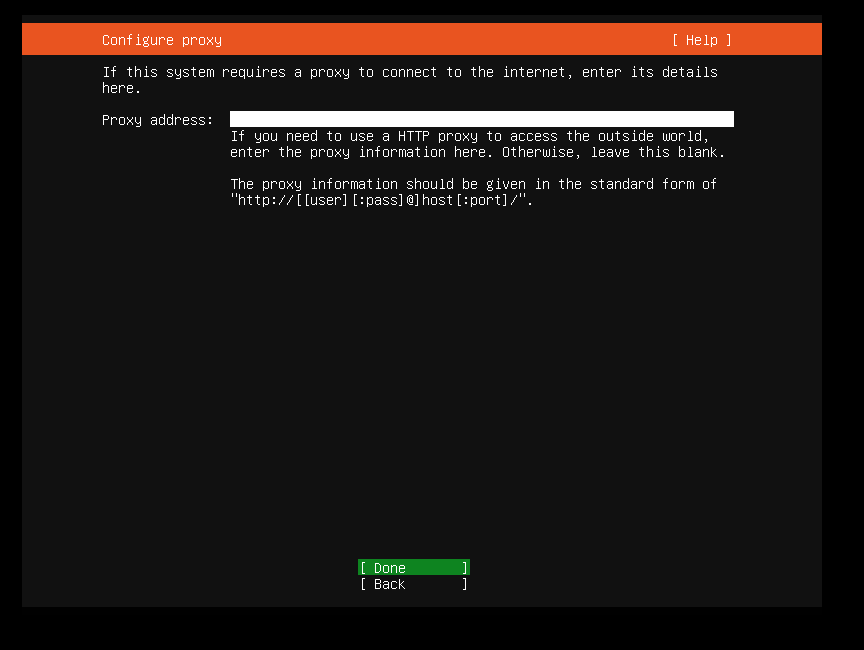
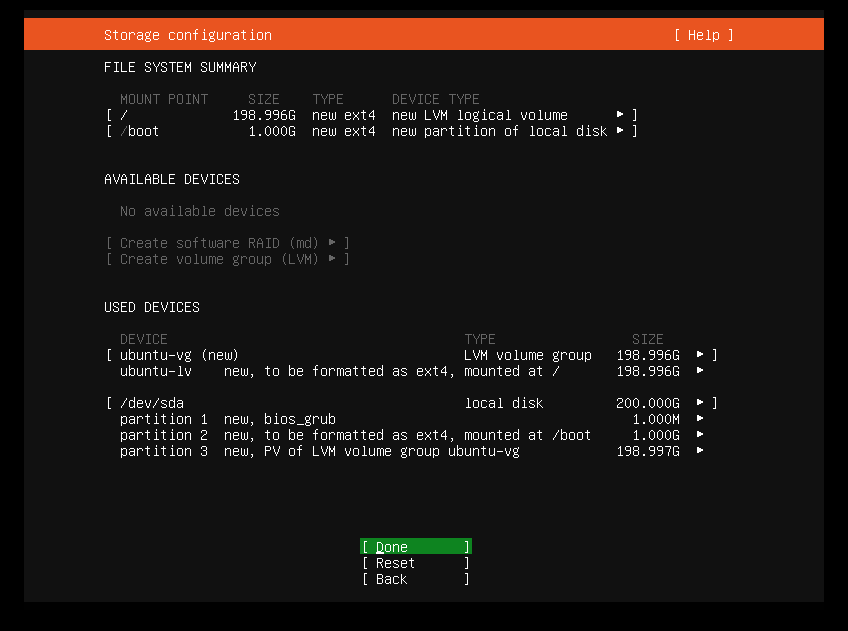

# ubuntu20.04操作系统安装

系统镜像位置：

\\\192.168.3.12\samba-iso\ISO-Linux\ubuntu\ubuntu-20.04.2-live-server-amd64.iso

### 1. 进入安装

### 2. 安装前检查

### 3. 选择语言

该处选择English

### 4. 键盘设置

默认即可`english（US）`，选择done继续

### 5. 网络配置

- 选择`Edit IPv4`进入配置

- 选择`Manual`开始进行配置

- 网络配置

其中：

 `Subnet`：子网掩码

`Address`：IP地址

`Gateway`：网关

`Name servers`：DNS地址

选择**save**保存配置

- 确认配置

选择done完成配置

### 6. 配置代理服务器

默认为空即可，选择done继续

### 7. 镜像源配置

保持默认即可，选择done继续

### 8. 磁盘选择

默认即可，选择done继续

### 9. 存储配置

- 删除原配置

选择unmount删除原`/`目录的配置

- 重新创建`/`目录

选择Edit开始进行配置

- `/`目录参考配置

其中：

Name：可自定义

Size：选择可选的最大值

Format：文件系统可自选

Mount：选择挂载`/`目录

- 确认配置

磁盘分配完成后，选择done继续

选择`continue`继续

### 10. 用户配置

其中：

- your name：系统名称
- your server’s name ： 服务器名称
- pick a username：用户名称
- choose a password：用户密码
- confirm your password：确认密码

选择done继续

### 11. ssh安装

使用`空格`确认安装openssh服务，选择done继续

### 12. 组件安装

可使用`空格`选择想安装的组件，这里选择默认不安装，选择done继续

### 13. 系统开始安装

- 安装进度查看

- 安装完成

选择reboot now重启以完成安装

### 14. 登陆

- 使用`ubuntu`用户登陆

- 配置`root`用户

- 切换`root`用户登陆

- 查看IP

- 开启root用户可远程登陆

编辑该`/etc/ssh/sshd_config`文件

- 在配置文件中开启root用户远程登陆

添加参数`PermitRootLogin yes` 并重启ssh服务

