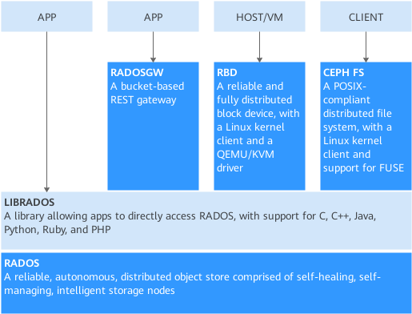

## Contents

[TOC]


## 1. Ceph介绍

Ceph 分布式存储、统一存储；[官方](https://docs.ceph.com/en/latest/)

Ceph 是一个专注于分布式的、弹性可扩展的、高可靠的、性能优异的存储系统平台，可以同时支持块设备、文件系统和对象网关三种类型的存储接口。Ceph架构如[图1](https://support.huaweicloud.com/dpmg-kunpengsdss/kunpengcephblock_04_0001.html#kunpengcephblock_04_0001__zh-cn_topic_0185813847_fig3121152)所示。




## 2. Ceph模块说明

| 模块名称 | 功能描述                                                     |
| -------- | ------------------------------------------------------------ |
| RADOS    | RADOS（Reliable Autonomic Distributed Object Store，RADOS）是Ceph存储集群的基础。Ceph中的一切都以对象的形式存储，而RADOS就负责存储这些对象，而不考虑它们的数据类型。RADOS层确保数据一致性和可靠性。对于数据一致性，它执行数据复制、故障检测和恢复，还包括数据在集群节点间的recovery。 |
| OSD      | 实际存储数据的进程。通常一个OSD daemon绑定一个物理磁盘。Client write/read数据最终都会走到OSD去执行write/read操作。 |
| MON      | Monitor在Ceph集群中扮演者管理者的角色，维护了整个集群的状态，是Ceph集群中最重要的组件。MON保证集群的相关组件在同一时刻能够达成一致，相当于集群的领导层，负责收集、更新和发布集群信息。为了规避单点故障，在实际的Ceph部署环境中会部署多个MON，同样会引来多个MON之前如何协同工作的问题。 |
| MGR      | MGR目前的主要功能是一个监控系统，包含采集、存储、分析（包含报警）和可视化几部分，用于把集群的一些指标暴露给外界使用。 |
| Librados | 简化访问RADOS的一种方法，目前支持PHP、Ruby、Java、Python、C和C++语言。它提供了Ceph存储集群的一个本地接口RADOS，并且是其他服务（如RBD、RGW）的基础，此外，还为CephFS提供POSIX接口。Librados API支持直接访问RADOS，使开发者能够创建自己的接口来访问Ceph集群存储。 |
| RBD      | Ceph块设备，对外提供块存储。可以像磁盘一样被映射、格式化和挂载到服务器上。 |
| RGW      | Ceph对象网关，提供了一个兼容S3和Swift的RESTful API接口。RGW还支持多租户和OpenStack的Keystone身份验证服务。 |
| MDS      | Ceph元数据服务器，跟踪文件层次结构并存储只供CephFS使用的元数据。Ceph块设备和RADOS网关不需要元数据。MDS不直接给Client提供数据服务。 |
| CephFS   | 提供了一个任意大小且兼容POSlX的分布式文件系统。CephFS依赖Ceph MDS来跟踪文件层次结构，即元数据。 |


## 3. Ceph部署(ceph-deploy)

### 3.1 Ceph部署方式

### 3.2 Ceph环境架构

#### 3.1.1 基础简单架构


| hostname | Role              | Public/clusterNetwork | Storage | OS release |
| -------- | ----------------- | --------------------- | ------- | ---------- |
| node1    | admin,mon,mds,osd | 172.16.103.21/16      | 50G*2   | Centos7.6  |
| node2    | osd               | 172.16.103.22/16      | 50G*2   | Centos7.6  |
| node3    | osd               | 172.16.103.23/16      | 50G*2   | Centos7.6  |

注意：安装用户统一使用root，而非官方推荐的创建新用户“ceph”


#### 3.1.2 测试环境架构

| hostname | Role    | Public-Network | cluster-Network | Storage | OS release |
| -------- | ------- | -------------- | --------------- | ------- | ---------- |
| node1    | osd/mon | 10.0.0.23/24   | 10.0.1.23/24    | 2T*4    | Centos7.6  |
| node2    | osd/mon | 10.0.0.24/24   | 10.0.1.24/24    | 2T*4    | Centos7.6  |
| node3    | osd/mon | 10.0.0.25/24   | 10.0.0.25/24    | 2T*4    | Centos7.6  |


### 3.3 Ceph前置工作

#### 3.3.1 主机名配置

```shell
// 所有节点配置
hostnamectl set-hostname node1
hostnamectl set-hostname node2
hostnamectl set-hostname node3
```

#### 3.3.2 hosts文件

```shell
// 所有节点配置
echo "172.16.103.21 node1" >>/etc/hosts
echo "172.16.103.22 node2" >>/etc/hosts
echo "172.16.103.23 node3" >>/etc/hosts
```

#### 3.3.3 免密登录

```shell
// node1节点执行
ssh-keygen -t rsa -P "" -f ~/.ssh/id_dsa 
ssh-copy-id -i .ssh/id_rsa.pub root@node1
ssh-copy-id -i .ssh/id_rsa.pub root@node2
ssh-copy-id -i .ssh/id_rsa.pub root@node3

// 测试登录（node1执行）
ssh node1
ssh node2
ssh node3
```

#### 3.3.4 关闭安全设置

```shell
// 所有节点配置
// 关闭防火墙
systemctl stop firewalld
systemctl disable firewalld

// 关闭selinux
sed -i 's/SELINUX=enforcing/SELINUX=disabled/g' /etc/selinux/config
setenforce 0

// 验证命令
getenforce
```

#### 3.3.5 NTP时间同步

```shell
// 安装ntp (所有节点)
yum -y install ntp ntpdate

// 配置ntp （node1配置）
vim /etc/ntp.conf
#server 0.centos.pool.ntp.org iburst
#server 1.centos.pool.ntp.org iburst
#server 2.centos.pool.ntp.org iburst
#server 3.centos.pool.ntp.org iburst
server ntp.aliyun.com iburst

// node2~3
vim /etc/ntp.conf
#server 0.centos.pool.ntp.org iburst
#server 1.centos.pool.ntp.org iburst
#server 2.centos.pool.ntp.org iburst
#server 3.centos.pool.ntp.org iburst
server 172.16.103.21 

// 重启ntp
systemctl start ntpd.service
systemctl enable ntpd.service

// 验证
ntpq -pn
```

#### 3.3.6 国内源获取方法

[阿里源入口](https://developer.aliyun.com/mirror/)       [清华源入口](https://mirrors.tuna.tsinghua.edu.cn/)

以阿里源为例，打开阿里源官网，搜索ceph，进入到ceph页面

https://mirrors.aliyun.com/ceph/rpm-nautilus/el7/noarch/

https://mirrors.aliyun.com/ceph/rpm-nautilus/el7/x86_64/

#### 3.3.7 yum源配置

```shell
// node1节点配置
vim /etc/yum.repos.d/ceph.repo
[noarch]
name=Ceph noarch packages
baseurl=https://mirrors.aliyun.com/ceph/rpm-nautilus/el7/noarch/
enabled=1
gpgcheck=0

[x86_64]
name=Ceph x86_64 packages
baseurl=https://mirrors.aliyun.com/ceph/rpm-nautilus/el7/x86_64/
enabled=1
gpgcheck=0


// 发送到所有节点
scp /etc/yum.repos.d/ceph.repo root@ceph-node2:/etc/yum.repos.d/
scp /etc/yum.repos.d/ceph.repo root@ceph-node3:/etc/yum.repos.d/

// 生成缓存所有节点
yum makecache


// centos8源
[noarch]
name=Ceph noarch packages
#baseurl=https://mirrors.aliyun.com/ceph/rpm-nautilus/el8/noarch/
baseurl=http://mirrors.ustc.edu.cn/ceph/rpm-nautilus/el8/noarch/
enabled=1
gpgcheck=0

[x86_64]
name=Ceph x86_64 packages
#baseurl=https://mirrors.aliyun.com/ceph/rpm-nautilus/el8/x86_64/
#baseurl=https://mirrors.aliyun.com/ceph/rpm-nautilus/el8/
baseurl=http://mirrors.ustc.edu.cn/ceph/rpm-nautilus/el8/x86_64/
enabled=1
gpgcheck=0

[SRPMS]
name=Ceph SRPMS packages
#baseurl=https://mirrors.aliyun.com/ceph/rpm-nautilus/el8/SRPMS/
baseurl=http://mirrors.ustc.edu.cn/ceph/rpm-nautilus/el8/SRPMS/
enabled=1
gpgcheck=0
```


### 3.4 Ceph部署(Centos7)

#### 3.4.1 install ceph-deploy

```shell
// admin节点node1
// 安装python-setuptools工具包
yum install -y python-setuptools

// 安装ceph-deploy
yum install -y ceph-deploy

// 验证版本
ceph-deploy
yum list |grep deploy

// 自动部署软件包（admin节点）
ceph-deploy install --no-adjust-repos --nogpgcheck node1 node2 node3 cli-1
///--no-adjust-repos 推送过程不更改yum源

// 手动部署软件包（所有节点部署）
yum install -y ceph ceph-mon ceph-mgr ceph-radosgw ceph-mds
/// ceph --version
```

#### 3.4.2 Cluster deploy

```shell
/ admin节点node1
// 创建部署目录
mkdir /root/ceph-deploy -p

// 创建一集群
/// 部署moniter(mon)
ceph-deploy new --cluster-network 10.0.1.0/24 --public-network 10.0.0.0/24 node1 node2 node3

/// 查看生成的文件
[root@ceph-node1 ceph-deploy]# ls
ceph.conf  ceph-deploy-ceph.log  ceph.mon.keyring
////.conf配置文件
////.log日志文件
////.keyring通信密钥

[root@ceph-node1 ceph-deploy]# cat ceph.conf 
[global]
fsid = a36b6a91-c5e8-4ecf-a82b-2c02f7b5ed8f
public_network = 172.16.103.0/16
cluster_network = 172.17.103.0/16
mon_initial_members = node1
mon_host = 172.16.103.21
auth_cluster_required = cephx
auth_service_required = cephx
auth_client_required = cephx

/// 初始化mon
ceph-deploy mon create-initial
////[root@ceph-node1 ceph-deploy]# ls -l
-rw-------. 1 root root    113 Nov 17 15:32 ceph.bootstrap-mds.keyring
-rw-------. 1 root root    113 Nov 17 15:32 ceph.bootstrap-mgr.keyring
-rw-------. 1 root root    113 Nov 17 15:32 ceph.bootstrap-osd.keyring
-rw-------. 1 root root    113 Nov 17 15:32 ceph.bootstrap-rgw.keyring
-rw-------. 1 root root    151 Nov 17 15:32 ceph.client.admin.keyring
-rw-r--r--. 1 root root    268 Nov 17 14:53 ceph.conf
-rw-r--r--. 1 root root 429530 Nov 17 15:32 ceph-deploy-ceph.log
-rw-------. 1 root root     73 Nov 17 14:53 ceph.mon.keyring

/// 拷贝admin密钥文件
ceph-deploy admin node1 node2 node3 cli-1
ceph-deploy --overwrite-conf config push cli-1

/// 验证集群
[root@ceph-node1 ceph-deploy]# ceph -s
  cluster:
    id:     a36b6a91-c5e8-4ecf-a82b-2c02f7b5ed8f	//集群id
    health: HEALTH_OK    //集群健康状态
 
  services:
    mon: 1 daemons, quorum node1 (age 2m)	//mon节点
    mgr: no daemons active		//managr节点
    osd: 0 osds: 0 up, 0 in		//osd数量
 
  data:
    pools:   0 pools, 0 pgs
    objects: 0 objects, 0 B
    usage:   0 B used, 0 B / 0 B avail
    pgs:    

/// 部署manager daemon
ceph-deploy mgr create node1 node2 node3
////ceph -s |grep mgr
    mgr: node1(active, since 62s)

/// 添加osd
ceph-deploy osd create node1 --data /dev/nvme0n1
ceph-deploy osd create node2 --data /dev/nvme0n1
ceph-deploy osd create node3 --data /dev/nvme0n1
//// ceph -s|grep osd
    osd: 3 osds: 3 up (since 26s), 3 in (since 26s)


/// 验证osd
[root@ceph-node1 ceph-deploy]# ceph osd tree
ID CLASS WEIGHT  TYPE NAME           STATUS REWEIGHT PRI-AFF 
-1       0.14639 root default                                
-3       0.04880     host node1                         
 0   hdd 0.04880         osd.0           up  1.00000 1.00000 
-7       0.04880     host node2                         
 2   hdd 0.04880         osd.2           up  1.00000 1.00000 
-5       0.04880     host nod3                         
 1   hdd 0.04880         osd.1           up  1.00000 1.00000 
 

```

#### 3.4.3 Cluster expand

```shell
//扩展moniter
ceph-deploy mon add node2
ceph-deploy mon add node3

[root@ceph-node1 ceph-deploy]# ceph quorum_status --format json-pretty

[root@ceph-node1 ceph-deploy]# ceph mon stat
e3: 3 mons at {node1=[v2:172.16.103.21:3300/0,v1:172.16.103.21:6789/0],node2=[v2:172.16.103.22:3300/0,v1:172.16.103.22:6789/0],node3=[v2:172.16.103.23:3300/0,v1:172.16.103.23:6789/0]}, election epoch 12, leader 0 node1, quorum 0,1,2 node1,node2,node3

[root@ceph-node1 ceph-deploy]# ceph mon dump
dumped monmap epoch 3
epoch 3
fsid a36b6a91-c5e8-4ecf-a82b-2c02f7b5ed8f
last_changed 2020-11-17 16:46:37.614720
created 2020-11-17 15:32:30.013113
min_mon_release 14 (nautilus)
0: [v2:172.16.103.21:3300/0,v1:172.16.103.21:6789/0] mon.node1
1: [v2:172.16.103.22:3300/0,v1:172.16.103.22:6789/0] mon.node2
2: [v2:172.16.103.23:3300/0,v1:172.16.103.23:6789/0] mon.node3


//扩展mgr
ceph-deploy	mgr create node2 node3

[root@ceph-node1 ceph-deploy]# ceph -s|grep mgr
    mgr: node1(active, since 60m), standbys: node3, node2


//手动部署mgr
ceph --cluster ceph auth get-or-create mgr.$(hostname) mon 'allow profile mgr' osd 'allow *' mds 'allow *'
mkdir /var/lib/ceph/mgr/ceph-$(hostname)
ceph --cluster ceph auth get-or-create mgr.$(hostname) -o /var/lib/ceph/mgr/ceph-$(hostname)/keyring
chown -R ceph:ceph /var/lib/ceph/mgr

systemctl daemon-reload
systemctl restart ceph-mgr@$(hostname)
```

#### 3.4.4 Ceph mds

mds（metadata server）,使用CephFS存储时，最少需要一个元数据服务器

```shell
ceph-deploy mds create node1
ceph-deploy mds create admin
```

#### 3.4.5 Ceph rgw

要使用Ceph的Ceph对象网关组件，您必须部署RGW的实例

```shell
ceph-deploy rgw create node1
```

默认情况下，RGW实例将在端口7480上侦听。可以通过在运行RGW的节点上编辑ceph.conf进行更改

```shell
//ipv4
[client]
rgw frontends = civetweb port=80

//ipv6
[client]
rgw frontends = civetweb port=[::]:80
```

#### 3.4.6 Ceph osd

##### 3.4.6.1 osd create option

```shell
[root@ceph-node1 ceph-deploy]# ceph-deploy osd create --help
usage: ceph-deploy osd create [-h] [--data DATA] [--journal JOURNAL]
                              [--zap-disk] [--fs-type FS_TYPE] [--dmcrypt]
                              [--dmcrypt-key-dir KEYDIR] [--filestore]
                              [--bluestore] [--block-db BLOCK_DB]
                              [--block-wal BLOCK_WAL] [--debug]
                              [HOST]

positional arguments:
  HOST                  Remote host to connect

optional arguments:
  -h, --help            show this help message and exit
  --data DATA           The OSD data logical volume (vg/lv) or absolute path
                        to device
  --journal JOURNAL     Logical Volume (vg/lv) or path to GPT partition
  --zap-disk            DEPRECATED - cannot zap when creating an OSD
  --fs-type FS_TYPE     filesystem to use to format DEVICE (xfs, btrfs)
  --dmcrypt             use dm-crypt on DEVICE
  --dmcrypt-key-dir KEYDIR
                        directory where dm-crypt keys are stored
  --filestore           filestore objectstore
  --bluestore           bluestore objectstore
  --block-db BLOCK_DB   bluestore block.db path
  --block-wal BLOCK_WAL
                        bluestore block.wal path
  --debug               Enable debug mode on remote ceph-volume calls
  
  -h, --help            显示帮助信息
  --data DATA           指定数据磁盘的逻辑卷（vg/lv）或绝对路径
  --journal JOURNAL     指定缓存加速的逻辑卷（vg/lv）或GPT分区路径
  --zap-disk            已弃用 - 创建osd是无法更改
  --fs-type FS_TYPE     指定格式化文件系统类型
  --dmcrypt             启用dm-crypt
  --dmcrypt-key-dir KEYDIR
                        dm-crypt密钥文件目录
  --filestore           filestore对象
  --bluestore           bluestore对象
  --debug               远程启用ceph-volume调试模式
```

##### 3.4.6.2 osd bluestore

```shell
// 清除osd磁盘旧数据
for node in node1 node2 node3
do
ceph-deploy disk zap ${node} /dev/nvme0n1
for i in {b..h}
do
ceph-deploy disk zap ${node} /dev/sd${i}
done
done

// SSD_lvm创建pv和vg
for node in node1 node2 node3
do
ssh root@${node} "pvcreate -y /dev/nvme0n1;vgcreate bluestore /dev/nvme0n1;pvs"
done

// SSD_lvm创建lv
for node in node1 node2 node3
do
for i in {b..h}
do
ssh root@${node} "lvcreate --size 60G -n osd${i}.db bluestore;lvcreate --size 40G -n osd${i}.wal bluestore;lsblk|grep osd"
done
done

// SAS_lvm创建pv、vg、lv
for node in node1 node2 node3
do
for i in {b..h}
do
ssh root@${node} "pvcreate -y /dev/sd${i};vgcreate -y data_sd${i} /dev/sd${i};lvcreate -l +100%FREE -n osd${i} data_sd${i};lsblk|grep osd"
done
done


// ceph-deploy批量部署osd
for node in node1 node2 node3
do
for i in {b..h}
do
ceph-deploy osd create --data data_sd${i}/osd${i} \
--block-db bluestore/osd${i}.db \
--block-wal bluestore/osd${i}.wal \
--bluestore ${node}
sleep 2
done
done && ceph osd tree

for i in {b..h}
do
ceph-deploy osd create --data /dev/sd$i \
--bluestore node3
done


// 删除SAS_lvm下的pv、vg、lv
for i in {b..h}
do
vgremove -f data_sd${i}
pvremove /dev/sd${i}
done && lsblk|grep osd

// 删除LVM_LVS下的db和wal
for i in {b..h}
do
lvremove -f /dev/bluestore/osd${i}.db
lvremove -f /dev/bluestore/osd${i}.wal
done && lsblk

// 删除pv和vg
for i in /dev/nvme0n1
do
vgremove -f bluestore
pvremove -f ${i}
done &&	pvs

for i in {b..h}
do
mkfs.xfs /dev/sd${i}
done && lsblk


// 手动部署命令
ceph-volume lvm create --data /dev/sdc --block.db /dev/nvme0n1p1
ceph-volume lvm create --data /dev/nvme0n1

// wal和db大小
// wal是RocksDB的write-ahead log, 相当于之前的journal数据，db是RocksDB的metadata信息。
// 在磁盘选择原则是block.wal > block.db > block。当然所有的数据也可以放到同一块盘上。
// 如果所有的数据都在单块盘上，那是没有必要指定wal&db 的大小的。
// 如果wal/db是在不同的盘上，由于 wal/db 一般都会分的比较小，是有满的可能性的。
// 如果满了，这些数据会迁移到下一个快的盘上(wal - db - main)。
// 所以最少不会因为数据满了，而造成无法写入。
// 参考文件：https://shenshengkun.github.io/posts/78fhjj54.html

// 官方说明：https://docs.ceph.com/en/nautilus/rados/configuration/bluestore-config-ref/

When using a mixed spinning and solid drive setup it is important to make a large-enough block.db logical volume for Bluestore. Generally, block.db should have as large as possible logical volumes.

It is recommended that the block.db size isn’t smaller than 4% of block. For example, if the block size is 1TB, then block.db shouldn’t be less than 40GB.
# block.db的大小不小于block的4%。例如1TB的block，block.db应该不小于40G。
# 而block.wal的大小加上block.db，一般建议是block的10%，所以wal应该为6%。

If not using a mix of fast and slow devices, it isn’t required to create separate logical volumes for block.db (or block.wal). Bluestore will automatically manage these within the space of block.
# 如果block/db/wal同时在一个盘，则不用单独指定，Blusestore自动管理。
```

##### 3.4.6.3 osd fliestore

```shell
// SSD_lvm创建pv和vg
for i in /dev/nvme0n1
do
	pvcreate -y ${i}
	vgcreate filestore ${i} 
done &&	pvs

// SSD_lvm创建lv
for i in {b..h}
do
	lvcreate --size 100G -n osd${i} filestore
done && lsblk | grep osd

// SAS_lvm创建pv、vg、lv
for i in {b..h}
do
	pvcreate -y /dev/sd${i}
	vgcreate data_sd${i} /dev/sd${i}
	lvcreate -l +100%FREE -n osd${i} data_sd${i}
done && lsblk|grep osd


// 批量部署osd
for node in node1 node2 nod3
for i in {b..h}
do
ceph-deploy disk zap ${node} /dev/sd${i}
ceph-deploy osd create --data data_sd${i}/osd${i} --journal filestore/osd${i} --filestore ${node}
done
done


// 批量清除lvm
for i in {b..h}
do
	vgremove -f data_sd${i}
	pvremove /dev/sd${i}
	lvremove -f /dev/filestore/osd${i}
done && lsblk|grep osd

for i in /dev/nvme1n1
do
	vgremove -f filestore
	pvremove -f ${i}
done &&	pvs

for i in {b..h}
do
	mkfs.xfs /dev/sd${i}
done && lsblk
```

##### 3.4.6.4 osd delete

```shell
// 查看osd信息
ceph osd tree

// 停止osd服务（登录到osd主机上执行）
systemctl stop ceph-osd@0.service

// 标记为out状态
ceph osd out osd.0

// 从crush里删除osd
ceph osd crush remove osd.0

// 删除osd
ceph osd rm osd.0

// 删除节点认证（不删除编号会占用）
ceph auth del osd.0


// 批量删除osd
for i in `ceph osd df tree $(hostname)|grep osd|awk '{print$21}'|awk -F '.' '{print$2}'`
do 
	systemctl stop ceph-osd@${i}.service
	ceph osd out osd.${i}
	ceph osd crush remove osd.${i}
	ceph osd rm osd.${i}
	ceph auth del osd.${i}
  umount -l /var/lib/ceph/osd/ceph-$i
  rm -fr /var/lib/ceph/osd/ceph-$i
  rm -fr /var/log/ceph/ceph-osd.$i.log
done && ceph osd df tree $(hostname)

dmsetup remove_all

for i in {a..o}
do
  sgdisk -Z /dev/sd$i
done

for i in {40..49}
do 
	systemctl stop ceph-osd@${i}.service
	ceph osd out osd.${i}
	ceph osd crush remove osd.${i}
	ceph osd rm osd.${i}
	ceph auth del osd.${i}
  umount -l /var/lib/ceph/osd/ceph-$i
  rm -fr /var/lib/ceph/osd/ceph-$i
done && ceph osd tree


// 处理osd_ceph-0
for i in `cat /proc/mounts|grep ceph|awk -F " " '{print $2}'`
do
	umount -l ${i}
	rm -rf ${i}
done && rm -fr /var/lib/ceph/osd/* && ls -d /var/lib/ceph/osd/
```


#### 3.4.7 Cehp mon

##### 3.4.7.2 mon map更换IP

```shell
// 以下在mon角色服务操作
// 导出mon map配置
ceph mon getmap -o /tmp/monmap

// 查看map配置
monmaptool --print /tmp/monmap

// 停止mon
systemctl stop ceph-mon@admin

// 删除mon map
monmaptool --rm admin /tmp/monmap

// 加入新mon map
monmaptool --add admin 10.0.0.22:6789 /tmp/monmap

// 验证map
monmaptool --print /tmp/monmap

// 注入map
ceph-mon -i admin  --inject-monmap /tmp/monmap

// 启动mon
systemctl start ceph-mon@admin

// 注意 
# 其他mon节点可以scp /tmp/monmap 文件到到对应节点，然后按照上述执行一遍

# 重启mon可能报错，查看日志/var/log/ceph/ceph-mon.admin.log
# 报错：/var/lib/ceph/mon/ceph-admin/store.db/CURRENT: Permission denied
# 解决：chown ceph.ceph /var/lib/ceph/mon/ceph-admin/store.db/*
```


#### 3.4.8 Ceph config

##### 3.4.8.1 运行配置查看

```shell
// 显示osd运行配置文件
ceph daemon osd.0 config show
ceph daemon osd.0 config show|grep bluestore

// 显示osd属性
ceph config show osd.0

// 转换当前生效配置
ceph daemon osd.0 config diff

// 配置文件检查
ceph -c ceph.conf health
```

##### 3.4.8.2 配置文件详解

检查当前配置文件是否正常：ceph -c ceph.conf health

```shell
[global]
fsid = 2c41945c-f39e-4d7a-be5d-8e8a3d2292d6
# 集群唯一标识码

mon initial members = admin
# 初始monitor (由创建monitor命令而定)

mon host = 10.0.0.22
# monitor IP地址，mon守护进程只能在public network内

auth cluster required = cephx
# 集群认证

auth service required = cephx
# 服务认证

auth client required = cephx
# 客户端认证

osd pool default size = 3
# 默认副本数设置 默认是3

osd pool default min size = 1        
# PG处于 degraded 状态不影响其 IO 能力,min_size是一个PG能接受IO的最小副本数

# osd pool default pg num = 512
# osd pool default pgp num = 512
# 存储池的PG/PGP大小，根据osd数据而定，配置文件一般不指定

public network = 10.0.0.0/24
# 公共网络(monitorIP段) 

cluster network = 10.0.0.0/24
# 集群网络

mon_allow_pool_delete = true
# 允许删除池

[mgr]
mgr modules = dashboard
# 开启 dashboard模块

[osd]
osd heartbeat grace = 20
osd heartbeat interval = 5
# osd心跳间隔值，配置iSCSI_lio时必须设置
```

##### 3.4.8.2 配置文件推送

```shell
ceph-deploy --overwrite-conf config push node1 node2 node3 cli-1
```

##### 3.4.8.3 重启服务

```shell
// 重启osds(osd对应节点执行)
ceph osd tree
systemctl restart ceph-osd@0.service

for i in `ls /var/lib/ceph/osd/ |awk -F "-" '{print $2}'`
do 
	systemctl restart ceph-osd@${i}.service
	systemctl status ceph-osd@${i}.service
	sleep 1
done && ceph osd tree


// 重启mon
systemctl restart ceph-mon@node1.service

systemctl list-unit-files|grep enabled|grep ceph|awk '{print "systemctl restart " $1}'|bash
```


#### 3.4.9 Ceph remove cluster

```shell
// 清理集群
ceph-deploy purge node1 node2 node3 cli-1
ceph-deploy purgedata node1 node2 node3 cli-1
ceph-deploy forgetkeys
rm -f ceph.*
```


#### 3.4.10 ceph iSCSI

```shell
// 参考
https://www.cnblogs.com/netonline/p/10432653.html
https://docs.ceph.com/en/nautilus/rbd/iscsi-overview/
https://blog.csdn.net/weixin_43357497/article/details/113531406

// 要求
# 正在运行的Ceph Luminous或更高版本的存储集群
# 红帽企业Linux / CentOS 7.5（或更高版本）；Linux内核v4.16（或更高版本）
# targetcli-2.1.fb47 或更新的包装
# python-rtslib-2.1.fb64 或更新的包装
# tcmu-runner-1.3.0 或更新的包装
# ceph-iscsi-3.2 或更新的包装

//卸载旧版本
rpm -e ceph-iscsi-config-2.6-2.6.el7.noarch
rpm -e ceph-iscsi-cli-2.7-2.7.el7.noarch
rpm -e ceph-iscsi-tools-2.1-3.el7cp.noarch
rpm -e ceph-iscsi-config-2.6-2.6.el7.noarch
rpm -e libtcmu-1.3.0-0.4.2.el7cp.x86_64
rpm -e tcmu-runner-1.3.0-0.4.2.el7cp.x86_64
rpm -e libtcmu-1.3.0-0.4.2.el7cp.x86_64

//配置源
echo '[ceph-iscsi]
name=ceph-iscsi noarch packages
baseurl=http://download.ceph.com/ceph-iscsi/3/rpm/el7/noarch
enabled=1
gpgcheck=1
gpgkey=https://download.ceph.com/keys/release.asc
type=rpm-md
[ceph-iscsi-source]
name=ceph-iscsi source packages
baseurl=http://download.ceph.com/ceph-iscsi/3/rpm/el7/SRPMS
enabled=0
gpgcheck=1
gpgkey=https://download.ceph.com/keys/release.asc
type=rpm-md
[tcmu-runner]
name=tcmu-runner
baseurl=https://3.chacra.ceph.com/r/tcmu-runner/master/eef511565078fb4e2ed52caaff16e6c7e75ed6c3/centos/7/flavors/default/x86_64/
priority=1
gpgcheck=0
[ceph-iscsi-conf]
name=ceph-iscsi-config
baseurl=https://3.chacra.ceph.com/r/ceph-iscsi-config/master/7496f1bc418137230d8d45b19c47eab3165c756a/centos/7/flavors/default/noarch/
priority=1
gpgcheck=0        
' > /etc/yum.repos.d/ceph-iscsi.repo

// 安装
yum -y install ceph-iscsi

// 配置
vim /etc/ceph/iscsi-gateway.cfg
[config]
cluster_name = ceph
gateway_keyring = ceph.client.admin.keyring
api_secure = false
# api_user = admin
# api_password = admin
# api_port = 5001
trusted_ip_list = 10.0.0.23,10.0.0.24

systemctl daemon-reload
systemctl restart rbd-target-api
systemctl status rbd-target-api

// iscsi配置
gwcli

cd /iscsi-targets
create iqn.2003-01.com.redhat.iscsi-gw:iscsi-igw

cd /iscsi-targets/iqn.2003-01.com.redhat.iscsi-gw:iscsi-igw/gateways 
create node1 10.0.0.23 skipchecks=true
create node2 10.0.0.24 skipchecks=true

cd /iscsi-targets/iqn.2003-01.com.redhat.iscsi-gw:iscsi-igw/hosts
create iqn.1994-05.com.redhat:rh7-client
auth username=myiscsiusername password=myiscsipassword
disk add rbd/disk00 20G


// 客户端部署
yum install iscsi-initiator-utils
yum install device-mapper-multipath

mpathconf --enable --with_multipathd y
vi /etc/multipath.conf
devices {
        device {
                vendor                 "LIO-ORG"
                hardware_handler       "1 alua"
                path_grouping_policy   "failover"
                path_selector          "queue-length 0"
                failback               60
                path_checker           tur
                prio                   alua
                prio_args              exclusive_pref_bit
                fast_io_fail_tmo       25
                no_path_retry          queue
        }
}

vim /etc/iscsi/iscsid.conf
node.session.auth.authmethod = CHAP
node.session.auth.username = myiscsiusername
node.session.auth.password = myiscsipassword

vim /etc/iscsi/initiatorname.iscsi
InitiatorName=iqn.1994-05.com.redhat:rh7-client

systemctl reload multipathd
systemctl restart iscsid
systemctl status iscsid
systemctl restart iscsi
systemctl status iscsi

// 发现服务
iscsiadm -m discovery -t st -p 10.0.0.23

// 连接服务
iscsiadm -m node -T iqn.2003-01.com.redhat.iscsi-gw:iscsi-igw -l	//多路径
iscsiadm -m node -T iqn.2003-01.com.redhat.iscsi-gw:iscsi-igw -p 10.0.0.23 -l

iscsiadm -m node -T iqn.2003-01.com.redhat.iscsi-gw:iscsi-igw -u
iscsiadm -m node -o delete -T iqn.2003-01.com.redhat.iscsi-gw:iscsi-igw -l
```


#### 3.4.12 ceph dashborad

```shell
// 参考
https://blog.51cto.com/renlixing/2487852?source=dra

// 部署
yum install -y ceph-mgr-dashboard -y

// 启动模块
ceph mgr module enable dashboard

// 配置信息
ceph config set mgr mgr/dashboard/ssl false
ceph config set mgr mgr/dashboard/server_addr 0.0.0.0
ceph config set mgr mgr/dashboard/server_port 8080
# ceph dashboard ac-user-create admin 123456 administrator

// 用户新的配置方法
ceph dashboard ac-user-create admin -i /etc/ceph/password administrator

// 启动服务
ceph mgr services

// 关闭模块
ceph mgr module disable dashboard
```

#### 3.4.11 ceph nvme spdk

```shell
# https://docs.ceph.com/en/nautilus/rados/configuration/bluestore-config-ref/#spdk-usage
# https://spdk.io/doc/getting_started.html#getting_started_examples

# 下载spdk，git clone很慢，打开web下载
git clone https://github.com/spdk/spdk
cd spdk
git submodule update --init

# 安装依赖 --all所有
scripts/pkgdep.sh --all

# 编译
./configure
make

# 测试
./test/unit/unittest.sh

# 自动配置
./scripts/setup.sh
./scripts/setup.sh reset # 删除配置

# 查看系统的nvme
./build/examples/identify

# 记录： NVMe Controller at 0000:86:00.0 [144d:a822]

# 在系统中可以使用找到nvme
lspci -mm -n -D -d 144d:a822

# spdk:0000:86:00.0
bluestore block path = spdk:0000:86:00.0
#bluestore_block_db_path = ""
#bluestore_block_db_size = 0
#bluestore_block_wal_path = ""
#bluestore_block_wal_size = 0

```


#### 3.4.13 bcache store

```shell
yum install libblkid-devel gcc gcc++ -y

git clone https://github.com/g2p/bcache-tools.git

cd bcache-tools

make && make install

make-bcache

make-bcache -B -w 4096 /dev/sdc --wipe-bcache
make-bcache -B -w 4096 /dev/sdd --wipe-bcache
make-bcache -B -w 4096 /dev/sde --wipe-bcache
make-bcache -B -w 4096 /dev/sdf --wipe-bcache

mkfs.xfs /dev/bcache0
mkfs.xfs /dev/bcache1
mkfs.xfs /dev/bcache2
mkfs.xfs /dev/bcache3

make-bcache -C -b 4096 /dev/nvme0n1 --wipe-bcache

bcache-super-show /dev/nvme0n1
cset.uuid		53db41a3-0fa3-4d56-abd4-12e8193260f9
cset.uuid		fe5c7000-0cbc-4f8c-912f-d21d323b05a7


echo "53db41a3-0fa3-4d56-abd4-12e8193260f9" > /sys/block/bcache0/bcache/attach
echo "53db41a3-0fa3-4d56-abd4-12e8193260f9" > /sys/block/bcache1/bcache/attach
echo "53db41a3-0fa3-4d56-abd4-12e8193260f9" > /sys/block/bcache2/bcache/attach
echo "53db41a3-0fa3-4d56-abd4-12e8193260f9" > /sys/block/bcache3/bcache/attach

echo "26274267-f47d-4c34-b763-1313ef39a5da" > /sys/block/bcache0/bcache/attach
echo "26274267-f47d-4c34-b763-1313ef39a5da" > /sys/block/bcache1/bcache/attach
echo "fe5c7000-0cbc-4f8c-912f-d21d323b05a7" > /sys/block/bcache2/bcache/attach
echo "fe5c7000-0cbc-4f8c-912f-d21d323b05a7" > /sys/block/bcache3/bcache/attach

// 一步到位
make-bcache -C -b 4096 /dev/nvme0n1 -B -w 4096 /dev/sdc /dev/sdd /dev/sde /dev/sdf --wipe-bcache

// 取消关联
echo "53db41a3-0fa3-4d56-abd4-12e8193260f9" > /sys/block/bcache0/bcache/detach
echo "53db41a3-0fa3-4d56-abd4-12e8193260f9" > /sys/block/bcache1/bcache/detach
echo "53db41a3-0fa3-4d56-abd4-12e8193260f9" > /sys/block/bcache2/bcache/detach
echo "53db41a3-0fa3-4d56-abd4-12e8193260f9" > /sys/block/bcache3/bcache/detach

echo "b3092af9-3cda-482b-b581-bb29d8bcd196" > /sys/block/bcache0/bcache/detach

// 删除前端缓存
echo 1 >/sys/fs/bcache/53db41a3-0fa3-4d56-abd4-12e8193260f9/unregister
echo 1 >/sys/fs/bcache/8cae4fac-1312-4b0a-8bf7-2142dae5a334/unregister

// 删除后端存储
echo 1 > /sys/block/bcache0/bcache/stop
echo 1 > /sys/block/bcache1/bcache/stop
echo 1 > /sys/block/bcache2/bcache/stop
echo 1 > /sys/block/bcache3/bcache/stop


ls -d /sys/fs/bcache/*-*-* | cut -f5 -d/
for i in `ls -d /sys/block/bcache*`; do echo `ls -d /sys/fs/bcache/*-*-* | cut -f5 -d/` > ${i}/bcache/detach;done


echo 1 > /sys/fs/bcache/`ls -d /sys/fs/bcache/*-*-* | cut -f5 -d/`/unregister

cat /sys/block/bcache0/bcache/state

for i in `ls -d /sys/block/bcache*`; do echo 1 > ${i}/bcache/stop;done
```


#### 3.4.14 ceph nfs-ganesha

```shell
yum install libcephfs2 nfs-ganesha nfs-ganesha-ceph

systemctl start nfs-ganesha.service

ceph dashboard set-ganesha-clusters-rados-pool-namespace 96265eda-f191-404f-8b31-8155c8c375d4:rbd
ceph dashboard set-ganesha-clusters-rados-pool-namespace 96265eda-f191-404f-8b31-8155c8c375d4:fs_data/cfs
```


#### 3.4.15 Centos7 update kernel

```shell
yum -y update

rpm --import https://www.elrepo.org/RPM-GPG-KEY-elrepo.org

yum -y install https://www.elrepo.org/elrepo-release-7.el7.elrepo.noarch.rpm

yum --disablerepo="*" --enablerepo="elrepo-kernel" list available

yum -y  --enablerepo=elrepo-kernel install kernel-ml

awk -F\' '$1=="menuentry " {print i++ " : " $2}' /etc/grub2.cfg

// 方法一
grub2-set-default 0

// 方法二
vim /etc/default/grub
GRUB_TIMEOUT=5
GRUB_DISTRIBUTOR="$(sed 's, release .*$,,g' /etc/system-release)"
GRUB_DEFAULT=0
GRUB_DISABLE_SUBMENU=true
GRUB_TERMINAL_OUTPUT="console"
GRUB_CMDLINE_LINUX="crashkernel=auto rd.lvm.lv=cl/root rhgb quiet"
GRUB_DISABLE_RECOVERY="true"

// 生成 grub 配置文件并重启
grub2-mkconfig -o /boot/grub2/grub.cfg

// 重启
reboot

// 验证
uname -r

// 删除旧内核（可选）

// 方法一
rpm -qa | grep kernel

yum remove kernel-3.10.0-514.el7.x86_64 \
kernel-tools-libs-3.10.0-862.11.6.el7.x86_64 \
kernel-tools-3.10.0-862.11.6.el7.x86_64 \
kernel-3.10.0-862.11.6.el7.x86_64

// 方法二
yum install yum-utils
package-cleanup --oldkernels
```


### 3.5 Ceph存储池

[参考官方文档](https://docs.ceph.com/en/nautilus/rados/operations/pools/#create-a-pool)

#### 3.5.1 创建池

```shell
// 查看pool
ceph osd lspools

// 创建一个ceph-rbd存储池
ceph osd pool create rbd 512
///pg数据量：
250*osd数量/复本数量，最终是2^N
如：250*12/3=1000,最终512

// 查看
[root@ceph-node1 ceph-deploy]# ceph osd lspools
1 ceph-rbd
[root@ceph-node1 ceph-deploy]# ceph osd pool get rbd pg_num
pg_num: 64
[root@ceph-node1 ceph-deploy]# ceph osd pool get rbd pgp_num
pgp_num: 64
[root@ceph-node1 ceph-deploy]# ceph osd pool get rbd size
size: 3
[root@ceph-node1 ceph-deploy]# ceph osd pool get rbd crush_rule
crush_rule: replicated_rule

// 调整
ceph osd pool set rbd pg_num 256
ceph osd pool set rbd pgp_num 256
ceph osd pool set rbd size 2

// 初始化pool（指定pool对应存储类型）
ceph osd pool application enable rbd rbd


ceph osd pool create device_health_metrics 1 1
ceph osd pool application enable device_health_metrics mgr_devicehealth
```

#### 3.5.2 删除池

```shell
// 添加如下内容到ceph.conf文件里
mon_allow_pool_delete = true

// 推送配置到所有节点
ceph-deploy --overwrite-conf config push node1 node2 node3

// 重启所有mon进程(每个都节点执行)
systemctl restart ceph-mon@ceph-node1.service
systemctl restart ceph-mon@ceph-node2.service
systemctl restart ceph-mon@ceph-node3.service

// 删除pool
ceph osd pool rm rbd rbd --yes-i-really-really-mean-it

```

#### 3.5.3 池复本

```shell
// 查看池复本数（在线）
ceph osd pool get cephfs_metadata size
ceph osd pool get cephfs_data size

// 设置池复本数（在线）
ceph osd pool set cephfs_metadata size 2
ceph osd pool set cephfs_data size 2
```


### 3.6 RBD块存储

#### 3.6.1 创建块文件

```shell
// 查看块文件
rbd -p rbd ls
rbd list

// 创建块文件
rbd create -p rbd --image rbd0.img --size 10G
-- or
rbd create rbd/rbd0.img --size 200G

// 查看
[root@ceph-node1 ~]# rbd -p rbd ls
rbd0.img
[root@ceph-node1 ~]# rbd info rbd/rbd0.img


// 创建指定特性的块文件
rbd create rbd/rbd0.img --image-feature layering --size 200G

[root@ceph-node1 ~]# rbd info rbd/rbd0.img

// 创建精简置备块存储(最大容量200G)
rbd resize --size 200G ceph-rbd/rbd0.img
rbd resize --size 200G ceph-rbd/rbd0.img --allow-shrink //允许收缩

// 批量创建(指定特性)
for i in {0..7}
do
	rbd create rbd/rbd${i}.img --image-feature layering --size 200G
done && rbd -p rbd ls

// 批量创建(默认特性)
for i in {0..7}
do
rbd create rbd/rbd${i}.img  --size 200G
done && rbd -p rbd ls


// 删除块
rbd rm -p rbd --image rbd0.img
rbd rm rbd/rbd0.img

// 批量删除rbd
for i in {0..7}
do
rbd rm rbd/rbd${i}.img
done && rbd -p rbd ls

```

#### 3.6.2 取消内核不支持的特性

本次测试环境的为Centos7.6，内核3.10版本，块存储有特性是不支持的，需要禁用，否者块存储挂载不了。
features: layering, exclusive-lock, object-map, fast-diff, deep-flatten
内核3.10不支持object-map, fast-diff, deep-flatten

```shell
// 举例挂载报错
[root@ceph-node1 ~]# rbd map ceph-rbd/rbd-demo-1.img
rbd: sysfs write failed
RBD image feature set mismatch. You can disable features unsupported by the kernel with "rbd feature disable ceph-rbd/rbd-demo-1.img object-map fast-diff deep-flatten".
In some cases useful info is found in syslog - try "dmesg | tail".
rbd: map failed: (6) No such device or address

// 禁止不支持的特性
// object-map, fast-diff, deep-flatten顺序从后往前禁止
rbd feature disable ceph-rbd/rbd-demo-1.img deep-flatten
rbd feature disable ceph-rbd/rbd-demo-1.img fast-diff
rbd feature disable ceph-rbd/rbd-demo-1.img object-map
```

#### 3.6.3 基于内核挂载

```shell
// 内核挂载设备
[root@ceph-node1 ~]# rbd map rbd/rbd0.img
/dev/rbd0

[root@ceph-node1 ~]# rbd device list
id pool      namespace image          snap device    
0  ceph-rbd           rbd-demo-1.img -    /dev/rbd0 

[root@ceph-node1 ~]# lsblk 

//取消map
rbd unmap /dev/rbd0

// 批量map rbd
for i in {0..7}
do
	rbd map rbd/rbd${i}.img
done && lsblk |grep rbd

rbd device map rbd/rdb0.img --id node3

// 批量unmap rbd
for i in {0..7}
do
	rbd unmap /dev/rbd${i}
done && lsblk |grep rbd
```

#### 3.6.4 使用挂载设备

```shell
[root@ceph-node1 ~]# mkfs.xfs /dev/rbd0
meta-data=/dev/rbd0              isize=512    agcount=16, agsize=163840 blks
         =                       sectsz=512   attr=2, projid32bit=1
         =                       crc=1        finobt=0, sparse=0
data     =                       bsize=4096   blocks=2621440, imaxpct=25
         =                       sunit=1024   swidth=1024 blks
naming   =version 2              bsize=4096   ascii-ci=0 ftype=1
log      =internal log           bsize=4096   blocks=2560, version=2
         =                       sectsz=512   sunit=8 blks, lazy-count=1
realtime =none                   extsz=4096   blocks=0, rtextents=0
 
[root@ceph-node1 ~]# mount /dev/rbd0 /media
[root@ceph-node1 ~]# df -h
Filesystem               Size  Used Avail Use% Mounted on
/dev/mapper/centos-root  196G  1.6G  194G   1% /
devtmpfs                 2.0G     0  2.0G   0% /dev
tmpfs                    2.0G     0  2.0G   0% /dev/shm
tmpfs                    2.0G  8.8M  2.0G   1% /run
tmpfs                    2.0G     0  2.0G   0% /sys/fs/cgroup
/dev/sda1               1014M  133M  882M  14% /boot
tmpfs                    396M     0  396M   0% /run/user/0
tmpfs                    2.0G   52K  2.0G   1% /var/lib/ceph/osd/ceph-0
/dev/rbd0                 10G   33M   10G   1% /media
```

#### 3.6.5 块存储扩容

```shell
// 扩容到400G
rbd resize rbd/rbd0.img --size 400G

[root@ceph-node1 ~]# rbd info ceph-rbd/rbd-demo-1.img
rbd image 'rbd-demo-1.img':
	size 20 GiB in 5120 objects
	order 22 (4 MiB objects)
	snapshot_count: 0
	id: 11c767d5ff
	block_name_prefix: rbd_data.11c767d5ff
	format: 2
	features: layering
	op_features: 
	flags: 
	create_timestamp: Tue Nov 17 19:19:50 2020
	access_timestamp: Tue Nov 17 19:19:50 2020
	modify_timestamp: Tue Nov 17 19:19:50 2020
	
[root@ceph-node1 ~]# lsblk |grep rbd0
rbd0  252:0    0    20G  0 disk /media

[root@ceph-node1 ~]# df -h|grep rbd0
/dev/rbd0                 10G   33M   10G   1% /media

[root@ceph-node1 ~]# blkid
/dev/sda1: UUID="fc845dde-d25b-4dab-a69d-5c871825d48a" TYPE="xfs" 
/dev/sda2: UUID="lzcs1v-lugH-usXR-3ybS-cEkF-fP1Q-9C3AjW" TYPE="LVM2_member" 
/dev/sdb: UUID="N8DweF-REUX-NgOL-B7sm-eztS-pDTs-FxdSxM" TYPE="LVM2_member" 
/dev/mapper/centos-root: UUID="c2388597-31a4-4ca7-b049-59fe44418eb1" TYPE="xfs" 
/dev/mapper/centos-swap: UUID="65058b10-525b-4095-8b42-cfa2aa701027" TYPE="swap" 
/dev/rbd0: UUID="09377b8e-8931-4bcc-9f51-04541676bf2f" TYPE="xfs" 

//xfs扩容
[root@ceph-node1 ~]# xfs_growfs /dev/rbd0
meta-data=/dev/rbd0              isize=512    agcount=16, agsize=163840 blks
         =                       sectsz=512   attr=2, projid32bit=1
         =                       crc=1        finobt=0 spinodes=0
data     =                       bsize=4096   blocks=2621440, imaxpct=25
         =                       sunit=1024   swidth=1024 blks
naming   =version 2              bsize=4096   ascii-ci=0 ftype=1
log      =internal               bsize=4096   blocks=2560, version=2
         =                       sectsz=512   sunit=8 blks, lazy-count=1
realtime =none                   extsz=4096   blocks=0, rtextents=0
data blocks changed from 2621440 to 5242880
///注意ext4使用resize2fs命令

[root@ceph-node1 ~]# df -h|grep rbd0
/dev/rbd0                 20G   34M   20G   1% /media
```

#### 3.6.6 查看块存储对象

```shell
[root@ceph-node1 ~]# rbd info rbd/rbd0.img

[root@ceph-node1 ~]# rados -p rbd ls |grep rbd_data.11c767d5ff

[root@ceph-node1 ~]# rados -p rbd stat rbd_data.11c767d5ff.0000000000000502
ceph-rbd/rbd_data.11c767d5ff.0000000000000502 mtime 2020-11-17 19:23:25.000000, size 2129920

[root@ceph-node1 ~]# ceph osd map rbd rbd_data.11c767d5ff.0000000000000502
osdmap e21 pool 'ceph-rbd' (1) object 'rbd_data.11c767d5ff.0000000000000502' -> pg 1.2f19d4af (1.2f) -> up ([0,2,1], p0) acting ([0,2,1], p0)

[root@ceph-node1 ~]# ceph osd tree
ID CLASS WEIGHT  TYPE NAME           STATUS REWEIGHT PRI-AFF 
-1       0.14639 root default                                
-3       0.04880     host node1                         
 0   hdd 0.04880         osd.0           up  1.00000 1.00000 
-7       0.04880     host node2                         
 2   hdd 0.04880         osd.2           up  1.00000 1.00000 
-5       0.04880     host node3                         
 1   hdd 0.04880         osd.1           up  1.00000 1.00000
```


### 3.7 CFS文件存储

#### 3.7.1 添加mds角色

mds（metadata server）,使用CephFS存储时，最少需要一个元数据服务器

```shell
ceph-deploy mds create node1
systemctl start ceph-mds@ceph-node1
systemctl enable ceph.target

[root@ceph-node1 ceph-deploy]# ceph -s
  cluster:
    id:     a36b6a91-c5e8-4ecf-a82b-2c02f7b5ed8f
    health: HEALTH_OK
 
  services:
    mon: 3 daemons, quorum node1,node2,node3 (age 4h)
    mgr: node1(active, since 5h), standbys: node3, node2
    mds:  1 up:standby  //只有创建了一些池和文件系统后，MDS才会处于活动状态。
    osd: 3 osds: 3 up (since 4h), 3 in (since 5h)
 
  data:
    pools:   1 pools, 64 pgs
    objects: 41 objects, 15 MiB
    usage:   3.0 GiB used, 147 GiB / 150 GiB avail
    pgs:     64 active+clean


```

#### 3.7.2 创建存储池

```shell
// 创建两个存储池
ceph osd pool create cephfs_data 256
ceph osd pool create cephfs_metadata 256

```

#### 3.7.3 创建Ceph FS

```shell
// 创建cfs文件系统
ceph fs new mycephfs cephfs_metadata cephfs_data 

// 查看
[root@ceph-node1 ceph-deploy]# ceph fs ls
name: mycephfs, metadata pool: cephfs_metadata, data pools: [cephfs_data ]

[root@ceph-node1 ceph-deploy]# ceph mds stat
mycephfs:1 {0=ceph-node2=up:active} 1 up:standby


// 删除cfs
systemctl stop ceph-mds@node1
ceph fs rm mycephfs --yes-i-really-mean-it
```

#### 3.7.4 基于内核挂载

```shell
// client创建目录
mkdir /mycephfs

// 编辑密钥文件
cd /etc/ceph
cp ceph.client.admin.keyring admin.secret
vim admin.secret
cat admin.secret
AQCOfLNfgqYpMhAALwmGyONDZxEgP79pgK+Pyg==

// 挂载
mount -t ceph 172.16.103.21:6789,172.16.103.22:6789,172.16.103.23:6789:/ /mycephfs -o name=admin,secretfile=/etc/ceph/admin.secret
mount -t ceph admin:6789:/ /mnt/kern_cephfs -o name=admin,secretfile=/etc/ceph/admin.keyring

// 测试
写：time dd if=/dev/zero of=/mycephfs/test bs=8k count=1000000
8192000000 bytes (8.2 GB) copied, 41.7994 s, 196 MB/s

读：time dd if=/mycephfs/test of=/dev/null bs=8k
8192000000 bytes (8.2 GB) copied, 30.439 s, 269 MB/s

读写：time dd if=/mycephfs/test of=/mycephfs/test1 bs=64k
8192000000 bytes (8.2 GB) copied, 50.7218 s, 162 MB/s
```

#### 3.7.4 基于fuse挂载

```shell
// client创建目录
mkdir /mycephfs

// 挂载
ceph-fuse -k /etc/ceph/ceph.client.admin.keyring -m node1:6789 /mycephfs
ceph-fuse -k /etc/ceph/ceph.client.admin.keyring -m admin:6789 /mnt/fuse_cephfs

// 测试
写：time dd if=/dev/zero of=/mycephfs/test2 bs=8k count=1000000
8192000000 bytes (8.2 GB) copied, 447.997 s, 18.3 MB/s

读：time dd if=/mycephfs/test2 of=/dev/null bs=8k
8192000000 bytes (8.2 GB) copied, 32.8237 s, 250 MB/s

读写：time dd if=/mycephfs/test2 of=/mycephfs/test3 bs=64k
8192000000 bytes (8.2 GB) copied, 129.844 s, 63.1 MB/
```


### 3.8 Ceph性能优化

#### 3.8.1 硬件层

```shell

```

#### 3.8.2 系统层

##### 3.8.2.1 升级系统版本

```shell
// 升级系统版本
yum -y updata

[root@cli-1 ~]# cat /etc/redhat-release
CentOS Linux release 7.9.2009 (Core)
```

##### 3.8.2.2 升级系统内核

```shell
// 升级内核
rpm --import https://www.elrepo.org/RPM-GPG-KEY-elrepo.org
yum -y install https://www.elrepo.org/elrepo-release-7.el7.elrepo.noarch.rpm
yum --disablerepo="*" --enablerepo="elrepo-kernel" list available
yum -y  --enablerepo=elrepo-kernel install kernel-ml
awk -F\' '$1=="menuentry " {print i++ " : " $2}' /etc/grub2.cfg
grub2-set-default 0
grub2-mkconfig -o /boot/grub2/grub.cfg
reboot

[root@node2 ~]# uname -r
5.10.1-1.el7.elrepo.x86_64
```

##### 3.8.2.3 调整系统参数

```shell
// vm.swappiness
# swap是系统虚拟内存。使用虚拟内存会导致性能下降，应该避免使用。
# 默认值60，应该关闭swap的使用，将参数设置为0
sudo sysctl vm.swappiness=0

// pid_max
# 系统默认的pid_max值为32768，但跑重量任务时会不够用，最终导致内存无法分配的错误
# 通过cat /proc/sys/kernel/pid_max查看，系统可生成最大线程数为4194303
echo 4194303 >/proc/sys/kernel/pid_max

// file-max
cat /proc/sys/fs/file-max
cat /proc/meminfo | grep MemTotal | awk '{print $2}'
echo ${file-max} > /proc/sys/fs/file-max

echo `cat /proc/meminfo | grep MemTotal | awk '{print $2}'` > /proc/sys/fs/file-max

// read_ahead
/sbin/blockdev --getra /dev/sdb
/sbin/blockdev --setra 8192 /dev/sdb

for i in {b..h}
do
/sbin/blockdev --setra 8192 /dev/sd${i}
/sbin/blockdev --getra /dev/sd${i}
done


// I/O Scheduler
cat /sys/block/sdb/queue/scheduler
# HDD设置为deadline，SSD设置为noop。
echo deadline > /sys/block/sdb/queue/scheduler

// nr_requests
cat /sys/block/sdb/queue/nr_requests
echo 512 > /sys/block/sdb/queue/nr_requests

for i in {b..h}
do
echo 512 > /sys/block/sd${i}/queue/nr_requests
cat /sys/block/sd${i}/queue/nr_requests
done
```


##### 3.8.2.4 调整内核参数

```shell
cat /sys/block/sda/queue/read_ahead_kb 
echo "8192" > /sys/block/sda/queue/read_ahead_kb 
```


#### 3.8.3 网络层

```shell
// MTU巨帧/长帧
vim /etc/sysconfig/network-scripts/ifcfg-p2p2
MTU=9000
systemctl restart network
```


#### 3.8.4 Ceph层

##### 3.8.4.1 [global]

```shell
mon_max_pg_per_osd = 3000
# 阈值项：调大PG告警阈值，默认250

mon_max_pool_pg_num = 300000
# 阈值项：调大PG告警阈值，默认值65536

# throttler_perf_counter = false
# 默认开启，可以观察阈值是否达到瓶颈。性能调节到最佳后，建议关闭，tracker影响性能

ms_dispatch_throttle_bytes = 2097152000
# 等待调度的最大消息数，建议调大，提高消息处理效率，默认值=1048576000

ms_bind_before_connect = true
# 消息队列绑定，保证多网口流量均衡，默认false

debug_none = 0/0
debug_lockdep = 0/0
debug_context = 0/0
debug_crush = 0/0
debug_mds = 0/0
debug_mds_balancer = 0/0
debug_mds_locker = 0/0
debug_mds_log = 0/0
debug_mds_log_expire = 0/0
debug_mds_migrator = 0/0
debug_buffer = 0/0
debug_timer = 0/0
debug_filer = 0/0
debug_striper = 0/0
debug_objecter = 0/0
debug_rados = 0/0
debug_rbd = 0/0
debug_rbd_mirror = 0/0
debug_rbd_replay = 0/0
debug_journaler = 0/0
debug_objectcacher = 0/0
debug_client = 0/0
debug_osd = 0/0
debug_optracker = 0/0
debug_objclass = 0/0
debug_filestore = 0/0
debug_journal = 0/0
debug_ms = 0/0
debug_mon = 0/0
debug_monc = 0/0
debug_paxos = 0/0
debug_tp = 0/0
debug_auth = 0/0
debug_crypto = 0/0
debug_finisher = 0/0
debug_reserver = 0/0
debug_heartbeatmap = 0/0
debug_perfcounter = 0/0
debug_rgw = 0/0
debug_civetweb = 0/0
debug_javaclient = 0/0
debug_asok = 0/0
debug_throttle = 0/0
debug_refs = 0/0
debug_xio = 0/0
debug_compressor = 0/0
debug_bluestore = 0/0
debug_bluefs = 0/0
debug_bdev = 0/0
debug_kstore = 0/0
debug_rocksdb = 0/0
debug_leveldb = 0/0
debug_memdb = 0/0
debug_kinetic = 0/0
debug_fuse = 0/0
debug_mgr = 0/0
debug_mgrc = 0/0
debug_dpdk = 0/0
debug_eventtrace = 0/0
# 关闭debug开关，减少日志打印开销

```


##### 3.8.4.2 [osd]

```shell
osd_max_write_size = 256	
# OSD一次可写入的最大值(MB)，默认90

osd_client_message_size_cap = 1073741824
# 客户端允许在内存中的最大数据(Bytes) ，默认524288000

osd_map_cache_size = 1024
# 保留OSD Map的缓存(MB)，默认50

bluestore_csum_type = none
# 不指定checksum type类型，默认crc32c

mon_osd_full_ratio = 0.97
# 将OSD视为已满之前使用的磁盘空间的百分比。数据量超过这个百分比后会停止一切读写操作，直到扩容或清除数据量至小于该百分比，默认0.95

mon_osd_nearfull_ratio = 0.95
# 将OSD视为近似之前使用的磁盘空间的百分比。数据量超过这个百分比后会产生告警，提示空间即将耗尽，默认0.85

osd_min_pg_log_entries = 10
# PGLog记录条数下阈值，默认1500

osd_max_pg_log_entries = 10
# PGLog记录条数上阈值，默认10000

bluestore_cache_meta_ratio = 0.8
# bluestore cache中分配给meta的比例，默认0.4

bluestore_cache_kv_ratio = 0.2
# bluestore cache中分配给kv的比例，默认0.2
```


##### 3.8.4.3 [osd]--RocksDB

```shell
// RocksDB的调优
ceph daemon osd.0 config show|grep rocksdb
"bluestore_rocksdb_options": "compression=kNoCompression,max_write_buffer_number=4,min_write_buffer_number_to_merge=1,recycle_log_file_num=4,write_buffer_size=268435456,writable_file_max_buffer_size=0,compaction_readahead_size=2097152,max_background_compactions=2",

compression=kNoCompression
# 表示数据不进行压缩。对每个SST文件，数据块都会被单独压缩，默认是snappy

max_write_buffer_number=4
# 最大的memtable个数，如果active memtable都full了，并且active memtable + immutable memtable 个数超过max_write_buffer_number，则RocksDB会停止写入，通常原因是写入太快而flush不及时造成。

min_write_buffer_number_to_merge=1
# 在flush到level0之前，最少需要被merge的memtable个数，假如设置为2，那么至少当有两个immutable的memtable时，RocksDB才会将这两个immutable memtable先merge，在flush到level0。merge的好处是，譬如一个key在不同的memtable里都有修改，可以merge形成一次修改。
# 这个值太大会影响读取性能，因为get会遍历所有的memtable来看该key是否存在。

recycle_log_file_num=4

write_buffer_size=268435456
# memtable的最大size，如果超过这个值，RocksDB会将其变成immutable memtable，并使用另一个新的memtable。插入数据时RocksDB首先会将其放到memtable里，所以写入很快。当一个memtable full之后RocksDB会将该memtable变成immutable，用另一个新的memtable来存储新的写入，immutable的memtable就被等待flush到level0

writable_file_max_buffer_size=0
# 可写文件的最大写缓存

compaction_readahead_size=2097152
# 预读大小，在进行commperssion时，执行更大的数据读取

max_background_compactions=2

[osd]
bluestore_rocksdb_options = compression=kNoCompression,max_write_buffer_number=64,min_write_buffer_number_to_merge=32,recycle_log_file_num=64,compaction_style=kCompactionStyleLevel,write_buffer_size=4MB,target_file_size_base=4MB,max_background_compactions=16,level0_file_num_compaction_trigger=64,level0_slowdown_writes_trigger=128,level0_stop_writes_trigger=256,max_bytes_for_level_base=6GB,compaction_threads=8,flusher_threads=4,compaction_readahead_size=2MB
```


##### 3.8.4.4 [client]

```shell
rbd_cache = false
# 关闭客户端cache。关闭后rbd cache一直是writethrough模式
```


### 3.9 对象存储


### 3.10 集群告警排查

```shell
// application not enabled on 1 pool(s)
[root@ceph-node1 ~]# ceph health detail
HEALTH_WARN application not enabled on 1 pool(s)
POOL_APP_NOT_ENABLED application not enabled on 1 pool(s)
    application not enabled on pool 'ceph-rbd'
    use 'ceph osd pool application enable <pool-name> <app-name>', where <app-name> is 'cephfs', 'rbd', 'rgw', or freeform for custom applications.
// 解决，资源池未做应用定义，即初始化pool
ceph osd pool application enable ceph-rbd rbd


```


### 3.11 技术神贴

1.ceph fileStore与blueStore逻辑架构对比
https://blog.csdn.net/weixin_43618070/article/details/87931284


Ceph三种存储类型对比

| 项目     | 块存储CephRBD                                                | 文件存储CephFS                                   | 对象存储CephRGW                                              |
| -------- | ------------------------------------------------------------ | ------------------------------------------------ | ------------------------------------------------------------ |
| 典型设备 | 磁阵，硬盘，主要是将裸磁盘空间映射给主机使用                 | FTP，NFS服务器，解决块存储无法共享的问题         | 多台服务器内置大容量硬盘，安装上对象存储管理软件，对外提供读写访问功能 |
| 优点     | 通过Raid与LVM等手段，对数据提供保护；多块廉价的硬盘组合起来，提供容量；多块磁盘组合出来的逻辑盘，提升读写效率。 | 造价低，随便一台机器就可以，方便共享             | 具备块存储的读写速度；具备文件存储的共享特性                 |
| 缺点     | 采用SAN架构组网时，光纤交换机造价成本高；主机之间无法共享数据。 | 读写速度低，传输速度慢                           | 对象存储不允许按片段更改数据，只能修改整个对象，这会影响性能适；只合更新变动较少的数据； |
| 应用场景 | Docker容器，虚拟机磁盘存储分配；Openstack的cinder下的块存储；K8S中容器的裸盘映射存储 | 日志存储，文件存储等；K8S 中容器的Volume存储需求 | 图片存储，视频存储                                           |


## 4. Ceph部署(ubuntu20.04)

### 4.1 前置条件

```shell
# 切root用户
sudo su - root

# 设置root用户密码
echo root:123456|chpasswd

# 允许root远程登录
sed -i '/PermitRootLogin/d' /etc/ssh/sshd_config
echo "PermitRootLogin yes" >> /etc/ssh/sshd_config
service sshd reload

# 添加hosts主机解析
vim /etc/hosts
10.0.0.23 node1
10.0.0.24 node2
10.0.0.25 node3

# 设置时区
timedatectl
tzselect
cp /usr/share/zoneinfo/Asia/Shanghai /etc/localtime 

# 安装时间同步工具
apt-get -y install ntpdate
ntpdate ntp.aliyun.com

# 配置时间定时任务
tee /var/spool/cron/crontabs/root <<-'EOF'
*/5 * * * * ntpdate ntp.aliyun.com
EOF

# 添加ceph源
wget -q -O- 'http://mirrors.aliyun.com/ceph/keys/release.asc' | sudo apt-key add -
echo deb http://mirrors.aliyun.com/ceph/debian-nautilus/ $(lsb_release -sc) main | sudo tee /etc/apt/sources.list.d/ceph.list
apt-get update


# ssh免密
ssh-keygen
ssh-copy-id -o StrictHostKeyChecking=no node1
ssh-copy-id -o StrictHostKeyChecking=no node2
ssh-copy-id -o StrictHostKeyChecking=no node3
```


### 4.2 ceph部署

```shell
# 部署ceph-deploy
apt-get install python3 python3-pip -y
mkdir /home/cephadmin
cd /home/cephadmin
git clone https://github.com/ceph/ceph-deploy.git
cd ceph-deploy
pip3 install setuptools
python3 setup.py install
cd ../
ceph-deploy --version

# 安装ceph
ceph-deploy install node1 node2 node3
root@node1:~# ceph --version
ceph version 15.2.8 (bdf3eebcd22d7d0b3dd4d5501bee5bac354d5b55) octopus (stable)

# 部署ceph集群
ceph-deploy new --cluster-network 10.0.1.0/24 --public-network 10.0.0.0/24 node1
ceph-deploy --overwrite-conf mon create-initial
ceph-deploy --overwrite-conf admin node1 node2 node3

ceph-deploy mgr create node1
ceph-deploy mds create node1
ceph-deploy rgw create node1

ceph -s


ceph-deploy --overwrite-conf config push node{1..3}
```


### 4.3 osd bluestor

```shell
// 清除osd磁盘旧数据
for node in node1 node2 node3
do
ceph-deploy disk zap ${node} /dev/nvme0n1
for i in {b..h}
do
ceph-deploy disk zap ${node} /dev/sd${i}
done
done

// SSD_lvm创建pv和vg
for node in node1 node2 node3
do
ssh root@${node} "pvcreate -y /dev/nvme0n1;vgcreate bluestore /dev/nvme0n1;pvs"
done

// SSD_lvm创建lv
for node in node1 node2 node3
do
for i in {b..h}
do
ssh root@${node} "lvcreate --size 60G -n osd${i}.db bluestore;lvcreate --size 40G -n osd${i}.wal bluestore;lsblk|grep osd"
done
done

// SAS_lvm创建pv、vg、lv
for node in node1 node2 node3
do
for i in {b..h}
do
ssh root@${node} "pvcreate -y /dev/sd${i};vgcreate -y data_sd${i} /dev/sd${i};lvcreate -l +100%FREE -n osd${i} data_sd${i};lsblk|grep osd"
done
done


// ceph-deploy批量部署osd
for node in node1 node2 node3
do
for i in {b..h}
do
ceph-deploy osd create --data data_sd${i}/osd${i} \
--block-db bluestore/osd${i}.db \
--block-wal bluestore/osd${i}.wal \
--bluestore ${node}
sleep 2
done
done && ceph osd tree

for i in {b..h}
do
ceph-deploy osd create --data /dev/sd$i \
--bluestore node3
done


// 删除SAS_lvm下的pv、vg、lv
for i in {b..h}
do
vgremove -f data_sd${i}
pvremove /dev/sd${i}
done && lsblk|grep osd

// 删除LVM_LVS下的db和wal
for i in {b..h}
do
lvremove -f /dev/bluestore/osd${i}.db
lvremove -f /dev/bluestore/osd${i}.wal
done && lsblk

// 删除pv和vg
for i in /dev/nvme0n1
do
vgremove -f bluestore
pvremove -f ${i}
done &&	pvs

for i in {b..h}
do
mkfs.xfs /dev/sd${i}
done && lsblk
```


### 4.4 dashborad

```shell
// 部署
apt-get -y install ceph-mgr-dashboard

// 启动模块
ceph mgr module enable dashboard

// 配置信息
ceph config set mgr mgr/dashboard/ssl false
ceph config set mgr mgr/dashboard/server_addr 0.0.0.0
ceph config set mgr mgr/dashboard/server_port 8080
ceph dashboard ac-user-create admin Ceph@admin administrator

// 启动服务
ceph mgr services

// 关闭模块
ceph mgr module disable dashboard
```


### 4.5 pool

```shell
// 查看pool
ceph osd lspools

// 创建一个ceph-rbd存储池
ceph osd pool create rbd 1024
///pg数据量：
250*osd数量/复本数量，最终是2^N
如：250*12/3=1000,最终512

// 查看
[root@ceph-node1 ceph-deploy]# ceph osd lspools
1 ceph-rbd
[root@ceph-node1 ceph-deploy]# ceph osd pool get rbd pg_num
pg_num: 64
[root@ceph-node1 ceph-deploy]# ceph osd pool get rbd pgp_num
pgp_num: 64
[root@ceph-node1 ceph-deploy]# ceph osd pool get rbd size
size: 3
[root@ceph-node1 ceph-deploy]# ceph osd pool get rbd crush_rule
crush_rule: replicated_rule

// 调整
ceph osd pool set rbd pg_num 256
ceph osd pool set rbd pgp_num 256
ceph osd pool set rbd size 2

// 初始化pool（指定pool对应存储类型）
ceph osd pool application enable rbd rbd

// mgr健康检查池
ceph osd pool create device_health_metrics 1 1
ceph osd pool application enable device_health_metrics mgr_devicehealth
```


### 4.6 rbd

```shell
// 查看块文件
rbd -p rbd ls
rbd list

// 创建块文件
rbd create -p rbd --image rbd0.img --size 10G
-- or
rbd create rbd/rbd0.img --size 200G

// 查看
[root@ceph-node1 ~]# rbd -p rbd ls
rbd0.img
[root@ceph-node1 ~]# rbd info rbd/rbd0.img


// 创建指定特性的块文件
rbd create rbd/rbd0.img --image-feature layering --size 200G

[root@ceph-node1 ~]# rbd info rbd/rbd0.img

// 创建精简置备块存储(最大容量200G)
rbd resize --size 200G ceph-rbd/rbd0.img
rbd resize --size 200G ceph-rbd/rbd0.img --allow-shrink //允许收缩

// 批量创建(指定特性)
for i in {0..7}
do
	rbd create rbd/rbd${i}.img --image-feature layering --size 200G
done && rbd -p rbd ls

// 批量创建(默认特性)
for i in {0..7}
do
rbd create rbd/rbd${i}.img  --size 200G
done && rbd -p rbd ls


// 删除块
rbd rm -p rbd --image rbd0.img
rbd rm rbd/rbd0.img

// 批量删除rbd
for i in {0..7}
do
rbd rm rbd/rbd${i}.img
done && rbd -p rbd ls
```


### 4.7 rbd map

```shell
// 内核挂载设备
[root@ceph-node1 ~]# rbd map rbd/rbd0.img
/dev/rbd0

[root@ceph-node1 ~]# rbd device list
id pool      namespace image          snap device    
0  ceph-rbd           rbd-demo-1.img -    /dev/rbd0 

[root@ceph-node1 ~]# lsblk 

//取消map
rbd unmap /dev/rbd0

// 批量map rbd
for i in {0..7}
do
	rbd map rbd/rbd${i}.img
done && lsblk |grep rbd

rbd device map rbd/rdb0.img --id node3

// 批量unmap rbd
for i in {0..7}
do
	rbd unmap /dev/rbd${i}
done && lsblk |grep rbd

```


### 4.7 iscsi gateway

```shell
# node1 node2 节点部署ceph-iscsi
apt-get -y install ceph-iscsi


# 配置
vim /etc/ceph/iscsi-gateway.cfg
[config]
cluster_name = ceph
gateway_keyring = ceph.client.admin.keyring
api_secure = false
# api_user = admin
# api_password = admin
# api_port = 5001
trusted_ip_list = 10.0.0.23,10.0.0.24,10.0.0.25

systemctl daemon-reload
systemctl restart rbd-target-gw
systemctl status rbd-target-gw
systemctl restart rbd-target-api
systemctl status rbd-target-api

// iscsi配置
gwcli

cd /iscsi-targets
create iqn.2003-01.com.ubuntu.iscsi-gw:iscsi-igw

cd /iscsi-targets/iqn.2003-01.com.ubuntu.iscsi-gw:iscsi-igw/gateways 
create node1 10.0.0.23 skipchecks=true
create node2 10.0.0.24 skipchecks=true
create node3 10.0.0.25 skipchecks=true

cd /iscsi-targets/iqn.2003-01.com.ubuntu.iscsi-gw:iscsi-igw/hosts
create iqn.1994-05.com.debian:ubuntu-client
auth username=myiscsiusername password=myiscsipassword
disk add rbd/disk00 200G


// 客户端部署
yum install iscsi-initiator-utils
yum install device-mapper-multipath

mpathconf --enable --with_multipathd y
vi /etc/multipath.conf
defaults {
        user_friendly_names        yes
        polling_interval           10
        checker_timeout            120
        queue_without_daemon       no
        flush_on_last_del          yes
}

devices {
        device {
                vendor                     "LIO-ORG"
                product                    "TCMU device"
               # path_grouping_policy       group_by_prio
                path_grouping_policy       multibus
                no_path_retry              30
                prio                       alua
                path_checker               tur
                path_selector              "round-robin 0"
                hardware_handler           0
                failback                   60
        }

}

vim /etc/iscsi/iscsid.conf
node.session.auth.authmethod = CHAP
node.session.auth.username = myiscsiusername
node.session.auth.password = myiscsipassword

vim /etc/iscsi/initiatorname.iscsi
InitiatorName=iqn.1994-05.com.debian:ubuntu-client

multipath -F 
systemctl reload multipathd
systemctl restart iscsid
systemctl status iscsid
systemctl restart iscsi
systemctl status iscsi
systemctl restart multipathd

// 发现服务
iscsiadm -m discovery -t st -p 10.0.0.23

// 连接服务
iscsiadm -m node -T iqn.2003-01.com.ubuntu.iscsi-gw:iscsi-igw -l	//多路径
iscsiadm -m node -T iqn.2003-01.com.ubuntu.iscsi-gw:iscsi-igw -p 10.0.0.23 -l   

iscsiadm -m node -T iqn.2003-01.com.ubuntu.iscsi-gw:iscsi-igw -u
iscsiadm -m node -o delete -T iqn.2003-01.com.ubuntu.iscsi-gw:iscsi-igw -l
```

